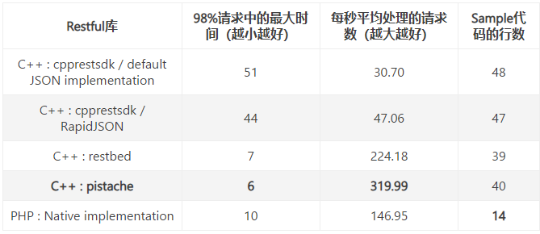

原文链接：http://www.cnblogs.com/codingbigdog/archive/2022/05/09/16249503.html
提交日期：Mon, 09 May 2022 07:49:00 GMT
博文内容：
规范见：[链接1](https://www.cnblogs.com/bigsai/p/14099154.html)
[链接2](https://restfulapi.cn/)

表格中第二列和第三列是性能指标，第四列体现易用性。从表中，我们可以很容易发现，巨硬（微软）开源的Restful库的性能最差，甚至不如PHP语言实现的，这简直是对C++的侮辱啊！其中性能最好的库——pistache，性能大约是PHP版本的2.17倍，不过易用性跟PHP差了很多：PHP仅仅用14行就可以写出一个Restful接口，而C++需要大约40行。

从上面的评测，我们可以看到不论是性能还是易用性方面，pistache在所有C++实现的Restful库中表现最为出色。

参考：[链接](https://www.jianshu.com/p/38c3ce4dfbb3)

https://jishuin.proginn.com/p/763bfbd2f0ca