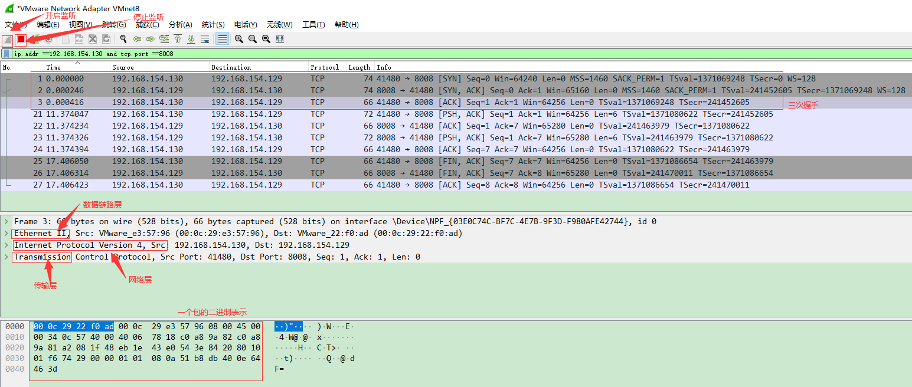
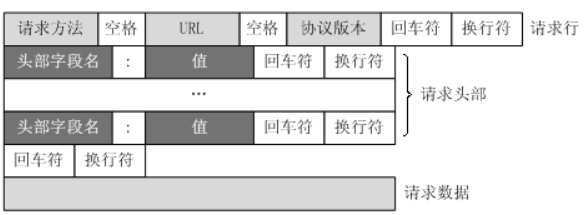
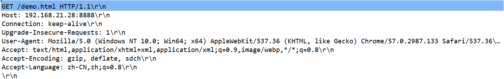
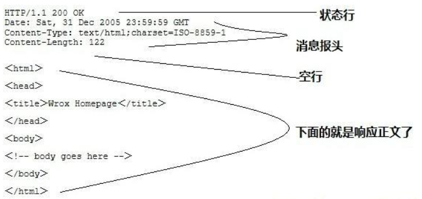

原文链接：http://www.cnblogs.com/codingbigdog/archive/2022/05/20/16293559.html
提交日期：Fri, 20 May 2022 11:42:00 GMT
博文内容：
# 1.使用抓包工具Wireshark查看三次握手
常用的抓包工具：
- tcpdump：游双的《高性能网络编程》中常用tcpdump进行抓包
- Wireshark：本黑马程序员课程中使用Wireshark进行抓包。抓包程序不要一直开着，不然内存会爆掉。

我首先在虚拟机中开启两个ubuntu系统，此时这两个系统，相当于在同一个网段下面的两台主机。然后使用Wireshark监听网卡VMware Network Adapter VMnet8。【[虚拟网卡的知识参考](https://www.cnblogs.com/lyh233/p/14592566.html)】

**使用抓包工具Wireshark查看三次握手步骤**
假设两台虚拟主机为A和B，A的IP为192.168.154.129，B的IP为192.168.154.130。
1.在主机A中运行黑马程序员课程中所给的代码02_process_tcp_server.c，具体代码如下：
```
#include <stdio.h>
#include <sys/socket.h>
#include <unistd.h>
#include <signal.h>
#include <sys/wait.h>
#include "wrap.h"
void free_process(int sig)
{
	pid_t pid;
	while(1)
	{
		pid = waitpid(-1,NULL,WNOHANG);
		if(pid <=0 )//小于0 子进程全部退出了 =0没有进程没有退出
		{
			break;
		}
		else
		{
			printf("child pid =%d\n",pid);
		}
	}


}
int main(int argc, char *argv[])
{
	sigset_t set;
	sigemptyset(&set);
	sigaddset(&set,SIGCHLD);
	sigprocmask(SIG_BLOCK,&set,NULL);
	//创建套接字,绑定
	int lfd = tcp4bind(8008,NULL);
	//监
	Listen(lfd,128);
	//提取
	//回射
	struct sockaddr_in cliaddr;
	socklen_t len = sizeof(cliaddr);
	while(1)
	{
		char ip[16]="";
		//提取连接,
		int cfd = Accept(lfd,(struct sockaddr *)&cliaddr,&len);
		printf("new client ip=%s port=%d\n",inet_ntop(AF_INET,&cliaddr.sin_addr.s_addr,ip,16),
				ntohs(cliaddr.sin_port));
		//fork创建子进程
		pid_t pid;
		pid = fork();
		if(pid < 0)
		{
			perror("");
			exit(0);
		}
		else if(pid == 0)//子进程
		{
			//关闭lfd
			close(lfd);
			while(1)
			{
			char buf[1024]="";

			int n = read(cfd,buf,sizeof(buf));
			if(n < 0)
			{
				perror("");
				close(cfd);
				exit(0);
			}
			else if(n == 0)//对方关闭j
			{
				printf("client close\n");
				close(cfd);
				exit(0);
			
			}
			else
			{
				printf("%s\n",buf);
				write(cfd,buf,n);
			//	exit(0);	
			}
			}
		
		}
		else//父进程
		{
			close(cfd);
			//回收
			//注册信号回调
			struct sigaction act;
			act.sa_flags =0;
			act.sa_handler = free_process;
			sigemptyset(&act.sa_mask);
			sigaction(SIGCHLD,&act,NULL);
			sigprocmask(SIG_UNBLOCK,&set,NULL);
		
		}
	}
	//关闭


	return 0;
}
```
编译和运行命令：
```
gcc 02_process_tcp_server.c wrap.c 
./a.out
```
wrap.c代码见[函数封装](https://www.cnblogs.com/codingbigdog/p/16245492.html)

2.开启Wireshark监听网卡VMware Network Adapter VMnet8
3.在主机B运行如下命令：
```
nc 192.168.154.129 8008
hello // 发送hello
hello // 发送hello以后，会收到hello
^C    // ctrl+c断开连接
```

Wireshark中抓到的信息如下：



# 2.HTTP协议
常用的请求方法有GET、HEAD、POST。
无连接：服务器处理完客户的请求，并收到客户的应答后，即断开连接。
无状态：HTTP协议是无状态协议。无状态是指协议对于事务处理没有记忆能力。缺少状态意味着如果后续处理需要前面的信息，则它必须重传，这样可能导致每次连接传送的数据量增大。另一方面，在服务器不需要先前信息时它的应答就较快。
从URL中获取参数：从“？”开始到“#”为止之间的部分为参数部分。允许有多个参数，参数与参数之间用“&”作为分隔符。可以从URL中获取参数，传给后台。

## 2.1.请求消息Request
请求消息Request有下面四个部分：
请求行（request line）、请求头部（header）、空行和请求数据


如：

其中\r\n代表空行


## 2.2.响应消息Response
HTTP响应也由四个部分组成，分别是：状态行、消息报头、空行和响应正文。

Content-Type是必填的；Content-Length可填可不填,填一定填对。

HTTP协议的具体内容可参考：[链接](https://www.cnblogs.com/ranyonsue/p/5984001.html)


# 3.webserver实现
## 一些API
读取目录下所有文件名
```
// dirent用于存储文件信息
struct dirent {
              ino_t          d_ino;       /* inode number */
              off_t          d_off;       /* not an offset; see NOTES */
              unsigned short d_reclen;    /* length of this record */
              unsigned char  d_type;      /* type of file; not supported
                                              by all filesystem types */
              char           d_name[256]; /* filename */
           };

// scandir 读取目录下的文件
struct dirent **mylist : // 指向指针数组的指针，如果要改变这个在指针的指向就需要使用三级指针
int scandir(const char *dirp, struct dirent ***namelist, // 需要改变mylist指针的指向，所以这里namelist使用三级指针
              int (*filter)(const struct dirent *),
              int (*compar)(const struct dirent **, const struct dirent **));
参数: 
        dirp: 目录的路径名
        namelist:  mylist地址，保存目录下的文件
        filter: 过滤的函数入口地址。用于过滤不需要的文件。不需要过滤时写NULL
        compar : 排序函数入口地址   可以直接使用已经写好的函数alphasort，用于字母排序
返回值: 读取文件的个数

```
## 具体实现代码
在黑马程序员课程中，实现了两个webserver，分别为epoll_web.c和event_wb.c。
具体代码可以在https://gitee.com/baba1980/heima_codes_notes的webserver下中找到，我添加了注释，所以代码直接应该可以看懂。
