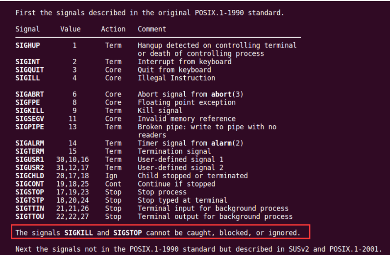
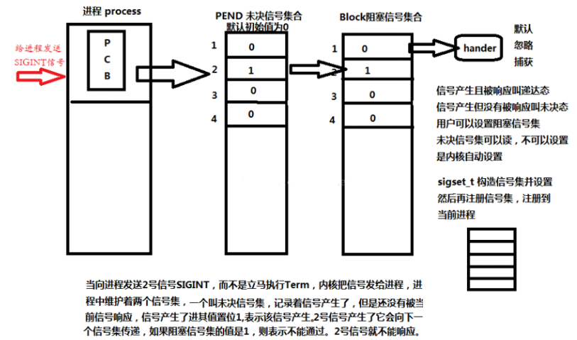
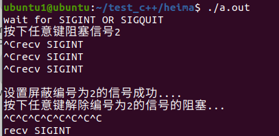
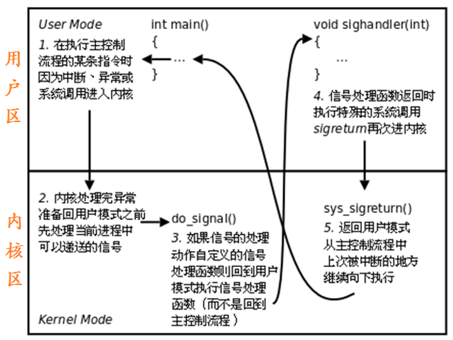

原文链接：http://www.cnblogs.com/codingbigdog/archive/2022/05/08/16246557.html
提交日期：Sun, 08 May 2022 11:36:00 GMT
博文内容：
#1.信号的概念

信号是 Linux 进程间通信的最古老的方式。信号是软件中断，它是在软件层次上对中断机制的一种模拟，是一种异步通信的方式 。信号可以导致一个正在运行的进程被另一个正在运行的异步进程中断，转而处理某一个突发事件。
“中断”在我们生活中经常遇到，譬如，我正在房间里打游戏，突然送快递的来了，把正在玩游戏的我给“中断”了，我去签收快递( 处理中断 )，处理完成后，再继续玩我的游戏。
这里我们学习的“信号”就是属于这么一种“中断”。我们在终端上敲“Ctrl+c”，就产生一个“中断”，相当于产生一个信号，接着就会处理这么一个“中断任务”（默认的处理方式为中断当前进程）。
中断：先停下本进程，去处理信号。
异步：不知道信号什么时候来

内核进程可以利用它来通知用户空间进程发生了哪些系统事件。


## 1.1信号的编号(了解)
1）信号编号：
Unix早期版本就提供了信号机制，但不可靠，信号可能丢失。Berkeley 和 AT&T都对信号模型做了更改，增加了可靠信号机制。但彼此不兼容。POSIX.1对可靠信号例程进行了标准化。

Linux 可使用命令：kill -l（"l" 为字母），查看相应的信号和对应的编号。
不存在编号为0的信号。其中1-31号信号称之为常规信号（也叫普通信号或标准信号），34-64称之为实时信号，驱动编程与硬件相关。名字上区别不大。而前32个名字各不相同。

2） Linux常规信号一览表 【加粗的为重点】:
| 编号    | 信号                  | 对应事件                                                                 | 默认动作          |
| ----- | ------------------- | -------------------------------------------------------------------- | ------------- |
| 1     | SIGHUP              | 用户退出shell时，由该shell启动的所有进程将收到这个信号。由于默认动作时终止进程，所以当终端被关闭以后，终端里面的后台\前台进程都会被终止                                     | 终止进程          |
| 2     | **SIGINT**              | 当用户按下了<Ctrl+C>组合键时，用户终端向正在运行中的由该终端启动的程序发出此信号                         | 终止进程          |
| 3     | **SIGQUIT**             | 用户按下<ctrl+\\>组合键时产生该信号，用户终端向正在运行中的由该终端启动的程序发出些信号                      | 终止进程          |
| 4     | SIGILL              | CPU检测到某进程执行了非法指令：c语言中可内嵌汇编语言，此时如果你写了一个非法的指令，就会发出SIGILL信号                                                     | 终止进程并产生core文件 |
| 5     | SIGTRAP             | 该信号由断点指令或其他 trap指令产生                                                 | 终止进程并产生core文件 |
| 6     | SIGABRT             | 调用abort函数时产生该信号                                                      | 终止进程并产生core文件 |
| 7     | SIGBUS              | 非法访问内存地址，包括内存对齐出错                                                    | 终止进程并产生core文件 |
| 8     | SIGFPE              | 在发生致命的运算错误时发出。不仅包括浮点运算错误，还包括溢出及除数为0等所有的算法错误                          | 终止进程并产生core文件 |
| 9     | SIGKILL             | 无条件终止进程。本信号不能被忽略，用于处理和阻塞                                               | 终止进程，可以杀死任何进程 |
| 10    | SIGUSE1             | 用户定义的信号。即程序员可以在程序中定义并使用该信号                                           | 终止进程          |
| 11    | **SIGSEGV**             | 指示进程进行了无效内存访问(段错误)                                                   | 终止进程并产生core文件 |
| 12    | SIGUSR2             | 另外一个用户自定义信号，程序员可以在程序中定义并使用该信号                                        | 终止进程          |
| 13    | **SIGPIPE**             | Broken pipe向一个没有读端的管道写数据                                             | 终止进程          |
| 14    | SIGALRM             | 定时器超时，超时的时间 由系统调用alarm设置                                             | 终止进程          |
| 15    | SIGTERM             | 程序结束信号，与SIGKILL不同的是，该信号可以被阻塞和终止。通常用来要示程序正常退出。执行shell命令Kill时，缺省产生这个信号 | 终止进程          |
| 16    | SIGSTKFLT           | Linux早期版本出现的信号，现仍保留向后兼容                                              | 终止进程          |
| 17    | **SIGCHLD**             | 子进程结束时，父进程会收到这个信号。由于默认忽略这个信号，所以当子进程退出，而父进程未对子进程进行清理，就会出现”僵尸子进程“。                                                    | 忽略这个信号        |
| 18    | SIGCONT             | 如果进程已停止，则使其继续运行                                                      | 继续/忽略         |
| 19    | SIGSTOP             | 停止进程的执行。信号不能被忽略，处理和阻塞                                                | 为终止进程         |
| 20    | SIGTSTP             | 停止终端交互进程的运行。按下<ctrl+z>组合键时发出这个信号                                     | 暂停进程          |
| 21    | SIGTTIN             | 后台进程读终端控制台                                                           | 暂停进程          |
| 22    | SIGTTOU             | 该信号类似于SIGTTIN，在后台进程要向终端输出数据时发生                                       | 暂停进程          |
| 23    | SIGURG              | 套接字上有紧急数据时，向当前正在运行的进程发出些信号，报告有紧急数据到达。如网络带外数据到达                       | 忽略该信号         |
| 24    | SIGXCPU             | 进程执行时间超过了分配给该进程的CPU时间 ，系统产生该信号并发送给该进程                                | 终止进程          |
| 25    | SIGXFSZ             | 超过文件的最大长度设置                                                          | 终止进程          |
| 26    | SIGVTALRM           | 虚拟时钟超时时产生该信号。类似于SIGALRM，但是该信号只计算该进程占用CPU的使用时间                        | 终止进程          |
| 27    | SIGPROF             | 类似于SIGVTALRM，它不公包括该进程占用CPU时间还包括执行系统调用时间                              | 终止进程          |
| 28    | SIGWINCH            | 窗口变化大小时发出                                                            | 忽略该信号         |
| 29    | SIGIO               | 此信号向进程指示发出了一个异步IO事件                                                  | 忽略该信号         |
| 30    | SIGPWR              | 关机                                                                   | 终止进程          |
| 31    | SIGSYS              | 无效的系统调用                                                              | 终止进程并产生core文件 |
| 34~64 | SIGRTMIN ～ SIGRTMAX | LINUX的实时信号，它们没有固定的含义（可以由用户自定义）                                       | 终止进程          |

加粗的为重要的。
通过自定义信号处理函数，可以修改信号的默认动作。


## 1.2.信号四要素
每个信号必备4要素，分别是：

1）编号 2）名称 3）事件 4）默认处理动作

可通过man 7 signal查看帮助文档获取：

在标准信号中，有一些信号是有三个“Value”，第一个值通常对alpha和sparc架构有效，中间值针对x86、arm和其他架构，最后一个应用于mips架构。一个‘-’表示在对应架构上尚未定义该信号。故要让程序具有系统可移植性，最好使用信号的名称而不是编号。

不同的操作系统定义了不同的系统信号。因此有些信号出现在Unix系统内，也出现在Linux中，而有的信号出现在FreeBSD或Mac OS中却没有出现在Linux下。这里我们只研究Linux系统中的信号。

Action为默认动作：
Term：终止进程
Ign： 忽略信号 (默认即时对该种信号忽略操作)
Core：终止进程，生成Core文件。(查验死亡原因，用于gdb调试)
Stop：停止（暂停）进程
Cont：继续运行进程
注意通过man 7 signal命令查看帮助文档，其中可看到 : The signals SIGKILL and SIGSTOP cannot be caught, blocked, or ignored.

这里特别强调了9) SIGKILL 和19) SIGSTOP信号，不允许忽略和捕捉，只能执行默认动作。甚至不能将其设置为阻塞。【什么叫做信号阻塞】

另外需清楚，只有每个信号所对应的事件发生了，该信号才会被递送(但不一定递达，有可能丢失)，不应乱发信号！！

 

## 1.3.信号的状态

**1） 产生**

a) 当用户按某些终端键时，将产生信号。

终端上按“Ctrl+c”组合键通常产生中断信号 SIGINT

终端上按“Ctrl+\”键通常产生中断信号 SIGQUIT

终端上按“Ctrl+z”键通常产生中断信号 SIGSTOP 等。

b) 硬件异常将产生信号。

除数为 0，无效的内存访问等。这些情况通常由硬件检测到，并通知内核，然后内核产生适当的信号发送给相应的进程。

c) 软件异常将产生信号。

当检测到某种软件条件已发生(如：定时器alarm)，并将其通知有关进程时，产生信号。

d) 调用系统函数(如：kill、raise、abort)将发送信号。

注意：接收信号进程和发送信号进程的所有者必须相同，或发送信号进程的所有者必须是超级用户。

e) 运行 kill /killall命令将发送信号。

此程序实际上是使用 kill 函数来发送信号。也常用此命令终止一个失控的后台进程。

 

**2) 未决状态**：没有被处理，处理函数未被调用

**3) 递达状态**：信号被处理了，处理函数已被调用


## 1.4.阻塞信号集和未决信号集
信号的实现手段导致信号有很强的延时性，但对于用户来说，时间非常短，不易察觉。
Linux内核的**进程控制块PCB**是一个结构体task_struct, 除了包含进程id，状态，工作目录，用户id，组id，文件描述符表，还包含了信号相关的信息，主要指阻塞信号集和未决信号集。

阻塞信号集(信号屏蔽字)：将某些信号加入集合，对他们设置屏蔽。当屏蔽x信号后，收到的信号x将不会被处理，直到解除屏蔽以后才会被处理。

未决信号集：信号产生后由于某些原因(主要是阻塞)不能抵达，这类信号的集合称之为未决信号集。信号产生，未决信号集中描述该信号的位立刻翻转为1，表示信号处于未决状态。当信号被处理时，对应位翻转回为0。这一时刻往往非常短暂。

这两个信号集都是内核使用位图机制来实现的。但操作系统不允许我们直接对其进行位操作。而需自定义另外一个集合，借助信号集操作函数来对PCB中的这两个信号集进行修改。


每一个PCB中都有阻塞信号集和未决信号集
### 1.4.1.自定义信号集函数
为了方便对多个信号进行处理，一个用户进程常常需要对多个信号做出处理，在 Linux 系统中引入了信号集（信号的集合）。

这个信号集有点类似于我们的 QQ 群，一个个的信号相当于 QQ 群里的一个个好友。

信号集是一个能表示多个信号的数据类型，sigset_t set，set即一个信号集。既然是一个集合，就需要对集合进行添加/删除等操作。

相关函数说明如下：
```
#include <signal.h>  
​
int sigemptyset(sigset_t *set);       //将set集合置空
int sigfillset(sigset_t *set)；          //将所有信号加入set集合
int sigaddset(sigset_t *set, int signo);  //将signo信号加入到set集合。信号是由一个个的int类型组成
int sigdelset(sigset_t *set, int signo);   //从set集合中移除signo信号
int sigismember(const sigset_t *set, int signo); //判断信号是否存在
```
除sigismember外，其余操作函数中的set均为传出参数。sigset_t类型的本质是位图。但不应该直接使用位操作，而应该使用上述函数，保证跨系统操作有效。
示例程序:
```
#include <stdio.h>
#include <stdlib.h>
#include <string.h>
#include <signal.h>

int main()
{
    sigset_t set;   // 定义一个信号集变量
    int ret = 0;
​
    sigemptyset(&set); // 清空信号集的内容
​
    // 判断 SIGINT 是否在信号集 set 里
    // 在返回 1， 不在返回 0
    ret = sigismember(&set, SIGINT);
    if (ret == 0)
    {
        printf("SIGINT is not a member of set \nret = %d\n", ret);
    }
​
    sigaddset(&set, SIGINT); // 把 SIGINT 添加到信号集 set
    sigaddset(&set, SIGQUIT);// 把 SIGQUIT 添加到信号集 set
​
    // 判断 SIGINT 是否在信号集 set 里
    // 在返回 1， 不在返回 0
    ret = sigismember(&set, SIGINT);
    if (ret == 1)
    {
        printf("SIGINT is a member of set \nret = %d\n", ret);
    }
​
    sigdelset(&set, SIGQUIT); // 把 SIGQUIT 从信号集 set 移除
​
    // 判断 SIGQUIT 是否在信号集 set 里
    // 在返回 1， 不在返回 0
    ret = sigismember(&set, SIGQUIT);
    if (ret == 0)
    {
        printf("SIGQUIT is not a member of set \nret = %d\n", ret);
    }
​
    return 0;
}
```

### 1.4.2.sigprocmask函数——修改阻塞集合
信号阻塞集也称信号屏蔽集、信号掩码。每个进程都有一个阻塞集，创建子进程时子进程将继承父进程的阻塞集。信号阻塞集用来描述哪些信号递送到该进程的时候被阻塞（在信号发生时记住它，直到进程准备好时再将信号通知进程）。

所谓阻塞并不是禁止传送信号, 而是将传送的信号阻塞。若将被阻塞的信号从信号阻塞集中删除，进程将会收到相应的信号。
【注】若发送同一个信号多次，但由于这个信号被阻塞而无法传送，当将被阻塞的信号从信号阻塞集中删除后，进程只处理一次这个信号（即使它发了很多次）

我们可以通过 sigprocmask() 修改当前的信号掩码来改变信号的阻塞情况。
```
#include <signal.h>

int sigprocmask(int how, const sigset_t *set, sigset_t *oldset);
功能：
    检查或修改信号阻塞集，根据 how 指定的方法对进程的阻塞集合进行修改，新的信号阻塞集由 set 指定，而原先的信号阻塞集合由 oldset 保存。
​
参数：
    how : 信号阻塞集合的修改方法，有 3 种情况：
        SIG_BLOCK（加）：向信号阻塞集合中添加 set 信号集，新的信号掩码是set和旧信号掩码的并集。相当于 mask = mask|set。
        SIG_UNBLOCK（减）：从信号阻塞集合中删除 set 信号集，从当前信号掩码中去除 set 中的信号。相当于 mask = mask & ~ set。
        SIG_SETMASK（覆盖）：将信号阻塞集合设为 set 信号集，相当于原来信号阻塞集的内容清空，然后按照 set 中的信号重新设置信号阻塞集。相当于mask = set。
    set : 要操作的信号集地址。
        若 set 为 NULL，则不改变信号阻塞集合，函数只把当前信号阻塞集合保存到 oldset 中。
    oldset : 保存原先信号阻塞集地址
​
返回值：
    成功：0，
    失败：-1，失败时错误代码只可能是 EINVAL，表示参数 how 不合法。
```
示例程序：
```
#include <stdio.h>
#include <stdlib.h>
#include <string.h>
#include <signal.h>

// 信号处理函数
void signal_handler(int signo)
{
	if (signo == SIGINT)
	{
		printf("recv SIGINT\n");
	}
	else if (signo == SIGQUIT)
	{
		printf("recv SIGQUIT\n");
	}
}

int main()
{	
	int ret;
	sigset_t set, oldset;
	printf("wait for SIGINT OR SIGQUIT\n");

	/* SIGINT: Ctrl+c ; SIGQUIT: Ctrl+\ */
	// 信号注册函数
	signal(SIGINT, signal_handler);
	signal(SIGQUIT, signal_handler);


	printf("按下任意键阻塞信号2\n");
	getchar();

	sigemptyset(&oldset);
	sigemptyset(&set);
	sigaddset(&set, SIGINT);

	//设置屏蔽编号为2的信号
	ret = sigprocmask(SIG_BLOCK, &set, &oldset);
	if (-1 == ret){
		perror("sigprocmaSk");
		return 1;
	}
	printf("设置屏蔽编号为2的信号成功....\n");

	printf("按下任意键解除编号为2的信号的阻塞...\n");
	getchar();
	//将信号屏蔽集设置为原来的集合
	ret = sigprocmask(SIG_SETMASK, &oldset, NULL);
	if (-1 == ret) {
		perror("sigp rocmask");
	}
	return 1;
}

```

在被阻塞期间我们发送了八个SIGINT信号，但是在阻塞解除时，进程只调用了一次信号处理函数


### 1.4.3.sigpending函数——读取当前进程的未决信号集


```
#include <signal.h>
​
int sigpending(sigset_t *set);
功能：读取当前进程的未决信号集
参数：
    set：未决信号集
返回值：
    成功：0
    失败：-1
```
示例程序:
```
#include <stdio.h>
#include <stdlib.h>
#include <string.h>
#include <signal.h>
#include <unistd.h>
int main()
{
	// 自定义信号集
	sigset_t myset, old;
	sigemptyset(&myset);// 清空　－》　０

	// 添加要阻塞的信号
	sigaddset(&myset, SIGINT);
	sigaddset(&myset, SIGQUIT);
	sigaddset(&myset, SIGKILL);

	// 自定义信号集设置到内核中的阻塞信号集
	sigprocmask(SIG_BLOCK, &myset, &old);

	sigset_t pend;
	int i = 0;
	while (1)
	{
		// 读内核中的未决信号集的状态
		sigpending(&pend);
		for (int i = 1; i < 32; ++i)
		{
			if (sigismember(&pend, i))
			{
				printf("1");
			}
			else if (sigismember(&pend, i) == 0)
			{
				printf("0");
			}
		}
		printf("\n");
		sleep(1);
		i++;

		// 10s之后解除阻塞
		if (i > 10)
		{
			// sigprocmask(SIG_UNBLOCK, &myset, NULL);
			sigprocmask(SIG_SETMASK, &old, NULL);
		}
	}

	return 0;
}
```


# 2.信号产生函数

## 2.1.kill函数
和kill命令的使用类似
```
#include <sys/types.h>
#include <signal.h>
​
int kill(pid_t pid, int sig);
功能：给指定进程发送指定信号
​
参数：
    pid : 取值有 4 种情况 （和waitpid函数的参数pid一样）:
        pid > 0:  将信号传送给进程 ID 为pid的进程。
        pid = 0 :  将信号传送给当前进程所在进程组中的所有进程。
        pid = -1 : 将信号传送给系统内所有的进程。
        pid < -1 : 将信号传给指定进程组的所有进程。这个进程组号等于 pid 的绝对值。
    sig : 信号的编号，这里可以填数字编号，也可以填信号的宏定义，可以通过命令 kill - l("l" 为字母)进行相应查看。不推荐直接使用数字，应使用宏名，因为不同操作系统信号编号可能不同，但名称一致。
​
返回值：
    成功：0
    失败：-1
```
super用户(root)可以发送信号给任意用户，普通用户是不能向系统用户发送信号的。

kill -9 (root用户的pid) 是不可以的。同样，普通用户也不能向其他普通用户发送信号，终止其进程。 只能向自己创建的进程发送信号。

普通用户基本规则是：发送者实际或有效用户ID == 接收者实际或有效用户ID

程序示例:
```
#include <stdio.h>
#include <stdlib.h> 
#include <string.h>
#include <sys/types.h>
#include <signal.h>
#include <unistd.h>

int main()
{
    pid_t pid = fork();
    if (pid == 0)
    {//子进程
        int i = 0;
        for (i = 0; i<5; i++)
        {
            printf("in son process\n");
            sleep(1);
        }
    }
    else
    {//父进程
        printf("in father process\n");
        sleep(2);
        printf("kill sub process now \n");
        kill(pid, SIGINT);
    }
​
    return 0;
}
```

## 2.2.raise函数——自己给自己发信号
```
#include <signal.h>
​
int raise(int sig);
功能：给当前进程发送指定信号(自己给自己发)，等价于 kill(getpid(), sig)
参数：
    sig：信号编号
返回值：
    成功：0
    失败：非0值
```

## 2.3.abort函数——给自己发送异常终止信号SIGABRT
```
#include <stdlib.h>
​
void abort(void);
功能：给自己发送异常终止信号 6) SIGABRT，并产生core文件，等价于kill(getpid(), SIGABRT);
​
参数：无
​
返回值：无
```
好的编程习惯：
```
写if(4 == i)
而不写
if(i == 4),
因为当我们写错成if(4 = i)时，会报错。
```


## 2.4.alarm函数(闹钟)——定时给自己发送SIGALRM信号
alarm函数是非阻塞的
```
#include <unistd.h>
​
unsigned int alarm(unsigned int seconds);
功能：
    设置定时器(闹钟)。在指定seconds后，内核会给当前进程发送14）SIGALRM信号。进程收到该信号，默认动作终止。每个进程都有且只有唯一的一个定时器。
    取消定时器alarm(0)，返回旧闹钟余下秒数。
参数：
    seconds：指定的时间，以秒为单位
返回值：
    返回0或剩余的秒数
```

定时，与进程状态无关(自然定时法)！就绪、运行、挂起(阻塞、暂停)、终止、僵尸……无论进程处于何种状态，alarm都计时（因为alarm是由内核进行运行的）。

测试程序:

```
int main()
{
    int seconds = 0;
​
    seconds = alarm(5);
    printf("seconds = %d\n", seconds);
​
    sleep(2);
    seconds = alarm(5); // 没有超时的闹钟被新的闹钟给覆盖了
    printf("seconds = %d\n", seconds);  // seconds输出为3，因为seconds是上一次闹钟剩余的时间
​
    while (1);
    return 0;
}
```
设置alarm(5)函数以后，程序还会执行5秒。

## 2.5.setitimer函数（定时器）
```
#include <sys/time.h>
​
int setitimer(int which,  const struct itimerval *new_value, struct itimerval *old_value);
功能：
    设置定时器(闹钟)。 可代替alarm函数。精度微秒us，可以实现周期定时。
参数：
    which：指定定时方式
        a) 自然定时：ITIMER_REAL,计算自然时间。返回14）SIGALRM
        b) 虚拟空间计时(用户空间)：ITIMER_VIRTUAL,只计算进程占用cpu的时间。返回26）SIGVTALRM  
        c) 运行时计时(用户 + 内核)：ITIMER_PROF,计算占用cpu及执行系统调用的时间。返回27）SIGPROF
    new_value：struct itimerval, 负责设定timeout时间
        struct itimerval {
            struct timerval it_interval; // 闹钟触发周期，每个多久触发一次
            struct timerval it_value;    // 闹钟触发时间，第一次执行function所延迟的秒数
        };
        struct timeval {
            long tv_sec;            // 秒
            long tv_usec;           // 微秒
        }
        itimerval.it_value： 设定第一次执行function所延迟的秒数 
        itimerval.it_interval：  设定以后每几秒执行function
​
    old_value： 存放旧的timeout值，一般指定为NULL
返回值：
    成功：0
    失败：-1
```
示例程序：
```
#include <stdio.h>
#include <stdlib.h>
#include <string.h>
#include <sys/time.h>

void myfunc(int sig)
{
    printf("hello\n");
}
​
int main()
{
    struct itimerval new_value;
​
    //定时周期
    new_value.it_interval.tv_sec = 1;
    new_value.it_interval.tv_usec = 0;
​
    //第一次触发的时间：延迟两秒触发
    new_value.it_value.tv_sec = 2;
    new_value.it_value.tv_usec = 0;
​
    signal(SIGALRM, myfunc); //信号处理
    setitimer(ITIMER_REAL, &new_value, NULL); //定时器设置
​
    while (1);
​
    return 0;
}
​
```
\#include\<sys/xxx.h\>是Linux系统中的系统头文件，这些头文件下面的函数A，都可以通过man A来查看A的用法

# 3.信号捕捉
信号捕捉内核实现信号捕捉过程：

【注】SIGKILL 和 SIGSTOP 不能更改信号的处理方式，因为它们向用户提供了一种使进程终止的可靠方法。

 

## signal函数
```
#include <signal.h>
​
typedef void(*sighandler_t)(int);
sighandler_t signal(int signum, sighandler_t handler);
功能：
    注册信号处理函数（不可用于 SIGKILL、SIGSTOP 信号），即确定收到信号后处理函数的入口地址。此函数不会阻塞。
​
参数：
    signum：信号的编号，这里可以填数字编号，也可以填信号的宏定义(最好使用宏)，可以通过命令 kill - l("l" 为字母)进行相应查看。
    handler : handler存储的是函数的起始地址，取值有 3 种情况：
          SIG_IGN：忽略该信号
          SIG_DFL：执行系统默认动作
          信号处理函数名：自定义信号处理函数，如：func。SIGKILL 和 SIGSTOP 不能更改信号的处理方式，因为它们向用户提供了一种使进程终止的可靠方法。
          回调函数的定义如下：
            void func(int signo)
            {
                // signo 为触发的信号，为 signal() 第一个参数的值
            }
​
返回值：
    成功：第一次返回 NULL，下一次返回此信号上一次注册的信号处理函数的地址。如果需要使用此返回值，必须在前面先声明此函数指针的类型。
    失败：返回 SIG_ERR
```
该函数由ANSI定义，由于历史原因在不同版本的Unix和不同版本的Linux中可能有不同的行为。**因此应该尽量避免使用它，取而代之使用sigaction函数。**

示例程序:

```
#include <stdio.h>
#include <stdlib.h>
#include <string.h>
#include <signal.h>

// 信号处理函数
void signal_handler(int signo)
{
    if (signo == SIGINT)
    {
        printf("recv SIGINT\n");
    }
    else if (signo == SIGQUIT)
    {
        printf("recv SIGQUIT\n");
    }
}

int main()
{
    printf("wait for SIGINT OR SIGQUIT\n");
    
    /* SIGINT: Ctrl+c ; SIGQUIT: Ctrl+\ */
    // 信号注册函数
    signal(SIGINT, signal_handler);
    signal(SIGQUIT, signal_handler);
    
    while (1); //不让程序结束

    return 0;
}
```
 
