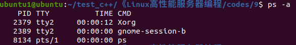
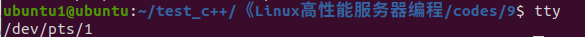
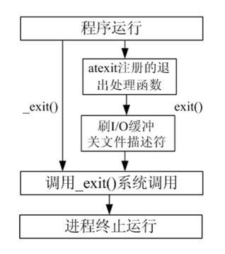

原文链接：http://www.cnblogs.com/codingbigdog/archive/2022/05/08/16245627.html
提交日期：Sun, 08 May 2022 06:59:00 GMT
博文内容：
# 进程相关的命令
## ps
进程是一个具有一定独立功能的程序，它是操作系统动态执行的基本单元。
ps命令可以查看进程的详细状况，常用选项(选项可以不加“-”，不加时输出结果更详细)如下：
| 选项   | 含义                   |
| ---- | -------------------- |
| -a   | 显示终端上的所有进程，包括其他用户的进程 |
| -u   | 显示进程的详细状态            |
| -x   | 显示没有控制终端的进程          |
| -w   | 显示加宽，以便显示更多的信息       |
| -r   | 只显示正在运行的进程           |

ps aux与ps ef等价
ps -a结果如下：

其中TTY代表终端，直接在终端中输入tty可显示终端名称：


ps命令常用于查找进程PID，以便于杀死进程。

## top
top命令用来动态显示运行中的进程。top命令能够在运行后，在指定的时间间隔更新显示信息。可以在使用top命令时加上-d 来指定显示信息更新的时间间隔。

在top命令执行后，可以按下按键得到对显示的结果进行排序：

| 按键   | 含义                 |
| ---- | ------------------ |
| M    | 根据内存使用量来排序         |
| P    | 根据CPU占有率来排序        |
| T    | 根据进程运行时间的长短来排序     |
| U    | 可以根据后面输入的用户名来筛选进程  |
| K    | 可以根据后面输入的PID来杀死进程。 |
| q    | 退出                 |
| h    | 获得帮助               |

知道有top这个东西就可以，没必要记后面的参数。

## kill
kill命令：使用某个信号来处理进程，需要配合 ps 使用。
使用格式：
kill [-signal] pid
-signal默认为-15
其中信号-9为绝对终止，可以处理一般信号无法终止的进程（即有些进程不能直接杀死，这时候我们需要加一个参数“ -9 ”，“ -9 ” 代表强制结束）。
查询可用的信号量：kill -l

杀死进程的流程：
```
ps aux| grep name  # 找到名字为name的进程的进程号
kill number        # 通过进程号杀死进程
```
killall -9 name  # 杀死名字为name的所有进程（可能有很多个同名的进程）


# 进程退出和子进程的清理
## 进程退出(exit() 和_exit())
```
#include <stdlib.h>
void exit(int status);
​
#include <unistd.h>
void _exit(int status);
功能：
    结束调用此函数的进程。
参数：
    status：返回给父进程的参数（低 8 位有效），至于这个参数是多少根据需要来填写。
返回值：
    无
```
exit() 和_exit() 函数功能和用法是一样的，无非时所包含的头文件不一样，还有的区别就是：_exit()属于标准库函数，exit()属于系统调用函数。

举例如下：
```
#include <stdio.h>
#include <string.h>
#include <stdlib.h>
#include <unistd.h>
//结束进程
int main(void)
{
	printf("hello world"); // 要输出"hello world"，就必须刷新I/O缓冲区
	
	//exit(0); // 等价于return 0;,会输出"hello world"
	
	//_ exit(0);  // 直接退出不做任何时候清理，不会输出"hello world"。等价于_Exit(0);
	
	return 0;
}

```
## 等待子进程退出并清理子进程（wait() 和 waitpid()）
在每个进程退出的时候，内核释放该进程所有的资源、包括打开的文件、占用的内存等。但是仍然为其保留一定的信息，这些信息主要主要指进程控制块PCB的信息（包括进程号、退出状态、运行时间等）。

父进程可以通过调用wait或waitpid得到它的退出状态同时彻底清除掉这个进程。
wait() 和 waitpid() 函数的功能一样，区别在于，wait() 函数会阻塞，waitpid() 可以设置不阻塞，waitpid() 还可以指定等待哪个子进程结束。

注意：一次wait或waitpid调用只能清理一个子进程，清理多个子进程应使用循环。

### wait函数
函数说明：
```
#include <sys/types.h>
#include <sys/wait.h>
​
pid_t wait(int *status);
功能：
    等待任意一个子进程结束，如果任意一个子进程结束了，此函数会回收该子进程的资源。
参数：
    status : 进程退出时的状态信息。
返回值：
    成功：已经结束子进程的进程号
    失败： -1
```
调用 wait() 函数的进程会挂起（阻塞），直到它的一个子进程退出或收到一个不能被忽视的信号时才被唤醒（相当于继续往下执行）。

若调用进程没有子进程，该函数立即返回；若它的子进程已经结束，该函数同样会立即返回，并且会回收那个早已结束进程的资源。
所以，wait()函数的主要功能为回收已经结束子进程的资源。

如果参数 status 的值不是 NULL，wait() 就会把子进程退出时的状态取出并存入其中，这是一个整数值（int），指出了子进程是正常退出还是被非正常结束的。

这个退出信息在一个 int 中包含了多个字段，直接使用这个值是没有意义的，我们需要用宏定义取出其中的每个字段。
**宏函数可分为如下三组：**
1\) WIFEXITED(status)：为非0 → 进程正常结束

WEXITSTATUS(status)：如WIFEXITED(status)为真，则可使用WEXITSTATUS(status)获取进程退出状态 (exit的参数)

2\) WIFSIGNALED(status)：为非0 → 进程异常终止

WTERMSIG(status)：如WIFSIGNALED(status)为真，则可使用WTERMSIG(status)取得使进程终止的那个信号的编号。

3\) WIFSTOPPED(status):为非0 → 进程处于暂停状态

WSTOPSIG(status):如WIFSTOPPED(status)为真，则可使用WSTOPSIG(status)取得使进程暂停的那个信号的编号。

WIFCONTINUED(status):为真 → 进程暂停后已经继续运行

举例如下：
 
```
#include <stdio.h>
#include <string.h>
#include <stdlib.h>
#include <sys/types.h>
#include <sys/wait.h>
#include <unistd.h>
//等待子进程退出
int main(void)
{
	int status = 0;
	int i = 0;
	int ret = -1;
	pid_t pid = -1;

	//创建子进程
	pid = fork();
	if (-1 == pid)
	{
		perror("fork");
		return 1;
	}
	if (0 == pid)
	{
		for (i = 0; i < 15; i++)
		{
			printf("child process %d do thing %d\n", getpid(),i + 1);
			sleep(1);
			//子进程终止
		}

		exit(10);
	}
	//父进程执行
	printf("父进程等待子进程退出，回收其资源\n");
	ret = wait(&status); // 父进程等待子进程退出，回收其资源
	if (-1 == ret)
	{
		perror("wait");
		return 1;
	}

	printf("父进程回收了子进程资源...\n");


	//属于正常退出
	if (WIFEXITED(status))
	{       
		printf("子进程退出状态码: %d\n", WEXITSTATUS(status));
	}
	else if (WIFSIGNALED(status))
	{
                // 通过kill pid或kill -9 pid杀死进程pid
		printf("子进程被信号%d杀死了... \n", WTERMSIG(status));
	}
	else if (WIFSTOPPED(status))
	{
                // 通过kill -19 pid挂起进程，通过kill -18 pid继续运行进程
                // 通过kill -l可查看-18和-19的含义
		printf("子进程被信号%d暂停...\n", WSTOPSIG(status));
	}

	return 0;
}
```

### waitpid函数
waitpid() 可以设置不阻塞，waitpid() 还可以指定等待哪个子进程结束。
函数说明：
```
#include <sys/types.h>
#include <sys/wait.h>
​
pid_t waitpid(pid_t pid, int *status, int options);
功能：
    等待子进程终止，如果子进程终止了，此函数会回收子进程的资源。
​
参数：
    pid : 参数 pid 的值有以下几种类型：
      pid > 0  等待进程 ID 等于 pid 的子进程。
      pid = 0  等待同一个进程组中的任何子进程，如果子进程已经加入了别的进程组，waitpid 不会等待它。
      pid = -1 等待任一子进程，此时 waitpid 和 wait 作用一样。
      pid < -1 等待指定进程组中的任何子进程，这个进程组的 ID 等于 pid 的绝对值。
​
    status : 进程退出时的状态信息。和 wait() 用法一样。
​
    options : options 提供了一些额外的选项来控制 waitpid()。
            0：同 wait()，阻塞父进程，等待子进程退出。
            WNOHANG：没有任何已经结束的子进程，则立即返回。
            WUNTRACED：如果子进程暂停了则此函数马上返回，并且不予以理会子进程的结束状态。（由于涉及到一些跟踪调试方面的知识，加之极少用到）
                 
返回值：
    waitpid() 的返回值比 wait() 稍微复杂一些，一共有 3 种情况：
        1) 当正常返回的时候，waitpid() 返回收集到的已经回收子进程的进程号；
        2) 如果设置了选项 WNOHANG，而调用中 waitpid() 发现没有已退出的子进程可等待，则返回 0；
        3) 如果调用中出错，则返回-1，这时 errno 会被设置成相应的值以指示错误所在，如：当 pid 所对应的子进程不存在，或此进程存在，但不是调用进程的子进程，waitpid() 就会出错返回，这时 errno 被设置为 ECHILD；

 ```

父进程还没运行到wait()或waitpid()，子进程就结束了。接下来父进程运行到wait()或waitpid()时，就会对这个已结束的子进程进行清理，而不是跳过这个已结束的子进程。
