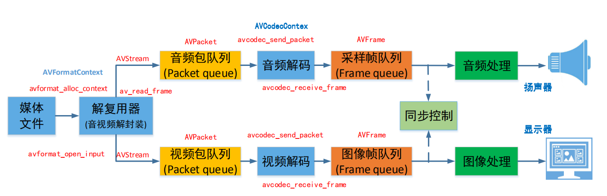
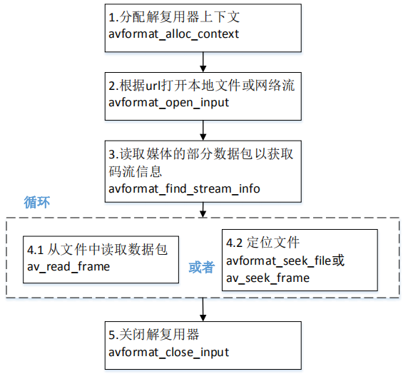
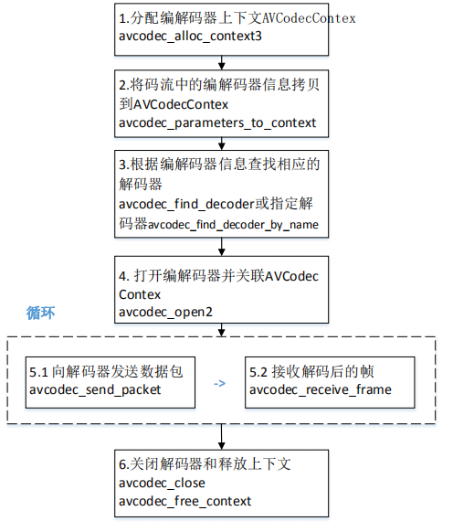
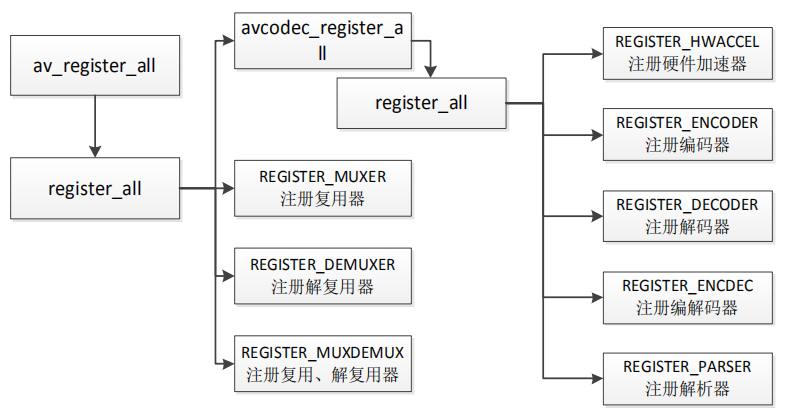
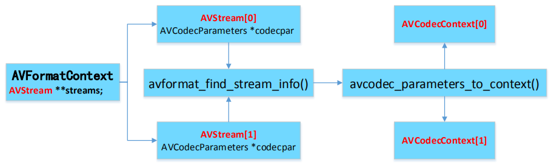
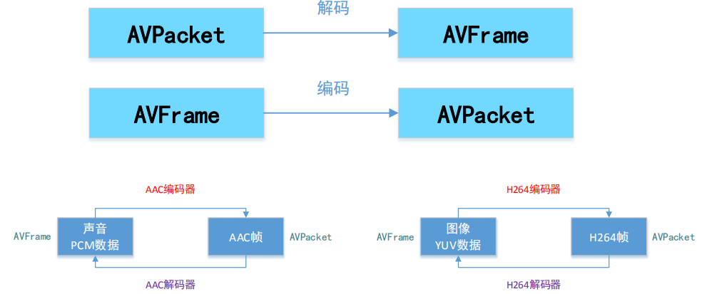
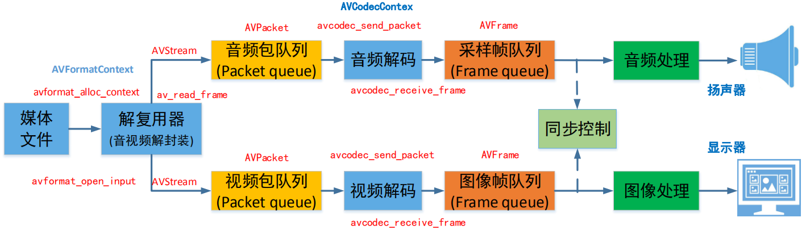

原文链接：http://www.cnblogs.com/codingbigdog/archive/2022/07/05/16448954.html
提交日期：Tue, 05 Jul 2022 14:48:00 GMT
博文内容：
# 0.源码编译安装ffmpeg

建议安装4.19版本，因为其他版本没有暂时函数说明文档。
建议直接参考这篇文章[ubuntu20源码编译安装ffmpeg](https://blog.csdn.net/H_Zhang/article/details/123684216)，这篇文档进行的是最简单的安装。如果按照[官方按照教程](https://trac.ffmpeg.org/wiki/CompilationGuide)进行按照可能会由于依赖问题，而无法使用。

如果参考[官方安装教程](https://trac.ffmpeg.org/wiki/CompilationGuide/Ubuntu)进行源码安装。在按照官方安装教程进行安装的时候，需要安装各种库，可以使用命令sudo apt-get install安装库，就尽量使用sudo apt-get install来安装。有些不能使用sudo apt-get install安装的库，就使用教程中的源码编译方式进行安装。


源码安装以后，会生成四个目录，分别为bin、include、lib和share。我们可以将include和lib拷贝到本系统的任何位置进行使用。从share可以学习到ffmpeg的使用实例，可以通过学习这些实例，从而进行进阶学习。

在设置ffmpeg安装配置时，有些库如果你安装失败了或者没有安装，请记得不要在./configure中对这些库进行enable，如：你没有安装库libaom，就要去掉 --enable-libaom。

在安装完ffmpeg后，你需要添加并enable一些库，怎么办？
答：我觉得只能下载这些库，然后重新对ffmpeg进行配置和编译。

参考：[链接](https://www.cnblogs.com/phillee/p/14605815.html)


## 0.1 简单的程序测试
### 0.1.1 c程序测试
测试程序test.c：
```
#include <stdio.h>
 #include "libavutil/avutil.h"
 int main(){
    printf("Hello FFMPEG, version is %s\n", av_version_info());
    return 0;
 }
```
编译和运行：
```
gcc test.c -o test -I /home/ubuntu1/ffmpeg_build/include -L /home/ubuntu1/ffmpeg_build/lib/ -l avutil   # avutil是静态库，所以不需要选项-Wl,-rpath
./test
Hello FFMPEG, version is N-107317-g85bc6b5abf
```


### 0.1.2 c++程序测试
由于 FFmpeg 是用C99标准写成的，有些功能在 C++ 中可能无法直接编译或者使用。
所以需要使用extern "C"显示声明头文件为C格式文件。
测试程序test.cpp：
```
#include <stdio.h>
extern "C" {
#include "libavutil/avutil.h"
}
int main(){
    printf("Hello FFMPEG, version is %s\n", av_version_info());
    return 0;
}
```
编译和运行：
```
g++ test.cpp -o test -I /home/ubuntu1/ffmpeg_build/include -L /home/ubuntu1/ffmpeg_build/lib/ -l avutil -D__STDC_CONSTANT_MACROS   # 没加-D__STDC_CONSTANT_MACROS时，如果不出错，就不加了。
./test
Hello FFMPEG, version is N-107317-g85bc6b5abf
```


# 1 播放器框架


图中其实涉及三个数据结构，分别为AVFormatContext、AVPacket和AVFrame。我对这三个数据结构的理解如下：
AVFormatContext可以当成是整个媒体文件，可以从中取出视频流、音频流和字幕流等信息。
而每个流都是由一个一个packet组成的，每个packet使用AVPacket数据结构进行保存。
由于流一般都是被压缩的数据，故AVPacket也是被压缩的数据，AVPacket经过解压就生成了原始数据帧AVFrame


# 2 常用音视频术语
• 容器／文件（Conainer/File）：即特定格式的多媒体文件，比如mp4、flv、mkv等。
• 媒体流（Stream）：表示时间轴上的一段连续数据，如一段声音数据、一段视频数据或一段字幕数据，可以是压缩的，也可以是非压缩的，压缩的数据需要关联特定的编解码器（有些码流音频他是纯PCM，视频流一般不会是未压缩的YUV格式）。
• 数据帧／数据包（Frame/Packet）：通常，一个媒体流是由大量的数据帧组成的，对于压缩数据，帧对应着编解码器的最小处理单元，分属于不同媒体流的数据帧交错存储于容器之中。
• 编解码器：编解码器是以帧为单位实现压缩数据和原始数据之间的相互转换的

# 3 FFmpeg库简介
FFMPEG有8个常用库：
• AVUtil：核心工具库，下面的许多其他模块都会依赖该库做一些基本的音视频处理操作。
• AVFormat：文件格式和协议库，该模块是最重要的模块之一，封装了Protocol层和Demuxer、Muxer层，使得协议和格式对于开发者来说是透明的。
• AVCodec：编解码库，封装了Codec层，但是有一些Codec是具备自己的License的，FFmpeg是不会默认添加像libx264、FDK-AAC等库的，但是FFmpeg就像一个平台一样，可以将其他的第三方的Codec以插件的方式添加进来，然后为开发者提供统一的接口。
• AVFilter：音视频滤镜库，该模块提供了包括音频特效和视频特效的处理，在使用FFmpeg的API进行编解码的过程中，直接使用该模块为音视频数据做特效处理是非常方便同时也非常高效的一种方式。
• AVDevice：输入输出设备库，比如，需要编译出播放声音或者视频的工具ffplay，就需要确保该模块是打开的，同时也需要SDL的预先编译，因为该设备模块播放声音与播放视频使用的都是SDL库。
• SwrRessample：该模块可用于音频重采样，可以对数字音频进行声道数、数据格式、采样率等多种基本信息的转换。
• SWScale：该模块是将图像进行格式转换的模块，比如，可以将YUV的数据转换为RGB的数据，缩放尺寸由1280*720变为800*480。 
• PostProc：该模块可用于进行后期处理，当我们使用AVFilter的时候需要打开该模块的开关，因为Filter中会使用到该模块的一些基础函数

# 4 FFmpeg函数简介
◼ av_register_all()：注册所有组件,4.0已经弃用
◼ avdevice_register_all()对设备进行注册，比如V4L2等。
◼ avformat_network_init();初始化网络库以及网络加密协议相关的库（比如openssl）

# 4.1 封装格式相关
◼ avformat_alloc_context();负责申请一个AVFormatContext结构的内存,并进行简单初始化
◼ avformat_free_context();释放该结构里的所有东西以及该结构本身
◼ avformat_close_input();关闭解复用器。关闭后就不再需要使用avformat_free_context 进行释放。
◼ avformat_open_input();打开输入视频文件
◼ avformat_find_stream_info()：获取音视频文件信息
◼ av_read_frame(); 读取音视频包
◼ avformat_seek_file(); 定位文件，就是起到拉动进度条的作用
◼ av_seek_frame():定位文件

调用流程：


# 4.2 解码器相关
• avcodec_alloc_context3(): 分配解码器上下文
• avcodec_find_decoder()：根据ID查找解码器，就是告诉它你要什么解码器，比如你可以告诉它你需要h264解码器
• avcodec_find_decoder_by_name():根据解码器名字，它知道了你需要h264解码器，它还需要知道你需要哪个h264解码器（h264解码器有多个）。不使用avcodec_find_decoder_by_name()时，直接使用第一个h264解码器。
• avcodec_open2()： 打开编解码器
• avcodec_decode_video2()：解码一帧视频数据【不建议使用】
• avcodec_decode_audio4()：解码一帧音频数据【不建议使用】
• avcodec_send_packet(): 发送编码数据包
• avcodec_receive_frame(): 接收解码后数据
• avcodec_free_context():释放解码器上下文，包含了avcodec_close()
• avcodec_close():关闭解码器

解码流程：


# 5 组件注册方式
## 5.1 FFmpeg 3.x 组件注册方式
我们使用ffmpeg，首先要执行av_register_all，把全局的解码器、编码器等结构体注册到各自全局的对象链表里，以便后面查找调用。一个av_register_all函数，做了以下工作：


虽然在FFmpeg 4.x以上的版本没有av_register_all，但是其内部也是经过了上面的注册操作。


## 5.2 Ffmpeg 4.0.2 组件注册方式
av_register_all操作是FFmepg内部去做，不需要用户调用av_register_all去注册。
以codec编解码器为例：
1. 在configure的时候生成要注册的组件
./configure:7203:print_enabled_components libavcodec/codec_list.c 
AVCodec codec_list $CODEC_LIST
这里会生成一个codec_list.c 文件，里面只有static const AVCodec* const codec_list[]数组。
2. 在libavcodec/allcodecs.c将static const AVCodec * const codec_list[]的编解码器用链表的方式组织起来。

对于demuxer/muxer（解复用器，也称容器）则对应：

3. libavformat/muxer_list.c
libavformat/demuxer_list.c 这两个文件也是在configure的时候生成，也就是说直接下载源码是没有这两个文件的。
4. 在libavformat/allformats.c将demuxer_list[]和muexr_list[]以链表的方式组织。
其他组件也是类似的方式。
  
# 6.FFmpeg数据结构简介
AVFormatContext：封装格式上下文结构体，也是统领全局的结构体，保存了视频文件封装格式相关信息。
AVInputFormat demuxer：每种封装格式（例如FLV, MKV, MP4, AVI）对应一个该结构体。
AVOutputFormat muxer
AVStream：视频文件中每个视频（音频）流对应一个该结构体。
AVCodecContext：编解码器上下文结构体，保存了视频（音频）编解码相关信息。
AVCodec：每种视频（音频）编解码器(例如H.264解码器)对应一个该结构体。
AVPacket：存储一帧压缩编码数据。AVPacket 里面也有一个index的字段，通过index就可以区分出不同的码流。
AVFrame：存储一帧解码后像素（采样）数据。

**FFmpeg数据结构之间的关系：**

将音视频包装成AVFormatContext结构的数据，通过访问streams就相当于访问了音视频。音视频中可能存在各种流，通过访问streams就可以得到这些流，然后通过avformat_find_stream_info()获取流的编解码信息。通过avcodec_parameters_to_context()将编解码信息拷贝到上下文AVCodecContext中取。

**AVPacket和AVFrame之间的关系：**

  
**FFmpeg数据结构分析：**
◼ AVFormatContext
• iformat：输入媒体的AVInputFormat，比如指向AVInputFormat ff_flv_demuxer
• nb_streams：输入媒体的AVStream 个数
• streams：输入媒体的AVStream []数组，数组的每一个元素都是一个流。
• duration：输入媒体的时长（以微秒为单位），计算方式可以参考av_dump_format()函数。
• bit_rate：输入媒体的码率
◼ AVInputFormat
• name：封装格式名称
• extensions：封装格式的扩展名
• id：封装格式ID
• 一些封装格式处理的接口函数,比如read_packet()
◼ AVStream
• index：标识该视频/音频流
• time_base：该流的时基，PTS*time_base=真正的时间（秒）
• avg_frame_rate： 该流的帧率
• duration：该视频/音频流长度
• codecpar：编解码器参数属性
◼ AVCodecParameters
• codec_type：媒体类型，比如AVMEDIA_TYPE_VIDEO AVMEDIA_TYPE_AUDIO等
• codec_id：编解码器类型， 比如AV_CODEC_ID_H264 AV_CODEC_ID_AAC等。
◼ AVCodecContext
• codec：编解码器的AVCodec，比如指向AVCodec 
ff_aac_latm_decoder
• width, height：图像的宽高（只针对视频）
• pix_fmt：像素格式（只针对视频）
• sample_rate：采样率（只针对音频）
• channels：声道数（只针对音频）
• sample_fmt：采样格式（只针对音频）
◼ AVCodec
• name：编解码器名称
• type：编解码器类型
• id：编解码器ID
• 一些编解码的接口函数，比如int (*decode)()
◼AVPacket
• pts：显示时间戳
• dts：解码时间戳
• data：压缩编码数据
• size：压缩编码数据大小
• pos:数据的偏移地址
• stream_index：所属的AVStream
◼AVFrame
• data：解码后的图像像素数据（音频采样数据）
• linesize：对视频来说是图像中一行像素的大小；对音频来说是整个音频帧的大小
• width, height：图像的宽高（只针对视频）
• key_frame：是否为关键帧（只针对视频） 。 • pict_type：帧类型（只针对视频） 。例如I， P， B • sample_rate：音频采样率（只针对音频）
• nb_samples：音频每通道采样数（只针对音频）
• pts：显示时间戳


# 7 AVPacket与AVFrame
从下图我们就可以大概看出AVPacket和AVFrame是个什么东西。



AVPacket结构体中有一个AVBufferRef指针，AVBufferRef结构体中有一个AVBuffer指针，AVBuffer指针指向真正的音视频数据。

**AVPacket常用API：**
|   函数原型   |    说明   |    
| ---- | ---- | 
|    AVPacket *av_packet_alloc(void);   |    分配AVPacket。这里没有让AVBuffer指向某一块内存，应该相当于创建一个空的AVPacket  |  
|void av_packet_free(AVPacket **pkt); | 释放AVPacket |
|void av_init_packet(AVPacket *pkt);| 初始化AVPacket，只做了一些简单的初始化操作，没有进行内存分配操作 |
|int av_new_packet(AVPacket *pkt, int size);|引用计数初始化为1，AVBuffer指向某块内存。AVBuffer指向的内存，此内存可能被其他AVBuffer所指向，有多少个AVBuffer指向这一个内存，引用计数就是多少|
|int av_packet_ref(AVPacket *dst, const AVPacket *src);|dst的AVBuffer指向src的AVBuffer所指向的内存，也就是两个指针都指向同一个内存，此时增加此内存的引用计数|
|void av_packet_unref(AVPacket *pkt); |pkt的AVBuffer不再指向内存，此时此内存的引用计数减一|
|void av_packet_move_ref(AVPacket *dst, AVPacket *src); |转移引用计数，即dst继承src的所有东西，然后将src的AVBufferRef置空|
|AVPacket *av_packet_clone(const AVPacket *src); |创建一块新的内存，将src内容拷贝进去|


**AVFrame与AVPacket类似，AVFrame常用API：**
|    函数原型  |  说明    |    
| ---- | ---- | 
|  AVFrame *av_frame_alloc(void);   |   分配AVFrame   |  
|void av_frame_free(AVFrame **frame); |释放AVFrame|
|int av_frame_ref(AVFrame *dst, const AVFrame *src); |增加引用计数|
|void av_frame_unref(AVFrame *frame);|减少引用计数|
|void av_frame_move_ref(AVFrame *dst, AVFrame *src);|转移引用计数|
|int av_frame_get_buffer(AVFrame *frame, int align);|根据AVFrame分配内存|
|AVFrame *av_frame_clone(const AVFrame *src);|等于av_frame_alloc()+av_frame_ref()|
 
## 7.1 AVPacket和AVFrame的测试程序
本测试程序测试了常见的内存泄漏等问题。

目录结构：
```
├── avframe.c
├── avframe.h
├── avpacket.c
├── avpacket.h
└── main.c
```
main.c：
```
#include <stdio.h>
#include "avpacket.h"
#include "avframe.h"
int main()
{
    printf("Hello World!\n");
   av_packet_test();
    // av_frame_test();
    return 0;
}
```
avpacket.h:
```
#ifndef AVPACKET_H
#define AVPACKET_H

#include "libavcodec/avcodec.h"
#include "libavutil/frame.h"

/*
//简单的创建一个AVPacket，将其字段设为默认值（data为空，没有数据缓存空间），data的指针需要另外去赋值。
AVPacket *av_packet_alloc(void);

int av_new_packet(AVPacket *pkt, int size);
//释放使用av_packet_alloc创建的AVPacket，如果该Packet有引用计数（packet->buf不为空），则先调用av_packet_unref(&packet)。
//只有当引用计数为0时，才会在调用av_packet_free()时释放data的缓存。
void av_packet_free(AVPacket **pkt);
// 初始化packet的值为默认值，该函数不会影响buffer引用的数据缓存空间和size，需要单独处理。AVPacket中的buf为空。
// 比如 av_get_packet里调用av_init_packet
void av_init_packet(AVPacket *pkt);

// 使用引用计数的浅拷贝
// 该函数会先拷贝所有非缓存类数据，然后创建一个src->buf的新的引用计数。如果src已经设置了引用计数发（src->buf不为空），则直接将其引用计数+1；
// 如果src没有设置引用计数（src->buf为空），则为dst创建一个新的引用计数buf，并复制src->data到buf->buffer中。
// 最后，复制src的其他字段到dst中。所以av_packet_ref()是将2个AVPacket共用一个缓存的。
int av_packet_ref(AVPacket *dst, const AVPacket *src);

// 使用引用计数清理数据
// 将缓存空间的引用计数-1，并将Packet中的其他字段设为初始值。如果引用计数为0，自动的释放缓存空间。
void av_packet_unref(AVPacket *pkt);

// 把src整个结构体直接赋值给dst，所以引用计数没有发生变化，并且src被av_init_packet重置
void av_packet_move_ref(AVPacket *dst, AVPacket *src);

//其功能是 av_packet_alloc() + av_packet_ref()；
//先创建一个新的AVPacket，然后再进行计数引用+数据拷贝，使得新的AVPacket指向老的AVPacket同一个data。
AVPacket *av_packet_clone(const AVPacket *src);
*/


void av_packet_test();
#endif // AVPACKET_H
```
avpacket.c:
```
#include "avpacket.h"

#define MEM_ITEM_SIZE (20 * 1024 * 102)
#define AVPACKET_LOOP_COUNT 1000
// 测试 内存泄漏
/**
 * @brief 测试av_packet_alloc和av_packet_free的配对使用
 */
void av_packet_test1()
{
    AVPacket *pkt = NULL;
    int ret = 0;

    pkt = av_packet_alloc();
    ret = av_new_packet(pkt, MEM_ITEM_SIZE); // 引用计数初始化为1
    memccpy(pkt->data, (void *)&av_packet_test1, 1, MEM_ITEM_SIZE);
    av_packet_unref(pkt); // 要不要调用。调用av_packet_free，就不需要调用av_packet_unref，因为av_packet_free内部调用了av_packet_unref。但是重复调用也没事，因为av_packet_unref中处理了重复调用的情况
    av_packet_free(&pkt); // 如果不free将会发生内存泄漏,内部调用了 av_packet_unref
}

/**
 * @brief 测试误用av_init_packet将会导致内存泄漏
 */
void av_packet_test2()
{
    AVPacket *pkt = NULL;
    int ret = 0;

    pkt = av_packet_alloc();
    ret = av_new_packet(pkt, MEM_ITEM_SIZE);
    memccpy(pkt->data, (void *)&av_packet_test1, 1, MEM_ITEM_SIZE);
    //    av_init_packet(pkt);        // 这个时候init就会导致内存无法释放。为什么调用av_init_packet，就无法使用 av_packet_free释放内存??
                                        // 答：我觉得：av_init_packet(pkt)将pkt中的buf指向空，但pkt中buf指向的那一块内存还没释放，从而导致了内存泄漏
    av_packet_free(&pkt);
}

/**
 * @brief 测试av_packet_move_ref后，可以av_init_packet
 */
void av_packet_test3()
{
    AVPacket *pkt = NULL;
    AVPacket *pkt2 = NULL;
    int ret = 0;

    pkt = av_packet_alloc();
    ret = av_new_packet(pkt, MEM_ITEM_SIZE);
    memccpy(pkt->data, (void *)&av_packet_test1, 1, MEM_ITEM_SIZE);
    pkt2 = av_packet_alloc();      // 必须先alloc
    av_packet_move_ref(pkt2, pkt); //内部其实也调用了av_init_packet
    av_init_packet(pkt);
    av_packet_free(&pkt); // test2中无法在av_init_packet之后调用av_packet_free，这里为什么又可以了？？
                          // 答：这里pkt中buf指向的内存，由pkt2的buf接管，可以通过pkt2的buf对内存进行释放。【内存泄漏：有内存空间没有释放】
    av_packet_free(&pkt2);
}
/**
 * @brief 测试av_packet_clone
 */
void av_packet_test4()
{
    AVPacket *pkt = NULL;
    // av_packet_alloc()没有必要，因为av_packet_clone内部有调用 av_packet_alloc
    AVPacket *pkt2 = NULL;
    int ret = 0;

    pkt = av_packet_alloc();
    ret = av_new_packet(pkt, MEM_ITEM_SIZE);
    memccpy(pkt->data, (void *)&av_packet_test1, 1, MEM_ITEM_SIZE);
    pkt2 = av_packet_clone(pkt); // av_packet_alloc()+av_packet_ref()
    av_init_packet(pkt);
    av_packet_free(&pkt);
    av_packet_free(&pkt2);
}

/**
 * @brief 多次调用av_packet_ref导致的内存泄漏
 */
void av_packet_test5()
{
    AVPacket *pkt = NULL;
    AVPacket *pkt2 = NULL;
    int ret = 0;

    pkt = av_packet_alloc(); //
    if (pkt->buf)            // 打印referenc-counted，必须保证传入的是有效指针
    {
        printf("%s(%d) ref_count(pkt) = %d\n", __FUNCTION__, __LINE__,
               av_buffer_get_ref_count(pkt->buf));
    }

    ret = av_new_packet(pkt, MEM_ITEM_SIZE);
    if (pkt->buf) // 打印referenc-counted，必须保证传入的是有效指针
    {
        printf("%s(%d) ref_count(pkt) = %d\n", __FUNCTION__, __LINE__,
               av_buffer_get_ref_count(pkt->buf));
    }
    memccpy(pkt->data, (void *)&av_packet_test1, 1, MEM_ITEM_SIZE);

    pkt2 = av_packet_alloc();      // 必须先alloc
    av_packet_move_ref(pkt2, pkt); // av_packet_move_ref
                                   //    av_init_packet(pkt);  //av_packet_move_ref

    av_packet_ref(pkt, pkt2);
    av_packet_ref(pkt, pkt2); // 多次ref如果没有对应多次unref将会内存泄漏。现在此内存的引用计数为3
    if (pkt->buf)             // 打印referenc-counted，必须保证传入的是有效指针
    {
        printf("%s(%d) ref_count(pkt) = %d\n", __FUNCTION__, __LINE__,
               av_buffer_get_ref_count(pkt->buf));
    }
    if (pkt2->buf) // 打印referenc-counted，必须保证传入的是有效指针
    {
        printf("%s(%d) ref_count(pkt) = %d\n", __FUNCTION__, __LINE__,
               av_buffer_get_ref_count(pkt2->buf));
    }
    av_packet_unref(pkt); // 现在引用计数为2
    av_packet_unref(pkt); // 由于pkt的buf已经在前面使用了av_packet_unref(pkt)进行置空，所以再使用一次av_packet_unref(pkt)，将不起到任何作用。内存的引用次数还是2
    if (pkt->buf)
        printf("pkt->buf没有被置NULL\n");
    else
        printf("pkt->buf已经被置NULL\n");
    if (pkt2->buf) // 打印referenc-counted，必须保证传入的是有效指针
    {
        printf("%s(%d) ref_count(pkt) = %d\n", __FUNCTION__, __LINE__,
               av_buffer_get_ref_count(pkt2->buf)); // 为2
    }
    av_packet_unref(pkt2);  // 内存的引用次数为1。由于内存的引用次数无法降低到零，从而导致内存无法释放，从而导致内存泄漏

    av_packet_free(&pkt);  
    av_packet_free(&pkt2);
}

/**
 * @brief 测试AVPacket整个结构体赋值, 和av_packet_move_ref类似
 */
void av_packet_test6()
{
    AVPacket *pkt = NULL;
    AVPacket *pkt2 = NULL;
    int ret = 0;

    pkt = av_packet_alloc();
    ret = av_new_packet(pkt, MEM_ITEM_SIZE);
    memccpy(pkt->data, (void *)&av_packet_test1, 1, MEM_ITEM_SIZE);

    pkt2 = av_packet_alloc(); // 必须先alloc
    *pkt2 = *pkt;             // 有点类似  pkt可以重新分配内存
    av_init_packet(pkt);

    av_packet_free(&pkt);
    av_packet_free(&pkt2);
}

void av_packet_test()
{
    av_packet_test1();
    //    av_packet_test2();
    //    av_packet_test3();
    //    av_packet_test4();
    //    av_packet_test5();
    // av_packet_test6();
}
```
avframe.h:
```
#ifndef AVFRAME_H
#define AVFRAME_H

#include "libavcodec/avcodec.h"

void av_frame_test();
#endif // AVFRAME_H
```

avframe.c:
```
#include "avframe.h"

#define MEM_ITEM_SIZE (20*1024*102)
#define AVPACKET_LOOP_COUNT 1000
// 测试 内存泄漏
void av_frame_test1()
{
    AVFrame *frame = NULL;
    int ret = 0;

    frame = av_frame_alloc();// 没有类似的AVPacket的av_new_packet的API
    // 1024 *2 * (16/8) =
    frame->nb_samples     = 1024;
    frame->format         = AV_SAMPLE_FMT_S16;//AV_SAMPLE_FMT_S16P AV_SAMPLE_FMT_S16
    frame->channel_layout = AV_CH_LAYOUT_STEREO;    //AV_CH_LAYOUT_MONO AV_CH_LAYOUT_STEREO
    ret = av_frame_get_buffer(frame, 0);    // 根据格式分配内存

    // 如果frame->format为AV_SAMPLE_FMT_S16P，这里P是平面的意思，如在双声道中，将两个声道的数据是分开存放的，一个声道存放在一个数组中。
    // 也就是说如果frame->format为AV_SAMPLE_FMT_S16P时，有几个声道，buf就有几个元素。如：双声道时，buf中就有两个元素，即buf[0]和buf[1]
    if(frame->buf && frame->buf[0])
        printf("%s(%d) 1 frame->buf[0]->size = %d\n", __FUNCTION__, __LINE__, frame->buf[0]->size);    //受frame->format等参数影响
    if(frame->buf && frame->buf[1])
        printf("%s(%d) 1 frame->buf[1]->size = %d\n", __FUNCTION__, __LINE__, frame->buf[1]->size);    //受frame->format等参数影响

    
    // 内存引用次数的实验
    if(frame->buf && frame->buf[0])        // 打印referenc-counted，必须保证传入的是有效指针
        printf("%s(%d) ref_count1(frame) = %d\n", __FUNCTION__, __LINE__, av_buffer_get_ref_count(frame->buf[0]));

    ret = av_frame_make_writable(frame);    // 当frame本身为空时不能make writable
    printf("av_frame_make_writable ret = %d\n", ret);

    if(frame->buf && frame->buf[0])        // 打印referenc-counted，必须保证传入的是有效指针
        printf("%s(%d) ref_count2(frame) = %d\n", __FUNCTION__, __LINE__, av_buffer_get_ref_count(frame->buf[0]));

    av_frame_unref(frame);
    if(frame->buf && frame->buf[0])        // 打印referenc-counted，必须保证传入的是有效指针
        printf("%s(%d) ref_count3(frame) = %d\n", __FUNCTION__, __LINE__, av_buffer_get_ref_count(frame->buf[0]));

    av_frame_free(&frame);
}


void av_frame_test()
{
    av_frame_test1();
}
```


 
 
 
