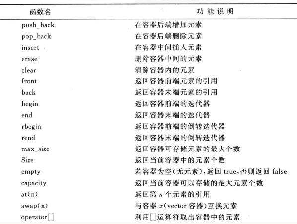
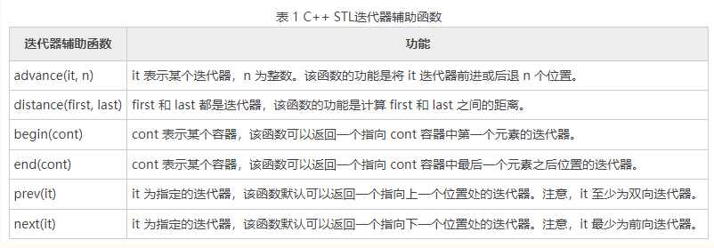

原文链接：http://www.cnblogs.com/codingbigdog/archive/2022/05/07/16243199.html
提交日期：Sat, 07 May 2022 08:53:00 GMT
博文内容：
请先看[这个](https://www.jianshu.com/p/29359030ef03)，然后再看本文
# 0.简介

容器的概念：容器就是类模板，此类模板是用来生成不同数据类型下的数据结构，如生成int型栈、char型栈等。容器是个类肯定包含对数据结构的操作，如进栈、出栈、获取栈中元素个数等。
容器一般都在命名空间std中，所以在#include<容器名>后， 一般还需要写using namespace std;


# 1.容器中一般都拥有的函数
容器中一般拥有以下的函数：
以下函数的具体使用直接参考[官方](http://www.cplusplus.com/reference/stl/)提供的代码实例，就可以很容易使用。
iterators：指向第一个元素和最后一个元素的 iterator，如begin、end、rbegin、rend等
size：元素个数、empty：是否为空
max_size： 容器的成员函数max_size()取得 STL容器的capacity属性，表示STL在发生realloc前能允许的最大元素数，也可以理解为预分配的内存空间。 例如一个vector<int> v的capacity为5，当插入第6个元素时，vector会realloc，vector内部数据会复制到另外一个内存区域。
front和back：返回第一个元素和最后一个元素
pop_front和pop_back：弹出第一个或最后一个元素
erase：擦除对应位置上的元素
swap：将两个对象的值进行交换
resize：通过删除后面的元素和增加零（或增加指定元素），来使对象中的元素变为指定大小
clear：清空对象
insert：在迭代器指向的位置插入元素
splice：将一个对象A中的连续的多个元素插入到另一个对象B中，此时这些元素在A中被删除。
remove：移除特定值的元素、remove_if移除满足条件的元素
unique：移除重复元素，或移除满足条件的元素
reverse：翻转元素顺序
merge：拼接已经排序好的两个对象时，输出的还是排序好的对象。拼接的两个对象其中有一或两个未排序好，则直接将两个对象拼接在一起。可以按指定条件拼接两个对象。
sort：将元素进行排序。除了容器本身带有的sort函数，我们还可以使用全局的::sort来实现排序。但是如果容器自带sort，使用自带的最好；如果容器没有自带sort，再使用全局的::sort。
assign：用于给容器分配元素，相当于初始化对象。
#　2.list
list（双向链表）：每个元素均有指针指向前一个元素和下一个元素（快速 插入或删除）。list 容器中的元素可以分散存储在内存空间里，而不是必须存储在一整块连续的内存空间中。不可通过[]访问元素（快速查找）。可使用push_back、pop_back、push_front、pop_front
```
#include <iostream>
#include <list>
using namespace std;
int main()
{	
	// 初始化list
	//std::list<double> values;  //创建空的 list 容器
	std::list<double> values(10, 5); // 创建了一个包含 10 个元素并且值都为 5 个 values 容器。

	//拷贝普通数组，创建list容器
	//int a[] = { 1,2,3,4,5 };
	//std::list<int> values(a, a + 5);

	//拷贝其它类型的容器，创建 list 容器
	//std::array<int, 5>arr{ 11,12,13,14,15 };
	//std::list<int>values(arr.begin() + 2, arr.end());//拷贝arr容器中的{13,14,15}

	//向容器中添加元素
	values.push_back(3.1);  // 也可使用push_front()在双向链表的前面添加元素
	values.push_back(2.2);
	cout << "values size：" << values.size() << endl;
	//对容器中的元素进行排序
	values.sort();
	//使用迭代器顺序输出list容器中的元素（不知道为什么这个才是顺序输出）
	for (std::list<double>::iterator it = values.end(); it != values.begin();) {
		std::cout << *(--it) << " ";
	}
	cout << std::endl;
	//使用迭代器倒序输出list容器中的元素
	for (std::list<double>::iterator it = values.begin(); it != values.end();++it) {
		std::cout << *it << " ";
	}
	return 0;
}
```


list是双向链表，那指向上一元素和下一个元素的指针是什么？？答：似乎没有提供这样的指针，只能使用迭代器进行访问。也就是说list是双向链表是指它的存储的采用的是双向链表的方式，从而让list 容器中的元素可以分散存储在内存空间里.
参考：[C++ list（STL list）容器完全攻略（超级详细）](http://c.biancheng.net/view/6892.html)
[c++官方STL手册](http://www.cplusplus.com/reference/stl/)

# 3.stack
stack和queue是不允许使用迭代器iterator，因为这会破坏栈和队列访问元素的特性。
```
// 栈的使用
stack<int> inStack;     // 定义
inStack.top();              // 取栈顶元素
inStack.push(1)          // 元素进栈
inStack.pop();            // 栈顶元素出栈
inStack.empty();        // 判断栈是否为空。为空时，返回true
```
# 4.vector
```
// vector（动态数组）的使用
void push_back(const T& x):向量尾部增加一个元素X
void pop_back():删除向量中最后一个元素
```
vector不可使用push_front和pop_front



# 5.deque（双端队列）
给vector分配的总空间都是2的整数倍。当扩充vector类型的数据时，如果发现空间不够，就会将数据搬移到一个更大的空间中去。新的空间大小是旧的空间的小的$2^n$倍（根据扩充的数据多少，选择最小的n）。在使用vector类型数据的时候，每次空间不够都需要将空间进行翻倍，这就会导致分配的空间可能有冗余，即有些空间没有被用。
deque（双端队列）：与vector类似，这里的双端指的是可以从数组的两端插入数据。从前端或后端以push_front()或push_back()添加元素。在增加数据元素时,如果deque容器内原先定义的内存空间不足,deque容器会将新增加的数据元素存储到另外一块内存中。可通过[]访问元素（快速查找）


# 6.map以及迭代器的使用
## 6.1.插入、查看、删除
map就是用来保存键值对的，即<key,value>。
元素的插入、查看、删除。这里我们以一个实际可运行的程序，进行说明，以便以后进行参考和使用。
```
#include<map>  //注意，STL头文件没有扩展名.h
#include<iostream>
#include<string>
using namespace std;

int main() {
	map<int, string> mapStudent;

	// 插入元素的三种方法
	// mapStudent.insert(pair<int, string>(0, "student_zero"));		// 不用纠结pair是什么，反正它就是这么写的
	// mapStudent.insert(map<int, string>::value_type(0,"student_zero"));
	mapStudent[0] = "student_zero";
	
	// 当使用insert插入的<key,value>时，mapStudent已经存在key了。此时insert不会生效
	pair<map<int, string>::iterator, bool> Insert_Pair;			// 接收插入失败的信息
	Insert_Pair = mapStudent.insert(map<int, string>::value_type(0, "student_one"));
	if (!Insert_Pair.second)
		cout << "Error insert new element" << endl;
	// mapStudent[0] = "student_one"; // 覆盖<0,"student_zero">为<0,"student_one">


	// 访问元素的两种方法
	//map<int,string>::iterator iter=  mapStudent.find(0);		// 使用迭代器访问元素
	//cout <<iter->first<<endl;		// 输出0
	//cout << iter->second << endl;    // 输出student_zero
	cout << mapStudent[0]<<endl;			// 数组方式访问元素。输出student_zero

	
	mapStudent[1] = "student_one";		// 插入新元素

	// 使用迭代器访问mapStudent中的所有元素
	map<int, string>::iterator iter;
	cout << "删除前" << endl;
	for (iter = mapStudent.begin(); iter != mapStudent.end(); iter++){
		cout << "iter->first:" << iter->first << "iter->second:" << iter->second << endl;
	}
		
	//int n =  mapStudent.erase(1);	// 删除key为1的元素。如果刪除了會返回1，否則返回0
	mapStudent.erase(mapStudent.begin(), mapStudent.end());//用迭代器范围刪除 : 把整个map清空
	cout << "删除后" << endl;
	for (iter = mapStudent.begin(); iter != mapStudent.end(); iter++) {
		cout << "iter->first:" << iter->first << "iter->second:" << iter->second << endl;
	}

	return 0;
}
```
pair的作用就是将两种类型包装成一个整体，具体可参考[链接](https://blog.csdn.net/sevenjoin/article/details/81937695)
## 6.2.map的操作函数总结
     C++ map是一种关联式容器，包含“关键字/值”对
     begin()         返回指向map头部的迭代器
     clear(）        删除所有元素
     count()         返回指定元素出现的次数, (帮助评论区理解： 因为key值不会重复，所以只能是1 or 0)
     empty()         如果map为空则返回true
     end()           返回指向map末尾的迭代器
     equal_range()   返回特殊条目的迭代器对
     erase()         删除一个元素
     find()          查找一个元素
     get_allocator() 返回map的配置器
     insert()        插入元素
     key_comp()      返回比较元素key的函数
     lower_bound()   返回键值>=给定元素的第一个位置
     max_size()      返回可以容纳的最大元素个数
     rbegin()        返回一个指向map尾部的逆向迭代器
     rend()          返回一个指向map头部的逆向迭代器
     size()          返回map中元素的个数
     swap()           交换两个map
     upper_bound()    返回键值>给定元素的第一个位置
     value_comp()     返回比较元素value的函数

## 6.3.map与vector的深拷贝
map1=map2和vec1 = vec2进行的就是深拷贝，vec1和vec2之间就没有关联，map1和map2之间就没有关联


#7.迭代器
迭代器：一种通用的方法访问具有不同结构的各种容器中的每个元素，是广义的指针。每种容器定义自己的迭代器，如list<T>::iterator、vector<T>::iterator

迭代器++是找到下一个元素，迭代器－－是找到上一个元素。
在双向链表list中，我们可以知道下一个元素就是next所指元素，上一个元素就是prev所指元素。list的迭代器的++操作，就会访问list节点对应的next指针。也就是说list的迭代器的++与指针的++不一样，后者只是地址的增加，而迭代器会根据具体的容器类型执行不同的“++”操作，迭代器是相当于一个智能指针。

其他三种迭代器：reverse_iterator（用于反向遍历）,const_iterator（返回一个常数值）,const_reverse_iterator

#8.操作容器的通用函数
操作容器的通用函数在<algorithm>头文件中定义，以函数模板的形式给出，使用迭代器对数据进行访问。
如果容器有自带某种函数，那么优先使用自带的。如：对于vector对象a，可使用a.sort()进行排序，就不要使用<algorithm>中的sort进行排序。


#其他
**1.emplace、emplace_front、emplace_back和push、push_front、push_back的区别：**
```
S.push(data(1,2));
S.emplce(data(1,2)); // push可以怎么使用，emplace就可以怎么使用。反之，不行。
S.emplce(1,2);  // 与S.emplce(data(1,2));等价，但是由于没有创建data(1,2)所以就节省了内存
```
注意：emplace_back(type) 对应 push_back(type)
emplace(i, type) 对应于 insert(type, i)
emplace_front(type) 对应于 push_front()
但是！对于stack 和 queue，只有push操作，所以也只有emplace操作，此时它们是相对应的。

详细讲解见：[STL - emplace 与 push 的区别](https://blog.csdn.net/Kprogram/article/details/82055673)


**2.STL迭代器辅助函数**



参考：[C/C++中深浅拷贝(map、vector)与内存释放](https://blog.csdn.net/hanxiaoyong_/article/details/112150777)
[C++ map用法总结（整理）](https://blog.csdn.net/sevenjoin/article/details/81943864)
[C++ 教程](https://www.w3cschool.cn/cpp)
[C++中的STL中map用法详解](https://www.cnblogs.com/fnlingnzb-learner/p/5833051.html)
C++语言程序设计教程 第3版  沈显君 