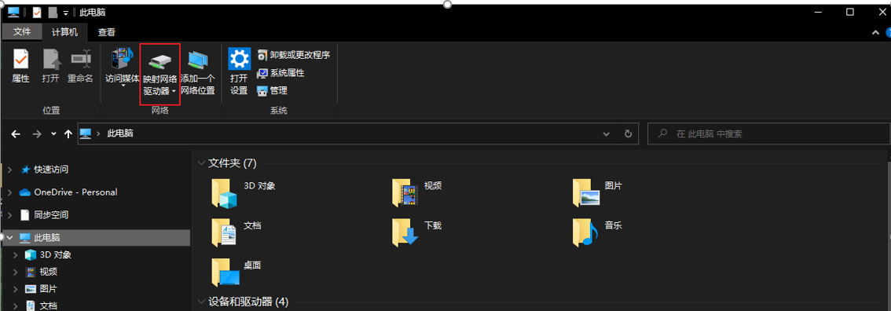
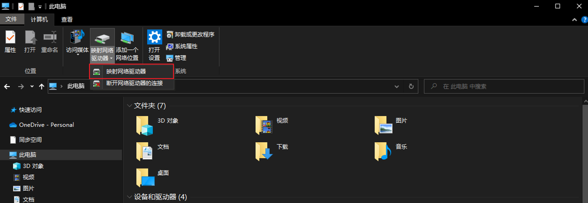
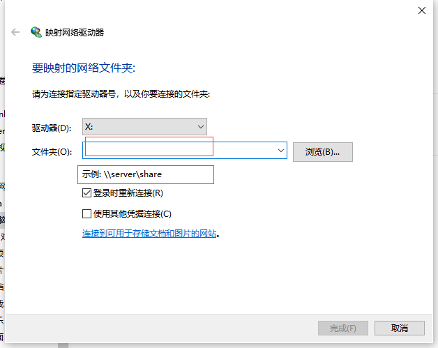

原文链接：http://www.cnblogs.com/codingbigdog/archive/2022/09/05/16659848.html
提交日期：Mon, 05 Sep 2022 14:26:00 GMT
博文内容：
# 1. Ubuntu中挂载使用nas服务器

在将nas挂载到ubuntu上前，首先要将ubuntu系统的ip修改为和nas在同一个网段，ubuntu修改ip的命令如下：
sudo ifconfig ens33 192.168.1.31 netmask 255.255.255.0  【临时方法，重启后会失效】【参考：[链接](https://blog.csdn.net/davidhzq/article/details/102991577)】


[本博客的方法三亲测有效](https://blog.csdn.net/ShareProgress/article/details/121033909)
要注意nas地址和本地地址的格式，如：
我的nas地址为：//ip地址/share   【//不要漏写了】【share为nas中的文件名】
本地地址：使用绝对地址，如/home/ubuntu1/nas

上面临时修改ip，重启以后ip会被修改回去，此时挂载会断掉，重启以后就需要重新修改ip和执行挂载命令：
```
sudo ifconfig ens33 192.168.1.31 netmask 255.255.255.0 # 修改ip
sudo mount -a  # 执行挂载，使得/etc/fstab生效
```

# 2. windows中挂载使用nas服务器
在将nas挂载到windows上前，首先要将windows系统的ip修改为和nas在同一个网段，具体自己百度。

挂载流程如下：




按照示例输入地址：

最后在弹出的窗口中输入用户名和密码。
挂载成功，即可看到自己的存储盘。
