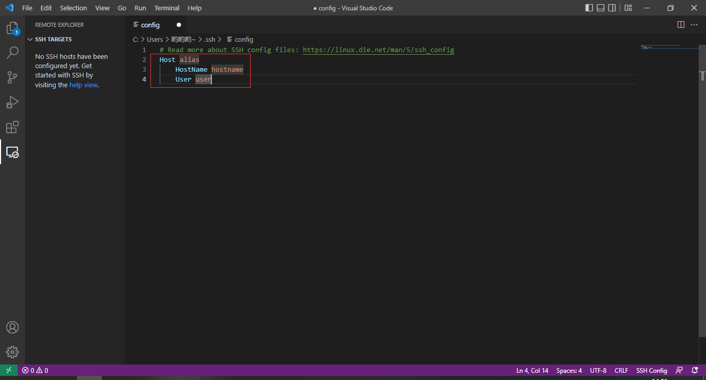
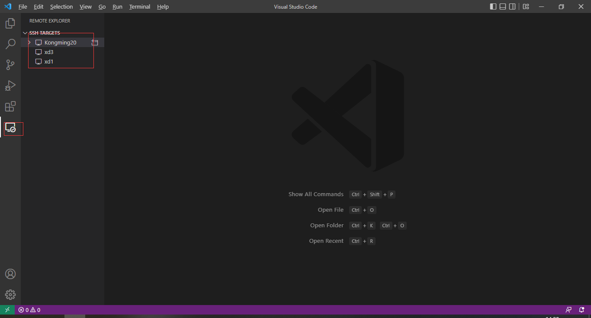

原文链接：http://www.cnblogs.com/codingbigdog/archive/2022/07/29/16533723.html
提交日期：Fri, 29 Jul 2022 14:07:00 GMT
博文内容：

### 0.服务器开启ssh
自己有服务器，如果要通过vscode进行连接，就需要先在服务器上先开启ssh服务。
请参考[链接](https://blog.csdn.net/qq_45164331/article/details/122533327)


### 1.下载和安装
下载：https://code.visualstudio.com/Download
推荐使用上述官网网址下载
百度直接搜到的vscode，大多是第三方的下载地址，建议别用。

### 2.安装remote ssh和编辑配置文件
搜索remote ssh：


然后点击如下区域：


出现配置文件如下：


配置文件说明：
```
Host 名称            # 自己随便取的
    HostName ip     # 服务器ip
    Port 22         # 通过ssh连接服务器，服务器必须开启ssh
    User   name     #  linux用户名称
```
【注】上面的配置文件中HostName、Port和User前面是一个<Tab>
保存配置文件后，出现类似下图的结果：

上图中有三个服务器，右击服务器，即可选择打开，如下：

然后就会提示输入密码，正确输入密码以后，就可以打开终端操作服务器了。


### 3.打开终端


进入项目目录下，执行code .   ,即可在当前目录下开启vscode：


输入密码以后，可以看到：


然后我们就可以对服务器文件进行远程操作。
我们还可以直接拖动本地文件到目录下，从而将文件上传到服务器。
我们还可以右击文件，点击下载，将服务器文件下载到本地。

【注】多人同时连接一台服务器的相同账户的时候，可能会出现有人关闭\开启vscode，其他人也会自动关闭\开启一个vscode

### 4.vscode常用快捷键
|快捷键|含义|
| ---- | ---- | 
|    Ctrl P  | 快速查找并打开某个文件     | 
|   Ctrl F   |   在当前文件里搜索字符串    | 
|Ctrl shift F | 在当前工作目录的所有文件里搜索某个字符串 |
|Ctrl + ` |快速打开或关闭终端|
|Alt + / | 快速切换到debug界面（如果在调试状态）|
|Ctrl + B | 快速打开或关闭侧边栏|


### 5.python和C++插件
python和C++插件：


### 6.python和C++调试配置(tasks.json 和 launch.json)

在项目所在文件夹下建立.vscode文件夹，在.vscode中建立launch.json和tasks.json：

C++调试配置：https://www.cnblogs.com/codingbigdog/p/16459417.html
python调试配置：https://www.cnblogs.com/codingbigdog/p/16282625.html

### 7.其他配置


### 问题

tasks.json 和 launch.json、c_cpp_properties.json、settings.json 
这个都是干嘛的？

python和C++的调试配置可以放在同一个launch.json中。
