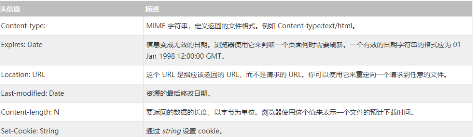
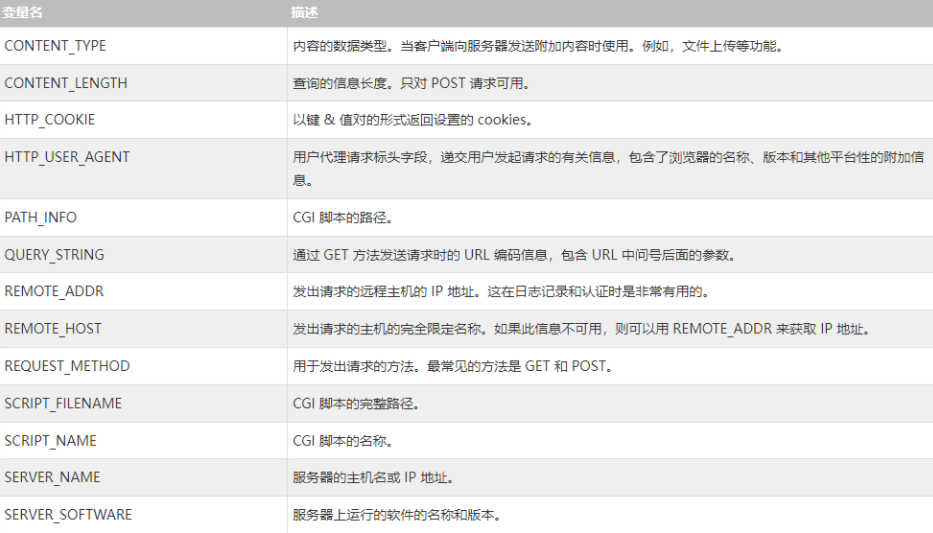

原文链接：http://www.cnblogs.com/codingbigdog/archive/2022/05/07/16243212.html
提交日期：Sat, 07 May 2022 08:55:00 GMT
博文内容：
# 1.CGI简介
##　1.1.简介和环境配置
公共网关接口（CGI），是一套标准，定义了信息是如何在 Web 服务器和客户端脚本之间进行交换的。CGI 程序包括网络通信的客户端和服务器。CGI 程序可以用 Python、PERL、Shell、C 或 C++ 等进行编写。
Apache（音译为阿帕奇）是世界使用排名第一的Web服务器软件

参考[CGI环境配置（Ubuntu）](https://www.cnblogs.com/paopaolx/p/14275964.html)，进行CGI环境配置。如果出现问题，建议重头再试来一遍。
C++的可执行文件放在/var/www/html/cgi-bin/目录下。除了C++的可执行文件外，/var/www/html/cgi-bin/目录下还可以存放各种各样的脚本程序。
## 1.2.第一个 CGI 程序：
在/var/www/html/cgi-bin/目录创建helloworld.cpp为文件，文件内容如下：
```
#include <iostream>
using namespace std;
 
int main ()
{
    
   cout << "Content-type:text/html\r\n\r\n";    cout << "<html>\n";
   cout << "<head>\n";
   cout << "<title>Hello World - 第一个 CGI 程序</title>\n";
   cout << "</head>\n";
   cout << "<body>\n";
   cout << "<h2>Hello World! 这是我的第一个 CGI 程序</h2>\n";
   cout << "</body>\n";
   cout << "</html>\n";
   
   return 0;
}
```
编译helloworld.cpp，并给可执行文件helloworld.cgi赋予相关权限：
```
gcc helloworld.cpp -o helloworld.cgi
chmod 755 helloworld.cgi
```

## 1.3.HTTP 头信息：



## 1.4.CGI 环境变量


所有的 CGI 程序都可以访问下列的环境变量。这些变量在编写 CGI 程序时扮演了非常重要的角色。


# 2.C++ CGI 库的使用
## 2.1.安装 CGI 库
这个cgicc库，似乎是个几百年前的库，感觉现在学，没有什么意义。


参考：[C++ Web 编程](https://www.w3cschool.cn/cpp/cpp-web-programming.html)·