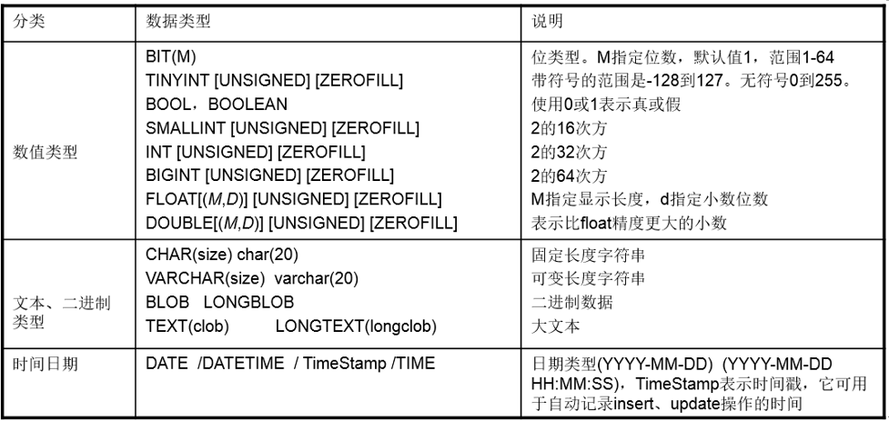

原文链接：http://www.cnblogs.com/codingbigdog/archive/2022/06/06/16349594.html
提交日期：Mon, 06 Jun 2022 12:31:00 GMT
博文内容：
# 1.安装mysql和启动
本人采用源码方式进行安装，请参考：[链接](https://blog.csdn.net/weixin_42973678/article/details/100107986)

一些说明：
**1.用户组与用户**
```
groupadd mysql # 创建用户组
useradd -g mysql mysql # 创建用户mysql，并将用户mysql指定给用户组mysql。-g指定用户组，后面跟着用户名。
mkdir /usr/local/mysql/data
chown -R mysql /usr/local/mysql # 修改文件和目录的所属用户。-R处理指定目录以及其子目录下的所有文件
chgrp -R mysql /usr/local/mysql # chgrp命令:修改文件和目录的所属组
```

**2.oracle与mysql**
oracle数据库中有多个用户，每个用户多张表
MySQL数据库只有一个用户(root), 有多个数据库,每个数据库下有多张表。【这里的root用户不是指linux下的root用户，而是指mysql中有一个称为root的用户】

**3.启动mysql：**
```
systemctl  restart mysqld # 重启MySQL服务

systemctl  status mysqld  # 查看MySQL服务状态

systemctl stop mysqld  # 停止MySQL服务

systemctl start mysqld # 启动MySQL服务

# 登录MySQL数据库有以下两种方法：
sudo mysql 
# 或
mysql -u root -p
```

# 2.CURD 
## 2.1.数据库CURD 

对数据库进行增(Create)、改(Update) 、查(Retrieve) 、删(Delete)操作。

### 2.1.1.创建数据库
```
CREATE {DATABASE | SCHEMA} [IF NOT EXISTS] db_name
    [create_specification [, create_specification] ...]
```
- IF NOT EXISTS 表示只有数据库不存在的时候才创建，如果存在同名就不再执行该语句
- Create specification是建库的一些选项

下面时创建数据库的一些实例：
```
1)创建一个名称为mydb1的数据库。
create database mydb1;
2)创建一个使用utf-8字符集的mydb2数据库。
create database mydb2 character set utf8;
3)创建一个使用utf-8字符集，并带校对规则的mydb3数据库，校对规则会对存入的数据进行检查。
create database mydb3 character set utf8 collate utf8_general_ci;
```

### 2.1.2.查看数据库
```
show databases; # 显示所有数据库
show create database mydb2;  # 显示创建数据库时使用的语句信息
 “ ` ”（ESC键 下面的按键），表示反引号，默认情况下，反引号括起来的字符串，区分大小写。

show create database mydb1;
注意 ：mysql默认语言集是latin1，每次在创建数据库的时候应指定字符集。Oracle是在安装时，即指定了字符集。
```

### 2.1.3.修改和删除数据库
```
alter database mydb1 character set utf8; # 修改mydb1的字符集为utf8(不能修改数据库名) 

drop database mydb3; # 删除数据库mydb3
```


## 2.2.表的CURD
对表本身进行操作：创建，查看，修改，删除

### 2.2.1.创建表
```
use mydb2; # 在mysql中对表操作前，必须先选择所使用的数据库。
show tables; # 查看表的内容
show create table t1; # 查看创建表的语法。ENGINE=InnoDB 默认指定的存储引擎 innoDB。
```

mysql中的数据类型：



- bit     1位　	可以指定位数，如：bit(3)
- int     2字节 	可以指定最大位数，如：int<4>　最大为4位的整数
- float   2个字节　可以指定最大的位数和最大的小数位数，如：float<5,2> 最大为一个5位的数，小数位最多2位 
- double　4个字节　可以指定最大的位数和最大的小数位数，如：float<6,4> 最大为一个6位的数，小数位最多4位
- char　  必须指定字符数,如char(5) 为不可变字符　即使存储的内容为'ab',也是用5个字符的空间存储这个数据
- varchar　必须指定字符数,如varchar(5) 为可变字符　如果存储的内容为'ab',占用2个字符的空间；如果为'abc',则占用3个字符的空间
- text: 大文本(大字符串)
- blob：二进制大数据　如图片，音频文件，视频文件
- date: 日期　如：'1921-01-02'
- datetime: 日期+时间　如：'1921-01-02 12:23:43'
- timeStamp: 时间戳，自动赋值为当前日期时间

创建一个员工表：
```
create table employee(empno int, ename varchar(20), sal int);
show create table employee;  # 查看创建employee表时使用了什么命令
```

### 2.2.2.查看表
```
show tables; # 查看所有的表
show create table employee; # 查看指定表的创建语句 # 注意，mysql表名称区分大小写, 对列名不区分大小写
desc employee; # 显示指定表的结构：
```
### 2.2.3.修改表
```
更改表名：    rename table employee to worker;
增加一个字段： alter table employee add column height double;  （column关键字在Oracle中，添加则语法错误）
修改一个字段：alter table employee modify column height float;
删除一个字段：alter table employee drop column height;
修改表的字符集:alter table employee character set gbk;
show create table employee; # 从这里可以查看修改表的字符集的结果
```

### 2.2.4.删除表
```
删除employee表:
drop table employee;	 (MySQL中不能使用purge，添加会出现语法错误)
```


## 2.3.表数据的CURD	

### 2.3.1.create数据
```
创建一个员工表，新建employee表并向表中添加一些记录：
create table employee(
id int,
name varchar(20),
sex int,
birthday date,
salary double,
entry_date date,
resume text
);
insert into employee values(1,'张三',1,'1983-04-27',15000,'2012-06-24','一个大牛');
insert into employee(id,name,sex,birthday,salary,entry_date,resume) values(2,'李四',1,'1984-02-22',10000,'2012-07-24','一个中牛');
insert into employee(id,name,sex,birthday,salary,entry_date,resume) values(3,'王五',0,'1985-08-28',7000,'2012-08-24','一个小虾');
```

### 2.3.2	update数据 
```
将所有员工薪水都增加500元。
update employee set salary=salary+500;
将王五的员工薪水修改为10000元，resume改为也是一个中牛
update employee set salary=10000, resume='也是一个中牛' where name='王五';
```

### 2.3.3.delete数据 
```
删除表中姓名为王五的记录。
delete from employee where name='王五';		【注意from不能省略】
删除表中所有记录。
delete from employee; 
使用truncate删除表中记录。
truncate table employee;--无条件 效率高
```

### 2.3.4.Retrieve数据
```
查询员工的年收入：
	select id, name as "名字", salary "月薪", salary*12 年薪  from employee where id >=2;
```


# 3. c语言连接mysql数据库
## 3.1.找到所需的头文件和库文件

找到头文件mysql.h和库文件libmysqlclient.a
1. 找到对应的头文件

   >[root@deng ~]# locate mysql.h
   >**/usr/include/mysql/mysql.h**  <---对应的头文件
   >/usr/share/doc/rsyslog-5.8.10/ommysql.html
   >/usr/share/doc/rsyslog-5.8.10/rsyslog_mysql.html

2. 找到对应的库文件

   >[root@deng ~]# locate libmysqlclient.a
   >**/usr/lib64/mysql/libmysqlclient.a**  # .a文件代表静态库    


## 3.2.编程步骤

1. 通过调用mysql_init()初始化连接处理程序，得到句柄
2. 通过调用mysql_real_connect()连接到服务器。
3. 发出SQL语句并处理其结果。
4. 通过调用mysql_close()，关闭与MySQL服务器的连接。


## 3.3.初始化和连接到MySQL

mysql_init函数

```C
MYSQL *mysql_init(MYSQL *mysql) 
功能:
	分配或初始化与mysql_real_connect()相适应的MYSQL对象。如果mysql是NULL指针，该函数将分配、初始化、并返回新对象。
        否则，将初始化对象，并返回对象的地址。如果mysql_init()分配了新的对象，当调用mysql_close()来关闭连接时。将释放该对象。

参数:
	mysql: 一般填写NULL, 会自动分配 初始化和返回对象

返回值:
	初始化的MYSQL*句柄。如果无足够内存以分配新的对象，返回NULL。
	
	
```


mysql_close函数:

```C
void mysql_close(MYSQL *mysql) 
功能:
	关闭前面打开的连接。如果句柄是由mysql_init()或mysql_connect()自动分配的，mysql_close()还将解除分配由mysql指向的连接句柄
	
参数:
	mysql:  是mysql_init的返回值

返回值:
	无
```


mysql_real_connect函数

```C
MYSQL *mysql_real_connect(MYSQL *mysql, const char *host, const char *user, const char *passwd, 
                        const char *db, unsigned int port, const char *unix_socket, unsigned long client_flag) 

功能:
	mysql_real_connect()尝试与运行在主机上的MySQL数据库引擎建立连接。在你能够执行需要有效MySQL连接句柄结构的任何其他API函数
        之前，mysql_real_connect()必须成功完成。

参数:
	mysql: mysql_init返回值, 初始化好的句柄
	host: 主机名或IP地址
	user: 数据库用户名
	passwd: 数据库对应用户名的密码
	db: 数据库名称
	port: 0表示使用默认的端口
	unix_socket: 一般填写NULL
	client_flag: 通常为0

返回值:
	如果连接成功，返回MYSQL*连接句柄。如果连接失败，返回NULL。对于成功的连接，返回值与第1个参数的值相同。

```


测试代码:

```C
#include <stdio.h>
#include <string.h>
#include <stdlib.h>
#include <mysql/mysql.h>

#define _HOST_ "127.0.0.1"
#define _USER_ "root"
#define _PASSWD_ "123456"
#define _DB_ "scott"

//初始化  关闭
int main(void)
{
    MYSQL *mysql = NULL;

    //1. 初始化一个句柄
    mysql = mysql_init(NULL);
    if (NULL == mysql)
    {
        printf("mysql_init failed...\n"); 
        return 1;
    }
    printf("mysql_init ok....\n");

    
    //2. 连接mysql数据库
    mysql = mysql_real_connect(mysql, _HOST_, _USER_, _PASSWD_, _DB_, 0, NULL, 0); 
    if (NULL == mysql)
    {
        printf("连接mysql数据库失败...\n"); 
    }
    else
    {
        printf("连接mysql数据库成功....\n"); 
    }


    //3. 关闭连接
    mysql_close(mysql);    

    return 0;
}

```

编译方法:
```
gcc testMysql.c -I  /home/xxx/software/mysql_5_7/include/ -L  /home/xxx/software/mysql_5_7/lib/ 
        -l mysqlclient -Wl,-rpath=/home/xxx/software/mysql_5_7/lib/
```
/home/xxx/software/mysql_5_7为mysql的安装路径（我使用的是源码安装的方法）


## 3.4.执行SQL语句(增删改查)

mysql_query函数

```C
int mysql_query(MYSQL *mysql, const char *query) 
功能:
	执行由“Null终结的字符串”查询指向的SQL查询。正常情况下，字符串必须包含1条SQL语句，而且不应为语句添加终结分号（‘;’）或
        “\g”。如果允许多语句执行，字符串可包含多条由分号隔开的语句

参数:
	mysql: 是mysql_real_connect连接成功之后的句柄
	query: 对应的SQL语句
	
返回值:
	如果查询成功，返回0。如果出现错误，返回非0值。 

```
执行插入的代码:

```c
#include <stdio.h>
#include <string.h>
#include <stdlib.h>
#include <mysql/mysql.h>

#define _HOST_ "192.168.73.36"
#define _USER_ "root"
#define _PASSWD_ "123456"
#define _DB_ "scott"

#define SIZE 128

//初始化  关闭
int main(void)
{
    int ret = -1;

    MYSQL *mysql = NULL;

    char buf[SIZE];

    //1. 初始化一个句柄
    mysql = mysql_init(NULL);
    if (NULL == mysql)
    {
        printf("mysql_init failed...\n"); 
        return 1;
    }
    printf("mysql_init ok....\n");

    
    //2. 连接mysql数据库
    mysql = mysql_real_connect(mysql, _HOST_, _USER_, _PASSWD_, _DB_, 0, NULL, 0); 
    if (NULL == mysql)
    {
        printf("连接mysql数据库失败...\n"); 
    }
    else
    {
        printf("连接mysql数据库成功....\n"); 
    }

    //3. 执行SQL语句
    memset(buf, 0, SIZE);
    strcpy(buf, "insert into dept values(3, '3name', '3loc')");
    ret = mysql_query(mysql, buf);
    if (0 != ret)
    {
        printf("mysql_query failed....\n"); 
    }
    else
    {
        printf("执行SQL语句ok....\n");
    }


    //4. 关闭连接
    mysql_close(mysql);    

    return 0;
}
```
其他操作自己看手册，或者百度。


# C++链接数据库
C++使用Connector/C++连接数据库
[链接](https://blog.csdn.net/hbtj_1216/article/details/51168596)


学会使用官方提供的文档
