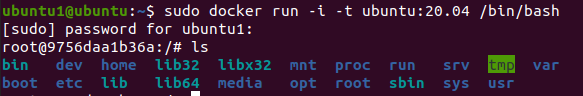

原文链接：http://www.cnblogs.com/codingbigdog/archive/2022/07/29/16533716.html
提交日期：Fri, 29 Jul 2022 14:06:00 GMT
博文内容：


#　1.介绍和安装
安装：参考菜鸟教程的手动安装进行安装。[菜鸟教程](https://www.runoob.com/docker/docker-tutorial.html)

docker的目的：代码下载下来以后，要配置代码所需的依赖，这很麻烦。所以将代码和代码所需的依赖包装在一个称作为镜像的东西里面，然后我们直接将镜像下载下来，运行这个镜像就相对于运行了代码。

镜像（Image）：Docker 镜像（Image），**就相当于是一个 root 文件系统，文件系统中存储有代码和代码所需依赖**。比如官方镜像 ubuntu:16.04 就包含了完整的一套 Ubuntu16.04 最小系统的 root 文件系统。
容器（Container）：镜像（Image）和容器（Container）的关系，就像是面向对象程序设计中的类和实例一样，镜像是静态的定义，容器是镜像运行时的实体。容器可以被创建、启动、停止、删除、暂停等。

看一下是不是文件系统：
```
sudo docker run -i -t ubuntu:20.04 /bin/bash
```
结果：


参数：
-t: 在新容器内指定一个伪终端或终端。
-i: 允许你对容器内的标准输入 (STDIN) 进行交互。
/bin/bash：代表在“root@712f2e8b8439:/#”下输入的脚本，使用/bin/bash来解释执行。

[docker 命令每次都需要sudo解决方案](https://blog.csdn.net/Saladbobo/article/details/119750929)

# 2.使用docker部署一个简单的c/c++程序
请直接参考：[使用docker部署一个简单的c/c++程序](https://blog.csdn.net/weixin_43142797/article/details/105895167)

说明：
本博客中使用的镜像codenvy/cpp_gcc应该就是在ubuntu镜像中的相关目录下添加了g++相关的配置环境而已。

查看镜像和容器：
```
docker images   # 列出镜像列表
docker ps -a    # 查看正在运行和已经停止的容器
```
删除镜像和容器：
```
docker rm -f 容器ID或名字   # 删除容器
docker rmi 镜像ID或名字     # 删除镜像
```

上传镜像到远程：
```
docker login    # 登录
docker push REPOSITORY名称或IMAGE ID  # 上传
# 拉取远程镜像
```


# 3.零基础手写一个 Docker（未完）

总结：[零基础手写一个 Docker](https://www.bilibili.com/video/BV1K44y1j7DV)，如下：

## 3.1 chroot
chroot的作用是:改变进程的根目录，使它不能访问该目录之外的其它文件。

进程运行时使用的根目录，叫rootfs (根文件系统)。在linux系统中，进程运行时默认使用的rootfs就是linux的文件系统，即进程运行时，默认从linux的文件系统中查找程序运行的相关依赖。chroot的作用就是改变进程使用的rootfs。


chroot NEWROOT [COMMAND [ARCG]..]
●NEWROOT:表示要切换到的新root目录
●COMMAND：指的是切换root目录后需要执行的命令


复制linux的ls和bash到chroot指定的文件系统中进行使用：
```
mkdir rootfs_dir_1
cd rootfs_dir_1

# 定位可执行文件ls和bash所在目录
which ls    
/usr/bin/ls
which bash
/usr/bin/bash

# 复制linux的ls和bash到chroot指定的文件系统中
mkdir bin
cp /usr/bin/ls bin
cp /usr/bin/bash bin

# 进入文件系统rootfs_dir_1，并执行/bing/ls
sudo chroot ../rootfs_dir_1 /bin/ls
chroot: failed to run command ‘/bin/ls’: No such file or directory # 找不到执行ls所需要的依赖库，所以报错


file bin/ls  # 查看ls的信息
bin/ls: ELF 64-bit LSB shared object, x86-64, version 1 (SYSV), dynamically linked, interpreter /lib64/ld-linux-x86-64.so.2, BuildID[sha1]=2f15ad836be3339dec0e2e6a3c637e08e48aacbd, for GNU/Linux 3.2.0, stripped
# 可以看到ls是动态链接的执行程序
# bash同理，也是动态链接的执行程序


# 查看ls和bash所依赖的动态库：
ldd /bin/ls
        linux-vdso.so.1 (0x00007fff9ffa5000)
        libselinux.so.1 => /lib/x86_64-linux-gnu/libselinux.so.1 (0x00007faf2031a000)
        libc.so.6 => /lib/x86_64-linux-gnu/libc.so.6 (0x00007faf20128000)
        libpcre2-8.so.0 => /lib/x86_64-linux-gnu/libpcre2-8.so.0 (0x00007faf20098000)
        libdl.so.2 => /lib/x86_64-linux-gnu/libdl.so.2 (0x00007faf20092000)
        /lib64/ld-linux-x86-64.so.2 (0x00007faf2037e000)
        libpthread.so.0 => /lib/x86_64-linux-gnu/libpthread.so.0 (0x00007faf2006f000)

ldd /bin/bash
        linux-vdso.so.1 (0x00007ffd9cde5000)
        libtinfo.so.6 => /lib/x86_64-linux-gnu/libtinfo.so.6 (0x00007f001de6b000)
        libdl.so.2 => /lib/x86_64-linux-gnu/libdl.so.2 (0x00007f001de65000)
        libc.so.6 => /lib/x86_64-linux-gnu/libc.so.6 (0x00007f001dc73000)
        /lib64/ld-linux-x86-64.so.2 (0x00007f001dfdb000)

mkdir lib
mkdir lib64
```
编写cp.sh脚本将依赖库复制到rootfs_dir_1的相应目录下，cp.sh内容如下:
```
cp /lib/x86_64-linux-gnu/libselinux.so.1 /lib/x86_64-linux-gnu/libc.so.6 /lib/x86_64-linux-gnu/libpcre2-8.so.0  /lib/x86_64-linux-gnu/libdl.so.2  /lib/x86_64-linux-gnu/libpthread.so.0 lib/
cp /lib64/ld-linux-x86-64.so.2 lib64/

cp  /lib/x86_64-linux-gnu/libtinfo.so.6 /lib/x86_64-linux-gnu/libdl.so.2  /lib/x86_64-linux-gnu/libc.so.6 lib/

cp /lib64/ld-linux-x86-64.so.2 lib64/
```
运行cp.sh
```
sh cp.sh
```
重新运行/bin/ls和/bin/bash，运行成功，如下：
```
sudo chroot ../rootfs_dir_1 /bin/ls
bin  cp.sh  lib  lib64

sudo chroot ../rootfs_dir_1 /bin/bash   # 开启一个shell
bash-5.0# 
bash-5.0# ls
bin  cp.sh  lib  lib64
bash-5.0# exit   # 退出
```
进入bash-5.0#之后运行的ls，指是rootfs_dir_1/bin/ls，即使用bash进入shell以后，然后输入ls，此时shell就会在当前文件系统的bin目录（rootfs_dir_1/bin）中查找可以执行文件ls。

运行sudo chroot ../rootfs_dir_1 ，会自动查找rootfs_dir_1/bin目录下是否有bash可执行文件，用于开启一个shell，如下：
```
sudo chroot ../rootfs_dir_1  # 开启一个shell
bash-5.0# 
```

sudo chroot ../rootfs_dir_1 /可执行文件A：这样的程序只会在执行完，可执行文件A后，就退出了文件系统rootfs_dir_1。
rootfs_dir_1被当成了根目录，然后 “/可执行文件A”代表执行根目录下的可执行文件A。

## 3.2 busybox【安装错了】
busybox是一个集成了一百多个最常用linux命令和工具的软件，甚至还集成了一个http服务器和一个telnet服务器,而所有这一切功能却只有1M左右的大小适用于
●嵌入式设备
●移动设备(安卓)
●超小的linux发行版(alpine linux）

根据[busybox安装](https://blog.csdn.net/m0_48958478/article/details/121628631)配置安装环境，但是这篇文章中未将busybox安装到指定目录中，从这篇文章([安装busybox到指定目录下](https://blog.csdn.net/lly374685868/article/details/80611741))可以知道如何指定安装目录。请将两篇文章结合起来看，然后再进行安装。

```
busybox ls  # 执行busybox中的ls命令
```

busybox安装在busybox目录下：
```
sudo chroot ./busybox /bin/ls
chroot: failed to run command ‘/bin/ls’: No such file or directory
```
我发现直接执行./busybox/bin/ls是可以运行的，但是却出现上面的错误。这是因为./busybox/bin/ls依赖的动态库不在busybox目录下，而在linux系统的lib目录下：
```
ldd busybox/bin/ls
        linux-vdso.so.1 (0x00007ffed202a000)
        libm.so.6 => /lib/x86_64-linux-gnu/libm.so.6 (0x00007f919ffff000)
        libresolv.so.2 => /lib/x86_64-linux-gnu/libresolv.so.2 (0x00007f919ffe3000)
        libc.so.6 => /lib/x86_64-linux-gnu/libc.so.6 (0x00007f919fdf1000)
        /lib64/ld-linux-x86-64.so.2 (0x00007f91a026d000)
```

busybox的安装方法还是有问题，待解决。。。。。


## 3.3 其他
容器访问网络方式：
veth、 bridge网桥、NAT

容器会对进程所能使用的CPU资源设置上限，一旦超过上限，就会跑不了。


容器的基石：
rootfs做文件系统，namespace 做隔离，cgroup 做限制，分层镜像

rootfs
namespace
cgroup
veth/bridge/nat
AUFS

# 问题
问题：
docker hub中的库和镜像的区别？
一个库中可以存多个镜像？
tag是什么？
