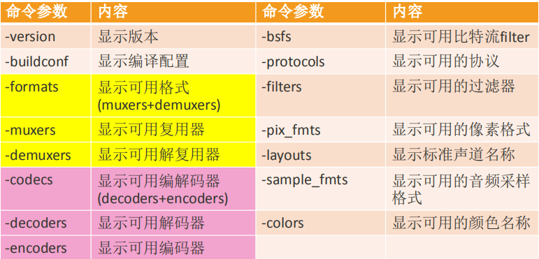
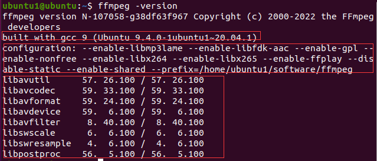
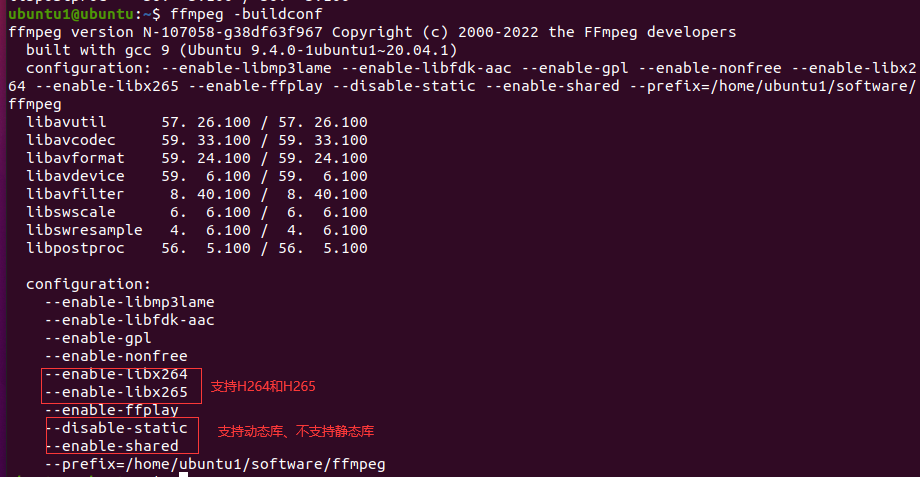
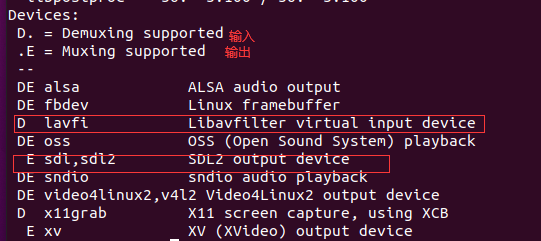
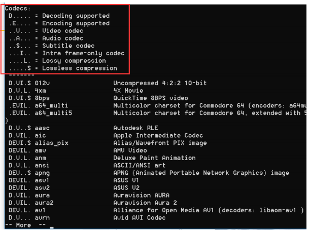
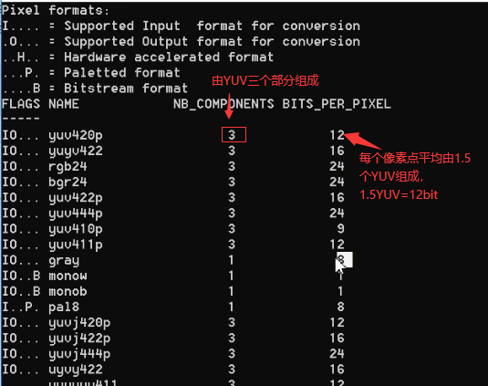
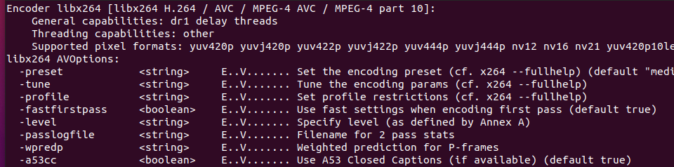
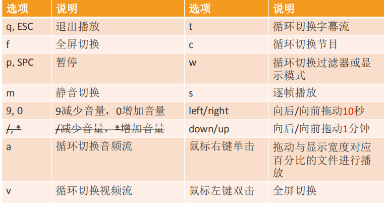
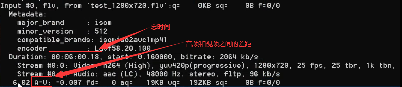

原文链接：http://www.cnblogs.com/codingbigdog/archive/2022/06/08/16357163.html
提交日期：Wed, 08 Jun 2022 12:52:00 GMT
博文内容：
# 1.ffmpeg、ffplay和ffprobe基础介绍

ffmpeg:Hyper fast Audio and Video encoder 超快音视频编码器
ffplay:Simple media player 简单媒体播放器
ffprobe:Simple multimedia streams analyzer 简单多媒体流分析器

## 1.1.ffmpeg、ffplay和ffprobe帮助文档


**ffmpeg查看帮助文档：**
```
基本信息：ffmpeg -h
高级信息：ffmpeg -h long
所有信息：ffmpeg -h full
若嫌打印过多： ffmepg -h full > ffmpeg_h_full.log，然后再打开ffmpeg_h_full.log文件查看
```

**ffmpeg命令格式：**
```
ffmpeg [options] [[infile options] -i infile]... {[outfile options] outfile}...
options代表全局选项，[infile options]代表离它们最近的输入文件的选项，可以有很多个[[infile options] -i infile]。[outfile options] outfile同理
```

**ffplay与ffprobe：**
```
ffplay -h  # ffplay命令查看帮助文档
ffplay [options] input_file # 命令格式

ffprobe -h  # ffprobe命令查看帮助文档
ffprobe [OPTIONS] [INPUT_FILE] # 命令格式
```
ffmpeg/ffplay/ffprobe部分参数通用，部分参数不通用，在使用时需要注意。


## 1.2.ffmpeg和ffplay基本命令
### 1.2.1.ffmpeg基本查询命令


一些命令的补充解释：
-devices：查询系统中可用摄像头和音频设备
-bsfs：ffmpeg支持处理比特流的信息，此命令用于查询支持哪些比特流。
-protocols：ffmpeg支持处理网络文件，此命令用于查询支持哪些协议
-filters：比如加水印、去水印
-pix_fmts：查询可用哪些格式存储图片
-sample_fmts：使用多少位来存储一个采样，如8位、16位、 32位（浮点型）
-layouts：如双声道、单声道、立体声（三个声道以上称为立体声）

**查询命令的作用：**
比如我们需要将音频输出成mp3格式，那么我们就需要查询mp3对应的编码器：
```
ffmpeg -encoders |grep mp3   # 查询mp3的编码器
# 输出
A....D libmp3lame           libmp3lame MP3 (MPEG audio layer 3) (codec mp3)

# 通过以下命令输出MP3格式的音频文件
ffmpeg -i test.mp4 -b:a 192k -ar 48000 -ac 2 -acodec libmp3lame -aframes 200 out.mp3
```

**下面对各个命令进行介绍：**

ffmpeg -version

除了显示版本信息以外，还显示了一些其他信息。即：
**不管使用ffmeg的什么命令，都会打印ffmpeg是使用什么编译器建立的、建立时采用的配置和库的版本信息。**


ffmpeg -buildconf


ffmpeg -devices

**查询命令：一般都会在最开始，说明各种字母代表的意思，比如这里的D和E**


ffmpeg -codecs

I代表I帧的编码器


ffmpeg -pix_fmts



### 1.2.2.ffmpeg查询类型所支持的参数

```
语法：ffmepg -h type=name
比如： ffmpeg -h muxer=flv
      ffmpeg -h filter=atempo (atempo调整音频播放速率)
      ffmpeg -h encoder=libx264
```
ffmpeg -h encoder=libx264就是查询使用libx264编码器是可以设置什么参数，结果如下



### 1.2.3.ffplay播放控制
使用ffplay播放视频时，可以使用下面按键来操作：


说明：
/和*不能用，所以这里划掉了

一个音视频文件中，是可能有多个视频流和多个音频流的，可以使用a和v切换。【多个视频流和多个音频流就是指很多个不同的视频和音频】
c就是切换节目，这样能够保持音视频的同步。如果只切换a或v或t一样，会导致音视频不同步。


### 1.2.4.ffplay命令选项
```
◼ -x width 强制显示宽带。
◼ -y height 强制显示高度。
◼ -video_size size 帧尺寸 设置显示帧存储(WxH格式)，仅适用于类似原始YUV等没有包含帧大小(WxH)的视频。
比如: ffplay -pixel_format yuv420p -video_size 320x240 -framerate 5 yuv420p_320x240.yuv
◼ -pixel_format format 格式设置像素格式。
◼ -fs 以全屏模式启动。
◼ -an 禁用音频（不播放声音）
◼ -vn 禁用视频（不播放视频）
◼ -sn 禁用字幕（不显示字幕）
◼ -ss pos：指定从pos位置开始播放视频，下面是几种典型的pos值：
    55：55秒开始 
    12:03:45：12小时03分钟45秒开始
    23.189：23.189秒开始 
◼ -t duration 设置播放视频/音频长度，时间单位如 -ss选项
```

```
◼ -bytes 按字节进行定位拖动（0=off 1=on -1=auto）。【什么叫做按字节进行拖动？？】
◼ -seek_interval interval 自定义左/右键定位拖动间隔（以秒为单位），默认值为10秒（代码没有看到实现） 
◼ -nodisp 关闭图形化显示窗口，视频将不显示
◼ -noborder 无边框窗口
◼ -volume vol 设置起始音量。音量范围[0 ~100]
◼ -f fmt 强制使用设置的格式进行解析。比如-f s16le。主要针对PCM数据进行解析。
◼ -window_title title 设置窗口标题（默认为输入文件名）
◼ -loop number 设置播放循环次数
    -t 5 -loop 2 ：播放五秒，循环两次
◼ -showmode mode 设置显示模式，可用的模式值：0 显示视频，1 显示音频波形，2 显示音频频谱。缺省为0，如果视频不存在则自动选择2 
◼ -vf filtergraph 设置视频滤镜
◼ -af filtergraph 设置音频滤镜
```
```
◼ -stats 打印多个回放统计信息，包括显示流持续时间，编解码器参数，流中的当前位置，以及音频/视频同步差值。默认情况下处于启用状态，要显式禁用它则需要指定-nostats。。
◼ -fast 非标准化规范的多媒体兼容优化。
◼ -genpts 生成pts。 
◼ -sync type 同步类型 将主时钟设置为audio（type=audio），video（type=video）或external（type=ext），默认是audio为主时钟。
    同步类型有以下几种：
      Audio Master：视频跟随音频的播放速度
      Video Master：音频跟随视频的播放速度
      External Clock Master：音频和视频都跟随外部时钟
◼ -ast audio_stream_specifier 指定音频流索引，比如-ast 3，播放流索引为3的音频流
      -ast：就是有很多个音频流，你可以指定播放哪个音频流 
◼ -vst video_stream_specifier指定视频流索引，比如-vst 4，播放流索引为4的视频流
◼ -sst subtitle_stream_specifier 指定字幕流索引，比如-sst 5，播放流索引为5的字幕流
◼ -autoexit 视频播放完毕后退出
```
-stats默认情况下处于启用状态，打印如下信息：


```
◼ -exitonkeydown 键盘按下任何键退出播放
◼ -exitonmousedown 鼠标按下任何键退出播放
◼ -codec:media_specifier codec_name 强制使用设置的多媒体解码器，media_specifier可用值为a（音频）， v（视频）和s字幕。比如-codec:v h264_qsv 强制视频采用h264_qsv解码
◼ -acodec codec_name 强制使用设置的音频解码器进行音频解码
◼ -vcodec codec_name 强制使用设置的视频解码器进行视频解码
    -codec:v h264 等价于 -vcodec h264
◼ -scodec codec_name 强制使用设置的字幕解码器进行字幕解码
◼ -autorotate 根据文件元数据自动旋转视频。值为0或1 ，默认为1。
◼ -framedrop 如果视频不同步则丢弃视频帧。当主时钟非视频时钟时默认开启。若需禁用则使用 -noframedrop
◼ -infbuf 不限制输入缓冲区大小。尽可能快地从输入中读取尽可能多的数据。播放实时流时默认启用，如果未及时读取数据，则可能会丢弃数据。此选项将不限制缓冲区的大小。若需禁用则使用-noinfbuf
```

更多信息请参考：https://ffmpeg.org/ffplay.html


### 1.2.5.ffplay实例
**播放实例：**
```
◼ 播放本地文件
◼ ffplay -window_title "test time" -ss 2 -t 10 -autoexit test.mp4
◼ ffplay buweishui.mp3
◼ 播放网络流
◼ ffplay -window_title "rtmp stream" 
rtmp://202.69.69.180:443/webcast/bshdlive-pc
◼ 强制解码器
◼ mpeg4解码器：ffplay -vcodec mpeg4 test.mp4
◼ h264解码器：ffplay -vcodec h264 test.mp4 
◼ 禁用音频或视频
◼ 禁用音频：ffplay test.mp4 -an
◼ 禁用视频：ffplay test.mp4 -vn
```
```
◼ 播放YUV数据
◼ ffplay -pixel_format yuv420p -video_size 320x240 -framerate 5 yuv420p_320x240.yuv
◼ 播放RGB数据
◼ ffplay -pixel_format rgb24 -video_size 320x240 -i rgb24_320x240.rgb
◼ ffplay -pixel_format rgb24 -video_size 320x240 -framerate 5 -i rgb24_320x240.rgb
◼ 播放PCM数据
◼ ffplay -ar 48000 -ac 2 -f f32le 48000_2_f32le.pcm
-ar set audio sampling rate (in Hz) (from 0 to INT_MAX) (default 0)
-ac set number of audio channels (from 0 to INT_MAX) (default 0)
```

**ffplay简单过滤器**
```
◼ 视频旋转
ffplay -i test.mp4 -vf transpose=1
◼ 视频反转
ffplay test.mp4 -vf hflip
ffplay test.mp4 -vf vflip
◼ 视频旋转和反转
ffplay test.mp4 -vf hflip,transpose=1
◼ 音频变速播放
ffplay -i test.mp4 -af atempo=2
◼ 视频变速播放
ffplay -i test.mp4 -vf setpts=PTS/2
◼ 音视频同时变速
ffplay -i test.mp4 -vf setpts=PTS/2 -af atempo=2
◼ 更多参考
http://www.ffmpeg.org/ffmpeg-filters.html
```

 


# 2.ffmpeg命令
## 2.1.ffmpeg基本参数

主要参数：
```
◼ -i 设定输入流
◼ -f 设定输出格式(format)
◼ -ss 开始时间
◼ -t 时间长度

实例：
ffmpeg -i test.mp4 -codec copy -ss 10 -t 20 -f f1v out.mp4
```

音频参数：
```
◼ -aframes 设置要输出的音频帧数
◼ -b:a 音频码率
◼ -ar 设定采样率
◼ -ac 设定声音的Channel数 
◼ -acodec 设定声音编解码器，如果用copy表示原始编解码数据必须被拷贝。
◼ -an 不处理音频
◼ -af 音频过滤器

实例：
ffmpeg -i test.mp4 -b:a 192k -ar 48000 -ac 2 -acodec libmp3lame -aframes 200 out2.mp3
```

视频参数：
```
◼ -vframes 设置要输出的视频帧数
◼ -b 设定视频码率
◼ -b:v 视频码率。和-b一样。
◼ -r 设定帧速率
◼ -s 设定画面的宽与高
◼ -vn 不处理视频
◼ -aspect aspect 设置横纵比 4:3 16:9 或 1.3333 1.7777。【和-s有什么区别？？】
◼ -vcodec 设定视频编解码器，如果用copy表示原始编解码数据必须被拷贝。
◼ -vf 视频过滤器

实例：
ffmpeg -i test.mp4 -vframes 300 -b:v 300k -r 30 -s 640x480 -aspect 16:9 -vcodec libx265
```

## 2.2.ffmpeg命令提取音视频数据

```
◼ 保留封装格式
ffmpeg -i test.mp4 -acodec copy -vn audio.mp4
ffmpeg -i test.mp4 -vcodec copy -an video.mp4
◼ 提取视频
保留编码格式：ffmpeg -i test.mp4 -vcodec copy -an test_copy.h264
强制格式：ffmpeg -i test.mp4 -vcodec libx264 -an test.h264
◼ 提取音频
保留编码格式：ffmpeg -i test.mp4 -acodec copy -vn test.aac
强制格式：ffmpeg -i test.mp4 -acodec libmp3lame -vn test.mp3
```

## 2.3.ffmpeg命令提取像素格式

```
◼ 提取YUV
◼ 提取3秒数据，分辨率和源视频一致
ffmpeg -i test_1280x720.mp4 -t 3 -pix_fmt yuv420p yuv420p_orig.yuv  # 命名为test_1280x720.mp4就容易看出是1280x720
ffplay -video_size 1280x720 yuv420p_orig.yuv  # 需要指定正确的-video_size才能播放

◼ 提取3秒数据，分辨率转为320x240
ffmpeg -i test_1280x720.mp4 -t 3 -pix_fmt yuv420p -s 320x240  yuv420p_320x240.yuv


◼ 提取RGB
◼ 提取3秒数据，分辨率转为320x240
ffmpeg -i test.mp4 -t 3 -pix_fmt rgb24 -s 320x240 rgb24_320x240.rgb
◼ RGB和YUV之间的转换
ffmpeg -s 320x240 -pix_fmt yuv420p -i yuv420p_320x240.yuv -pix_fmt rgb24 rgb24_320x240_2.rgb
```

## 2.4.ffmpeg命令提取PCM数据
```
ffmpeg -i buweishui.mp3 -ar 48000 -ac 2 -f s16le 48000_2_s16le.pcm # PCM文件的后缀可以是随意的，最好设为pcm。
ffmpeg -i buweishui.mp3 -ar 48000 -ac 2 -sample_fmt s16 out_s16.wav
ffmpeg -i buweishui.mp3 -ar 48000 -ac 2 -codec:a pcm_s16le out2_s16le.wav # out2_s16le.wav与out_s16.wav完全一致
ffmpeg -i buweishui.mp3 -ar 48000 -ac 2 -f f32le 48000_2_f32le.pcm
ffmpeg -i test.mp4 -t 10 -vn -ar 48000 -ac 2 -f f32le 48000_2_f32le_2.p
```
“-f s16le”中的s16le可以通过下面命令查到：
```
ffmpeg -muxers | grep PCM
```


## 2.5.ffmpeg命令转封装

```
◼ 保持编码格式：
ffmpeg -i test.mp4 -vcodec copy -acodec copy test_copy.ts
ffmpeg -i test.mp4 -codec copy test_copy2.ts #  test.mp4中无字幕时，和上面的命令等价
◼ 改变编码格式：
ffmpeg -i test.mp4 -vcodec libx265 -acodec libmp3lame out_h265_mp3.mkv
◼ 修改帧率：
ffmpeg -i test.mp4 -r 15 -codec copy output.mp4 # 由于修改帧率涉及到编解码，所以使用-codec copy将使得帧率没有变化
ffmpeg -i test.mp4 -r 15 output2.mp4
◼ 修改视频码率：
ffmpeg -i test.mp4 -b 400k output_b.mkv # 由于输出为mkv格式，所以音视频会采用mkv格式默认的编码器，故此时音视频可能会被重新编码
◼ 修改视频码率：
ffmpeg -i test.mp4 -b:v 400k output_bv.mkv # 和上述命令完全等价
【注】修改码率只是说修改到400k附近，不一定能修改到400k


```

```
◼ 修改音频码率：
ffmpeg -i test.mp4 -b:a 192k output_ba.mp4
上述命令也会导致video被重新编码，从而导致视频码率的变化。如果不想重新编码video，需要加上-vcodec copy。修改视频码率的时候，音频的码率也有可能发生变化，此时我们可以利用-acodec copy。
◼ 修改音视频码率：
ffmpeg -i test.mp4 -b:v 400k -b:a 192k output_bva.mp4
◼ 修改视频分辨率：
ffmpeg -i test.mp4 -s 480x270 output_480x270.mp4
◼ 修改音频采样率: 
ffmpeg -i test.mp4 -ar 44100 output_44100hz.mp4
```


## 2.6.ffmpeg命令裁剪和合并视频
```
◼ 找三个不同的视频每个视频截取10秒内容
ffmpeg -i 沙海02.mp4 -ss 00:05:00 -t 10 -codec copy 1.mp4
ffmpeg -i 复仇者联盟3.mp4 -ss 00:05:00 -t 10 -codec copy 2.mp4
ffmpeg -i 红海行动.mp4 -ss 00:05:00 -t 10 -codec copy 3.mp4
由于需要将1.mp4、2.mp4和3.mp4合并起来，如果沙海02.mp4、复仇者联盟3.mp4和红海行动.mp4格式不统一时，
则需要强制统一为 -vcodec libx264 -acodec aac。
◼ 将上述1.mp4/2.mp4/3.mp4转成ts格式
ffmpeg -i 1.mp4 -codec copy -vbsf h264_mp4toannexb 1.ts
ffmpeg -i 2.mp4 -codec copy -vbsf h264_mp4toannexb 2.ts
ffmpeg -i 3.mp4 -codec copy -vbsf h264_mp4toannexb 3.ts
◼ 转成flv格式
ffmpeg -i 1.mp4 -codec copy 1.flv
ffmpeg -i 2.mp4 -codec copy 2.flv
ffmpeg -i 3.mp4 -codec copy 3.flv
分离某些封装格式（例如MP4/FLV/MKV等）中的H.264的时候，需要首先写入
SPS和PPS，否则会导致分离出来的数据没有SPS、PPS而无法播放。H.264码流
的SPS和PPS信息存储在AVCodecContext结构体的extradata中。需要使用ffmpeg
中名称为“h264_mp4toannexb”的bitstream filter处理
```

## 2.7.ffmpeg命令图片和视频转换
```
◼ 截取一张图片
ffmpeg -i test.mp4 -y -f image2 -ss 00:00:02 -vframes 1 -s 640x360 test.jpg
ffmpeg -i test.mp4 -y -f image2 -ss 00:00:02 -vframes 1 -s 640x360 test.bmp
    -i 输入
    -y 覆盖
    -f 格式
    image2 一种格式
    -ss 起始值
    -vframes 1：输出一帧。如果大于1，那么输出加%03d，即test%03d.jpg，即输出的图片按testxxx.jpg进行编号，如test001.jpg 
    -s 格式大小size
◼ 转换视频为图片（每帧一张图):
ffmpeg -i test.mp4 -t 5 -s 640x360 -r 15 frame%03d.jpg 
-t 5：对视频的五秒进行操作，每秒十五帧（-r 15）

◼ 图片转换为视频:
ffmpeg -f image2 -i frame%03d.jpg -r 25 video.mp4

◼ 从视频中生成GIF图片
ffmpeg -i test.mp4 -t 5 -r 1 image1.gif
ffmpeg -i test.mp4 -t 5 -r 25 -s 640x360 image2.gif
◼ 将 GIF 转化为 视频
ffmpeg -f gif -i image2.gif image2.mp4
```


视频学习，学到的东西总是基础的。我们还是需要学会使用官方文档
