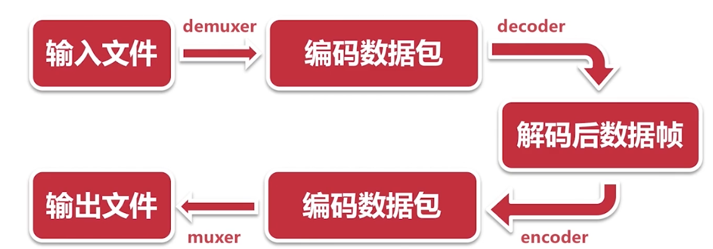
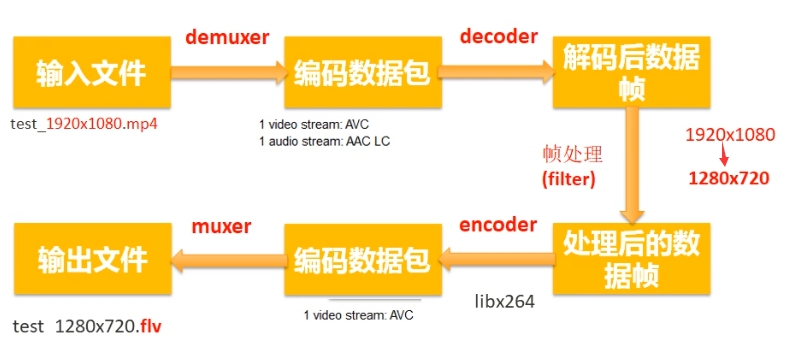
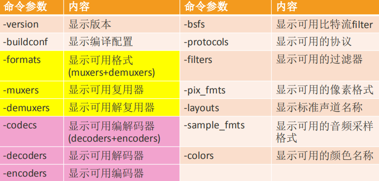

原文链接：http://www.cnblogs.com/codingbigdog/archive/2022/06/02/16339225.html
提交日期：Thu, 02 Jun 2022 14:36:00 GMT
博文内容：
# 1.FFmpeg简介

# 1.1.FFMPEG下载编译与安装
直接参考这篇文章[ubuntu20源码编译安装ffmpeg](https://blog.csdn.net/H_Zhang/article/details/123684216)。


## 1.2.ffmpeg库文件的说明
libavformat：用于各种音视频封装格式的生成和解析

libavutil：libavutil库是一个工具库，以辅助多媒体编程。

libavcodec：libavcodec 库提供通用编码/解码框架，并包含用于音频，视频和字幕流的多个解码器和编码器，以及多个比特流滤波器。实现了市面上可见的绝大部分解码器的功能， libavcodec 库被其他各大解码器 ffdshow， Mplayer 等所包含或应用。

libavdevice：提供了一个通用框架，用于从许多常见的多媒体输入/输出设备抓取和渲染，并支持多个输入和输出设备，包括 Video4Linux2，VfW，DShow和ALSA，AUDIO_BEOS，JACK,OSS,1394。

libavresample：对音频进进行重采样

libavfilter：通用的音视频后处理库，亦即音频/视频过滤框架（FileIO、 FPS、 DrawText），提供了宽高比 裁剪 格式化 非格式化 伸缩，及噪音处理等处理操作。

libswresample：原始音频格式转码。执行高度优化的音频重采样，重新矩阵化和样本格式转换操作。该libswresample库进行高度优化的音频采样，rematrixing和采样格式转换操作。

libswscale：（原始视频格式转换） 用于视频场景比例缩放、色彩映射转换；图像颜色空间或格式转换，如 rgb565、rgb888 等与 yuv420 等之间转换。

上面对库文件进行了简单的介绍，具体可参考[ffmpeg自学路(三)ffmpeg各项库说明，及build.sh的shell相关命令说明](https://blog.csdn.net/u014436704/article/details/106763235)


## 1.3.工具集
ffmpeg：该项目提供的一个工具，可用于格式转换、解码或电视卡即时编码等。
ffsever：一个 HTTP 多媒体即时广播串流服务器。
ffplay：是一个简单的播放器，使用 ffmpeg 库解析和解码，通过 SDL 显示。
ffprobe：多媒体侦测   


# 2.FFmpeg处理音视频流程

那电影的实质就是N多张图片的集合。事实上，如果一部影片里面的图片，我们原封不动的全部存起来，空间会很大很大很大，但是如果通过一定的算法（这里不讲相关算 法），把每一张图片压缩（编码_encode）一下，变成帧。再把帧连起来变成流，再把不同的流放到某个容器里面，这就是我们平常看见的电影文件了。

FFmpeg处理音视频流程：


输入文件：如mp4、flv
编码数据包：从mp4中提取出来的音频和视频等数据
解码后的数据帧：编码数据包中数据都是压缩过的，所以需要进行解码。然后我们就可以对解码后的数据进行各种各样的处理。处理完之后，重新进行encoder和muxer。

实例：
- 720p视频转480p视频：首先将720p视频解码成数据帧，然后对数据帧进行处理，最后再封装成视频。故需要经过FFmpeg处理音视频的全部流程。
- mp4转flv：首先将mp4文件demuxer成编码数据包，然后直接将编码数据包muxer成flv文件。故不需要经过FFmpeg处理音视频的全部流程。从这个例子可以看出，我们不一定需要经过FFmpeg处理音视频的全部流程。

```
ffmpeg -i test_1920x1080.mp4 -acodec copy -vcodec libx264 -s 1280x720 test_1280x720.flv
```
上述命令在ffmpeg基本流程中：


libx264代表采用x264进行视频编码，
copy代表音频直接copy原来的，copy命令代表就没有经过decode和encode，只经历的demuxe和muxe


# 3.ffmpeg常用命令
ffmpeg常用命令可以分为八类：
- 基本信息查询命令
- 录制命令
- 分解/复用命令
- 处理原始数据命令
- 裁剪与合并命令
- 图片/视频互转命令
- 直播相关命令
- 各种滤镜命令


## 3.1.基本信息查询命令



结合FFmpeg处理音视频流程来记上面的命令。
一些命令的补充解释：
-devices：查询系统中可用摄像头和音频设备
-bsfs：ffmpeg支持处理比特流的信息，此命令用于查询支持哪些比特流。
-protocols：ffmpeg支持处理网络文件，此命令用于查询支持哪些协议
-filters：比如加水印、去水印
-pix_fmts：查询可用哪些格式存储图片
-sample_fmts：使用多少位来存储一个采样，如8位、16位、 32位（浮点型）
-layouts：如双声道、单声道、立体声（三个声道以上称为立体声）


## 3.2.录制命令
ffmpeg命令结构：
```
ffmpeg [options] [[infile options] -i infile]... {[outfile options] outfile}...
```


录制屏幕：
```
ffmpeg -video_size 1920x1080 -framerate 25 -f x11grab -i :0.0+0,00 output.mp4
```
-f x11grab：使用桌面录制工具x11grab录制桌面
-video_size：指定分辨率，即将屏幕上的多大一块录制下来
-framerate 25：帧率25，即每秒展示25帧图像。
-i :0.0+0,00 ：-i是用来指定输入设备，带冒号的代表是音频设备（:0.0+0），没有冒号的代表是视频设备（00）。 【本段是我猜的】


## 3.3.分解与复用

分解与复用：不同视频格式的转换、音频和视频的分离，分离出来是mp3、H264等未解码的数据。

```
ffmpeg -i out.mp4 -vcodec copy -acodec copy out.flv
ffmpeg -i out.mp4 -vn -acodec copy out.aac  # 如果没有音频就会出现错误
ffmpeg -i out.mp4 -vcodec copy -an out.h264 # 如果没有视频就会出现错误
```
-vcodec copy：复制原来的视频数据
-acodec copy：复制原来的音频数据
-vn：不需要视频
-an：不需要音频


## 3.4.处理原始数据命令
处理原始数据命令：就是指处理PCM和YUV格式的数据
```
# FFmpeg提取YUV数据
ffmpeg -i input.mp4 -an -c:v rawvideo -pix_fmt yuv420p out.yuv
-c:v rawvideo  ： -c:v代表对视频进行编码；rawvideo代表原始视频
-pix_fmt：指定像素格式 
```
以上编码得到的是视频out.yuv根本无法通过ffplay播放，且ffplay根本没有-s选项


# 其他
项目的目录：
首先利用git建立版本管理，然后创建以下四个目录：
src：源码
bin：可执行文件
lib：库文件
doc：说明文档


为什么我觉得拿git做版本管理很不好用？？？？