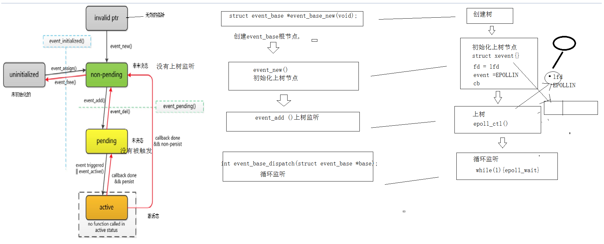
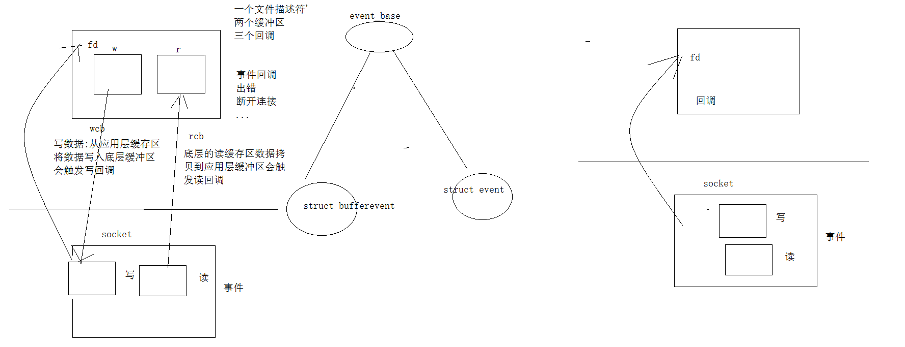

原文链接：http://www.cnblogs.com/codingbigdog/archive/2022/05/09/16251389.html
提交日期：Mon, 09 May 2022 14:40:00 GMT
博文内容：
# 1.libevent安装
**1.下载：**在https://libevent.org/中找到安装包并下载
**2.解压：**tar -zxvf libevent-2.1.11-stable.tar.gz

**3.配置安装路径**
```
cd libevent-2.1.11-stable 
./configure --prefix=/usr  # 执行configure ,检测环境生成makefile
```
如果不设置prefix，则默认为**/usr/local/lib**，这里建议如上设置。
如果提示错误：
```
configure: error: openssl is a must but can not be found. You should add the directory containing `openssl.pc' to the `PKG_CONFIG_PATH' environment variable, or set `CFLAGS' and `LDFLAGS' directly for openssl, or use `--disable-openssl' to disable support for openssl encryption
```
一般为openssl库的缘故，需要安装openssl，一般ubuntu自带openssl，这里需要openssl-devel，要注意的是在ubuntu中需要使用sudo apt-get install libssl-dev来安装而不是sudo apt-get install openssl-devel。
然后重新执行：
./configure --prefix=/usr
**4.编译和安装**
```
sudo make
sudo make install
```
由于前面使用--prefix=/usr指定了安装路径
故安装后：
- 库的路径: /usr/lib
- 头文件目录: /usr/include

**编译时需要指定库名  -levent**
-levent相当于libevent的简写，指明本程序编译时需要库libevent。（这里应该是静态链接）

测试代码domo.c：
```
#include <event.h>
#include <stdio.h>

int main()
{
    char ** methods = event_get_supported_methods();//获取libevent后端支持的方法
    int i =0;
    for(i = 0;methods[i] != NULL ;i++)
    {
        printf("%s\n",methods[i]);
    }
    struct event_base * base = event_base_new();
    printf("当前使用的方法：%s\n",event_base_get_method(base));
    return 0;
}
```
执行gcc demo.c -o demo -levent进行编译


参考：[libevent安装教程](https://blog.csdn.net/superhoner/article/details/112001995)


# 2.libevent API
**1.创建和释放根节点**
创建event_base根节点
```
struct event_base *event_base_new(void);
```
返回值值就是event_base根节点地址

释放根节点
```
void event_base_free(struct event_base *);
```
**2.循环监听**
循环监听:
```
int event_base_dispatch(struct event_base *base);
```
相当于 while(1){epoll_wait}循环监听。【epoll用于监听多个文件描述符上的事件。epoll_wait函数获取就绪事件】
退出循环监听:
```
int event_base_loopexit(struct event_base *base, const struct timeval *tv); //等待固定时间之后退出
int event_base_loopbreak(struct event_base *base);//立即退出
```

**3.libevent事件触发流程**


流程:1.创建事件监听节点 2. 添加文件描述符进行循环监听


**4.构建节点用于上树（即将文件描述符、监听事件和回调函数包装成一个特定的结构event，这个结构称为一个节点）**
```
struct event *event_new(struct event_base *base, evutil_socket_t fd, short events, event_callback_fn cb, void *arg);
参数:
base: event_base根节点
fd: 上树的文件描述符
events: 监听的事件
   #define  EV_TIMEOUT         0x01   //超时事件
   #define  EV_READ                  0x02 //读事件
   #define  EV_WRITE                0x04  //写事件
   #define  EV_SIGNAL              0x08     //信号事件
   #define  EV_PERSIST              0x10   //周期性触发,起到循环监听的作用
   #define  EV_ET      
cb: 回调函数
   typedef void (*event_callback_fn)(evutil_socket_t fd, short events, void *arg);
arg: 传给回调函数的参数
返回值: 初始化好的节点的地址
```

**5.节点上树和下树**
上树：
```
int event_add(struct event *ev, const struct timeval *timeout);

ev: 上树节点的地址
timeout: NULL：永久监听  固定时间：限时等待
```

下树:
```
int event_del(struct event *ev);
ev: 下树节点的地址
```

# 3.使用libevent编写tcp服务器流程

示例代码01_event_tcp_server.c：
```
#include <stdio.h>
#include "wrap.h"  
#include <event.h>

void cfdcb(int cfd,short event,void *arg)
{
	char buf[1500]="";
	
	int n = Read(cfd,buf,sizeof(buf));
	if(n <= 0)
	{
		perror("err or close\n");
		//event_del();//下树。这里下树，是有问题的
	
	}
	else
	{
		printf("%s\n",buf);
		Write(cfd,buf,n);
	
	}

}
void lfdcb(int lfd,short event,void *arg)
{
	struct event_base *base = (struct event_base *)arg; 
	//提取新的cfd
	int cfd = Accept(lfd,NULL,NULL);
	//将cfd上树
	struct event *ev = event_new(base,cfd,EV_READ | EV_PERSIST,cfdcb,NULL);//初始化上树节点
	event_add(ev,NULL);
	
}
int main(int argc, char *argv[])
{
	//创建套接字
	//绑定
	int lfd = tcp4bind(8000,NULL);
	//监听
	Listen(lfd,128);
	//创建event_base根节点
	struct event_base * base = event_base_new();
	//构建节点用于上树，即将文件描述符、监听事件和回调函数包装成一个特定的结构event。
	struct event *ev = event_new(base,lfd,EV_READ | EV_PERSIST,lfdcb,base);
	//上树
	event_add(ev,NULL);
	//循环监听（阻塞了）
	event_base_dispatch(base);//阻塞
	//收尾
	close(lfd);
	event_base_free(base);
	return 0;
}
```
编译命令：gcc 01_event_tcp_server.c -o 01_event_tcp_server.c -levent
本代码的下树是有问题的，需要看视频解决，我懒得看，以后再补充

# 4.bufferevent事件 
普通的event事件：文件描述符   事件(底层缓冲区的读事件或者写事件) 触发    回调
bufferevent事件： 应用层有两个缓冲区（读/写缓冲区），每个缓冲区对应一个回调函数，此外还有一个事件的回调函数，总共3个回调函数。




## 4.1.bufferevent事件的API
**1.创建新的节点**
```
struct bufferevent *bufferevent_socket_new(struct event_base *base, evutil_socket_t fd, int options);

参数: 
    base  : event_base 根节点
    fd: 要初始化上树的文件描述符
    options : 
           BEV_OPT_CLOSE_ON_FREE   -- 释放bufferevent自动关闭底层接口   
           BEV_OPT_THREADSAFE      -- 使bufferevent能够在多线程下是安全的    
返回值:
   新建节点的地址
```

**2.设置回调函数并进行上树**

使用bufferevent_setcb就可以设置回调函数并进行上树
```
void bufferevent_setcb(struct bufferevent *bufev,
    bufferevent_data_cb readcb, 
    bufferevent_data_cb writecb,
    bufferevent_event_cb eventcb, void *cbarg);


参数:
    bufev : 新建的节点的地址
    readcb : 读回调
    writecb : 写回调
    eventcb : 异常回调
    cbarg: 传给回调函数的参数
```
bufferevent_setcb设置节点对应文件描述符事件触发的回调并进行上树。

回调函数长下面这样：
```
typedef void (*bufferevent_data_cb)(struct bufferevent *bev, void *ctx);             // 读写回调
typedef void (*bufferevent_event_cb)(struct bufferevent *bev, short what, void *ctx);// 事件回调

What代表对应的事件:
    BEV_EVENT_EOF, 对方关闭连接
    BEV_EVENT_ERROR，出错
    BEV_EVENT_TIMEOUT,超时
    BEV_EVENT_CONNECTED 建立连接成功
```

bufferevent_setcb自动监听三个事件（读、写和异常），下面函数用于设置是否在发生某个事件（读、写和异常）的时候触发回调函数
int bufferevent_enable(struct bufferevent *bufev, short event);//EV_READ  EV_WRITE,异常事件也被当成EV_READ
int bufferevent_disable(struct bufferevent *bufev, short event);//EV_READ  EV_WRITE,异常事件也被当成EV_READ


**3.发送数据**
```
int bufferevent_write(struct bufferevent *bufev, const void *data, size_t size);
bufferevent_write是将data的数据写到bufferevent的写缓冲区。写进应用层的写缓冲区，而不是写进内核的写缓冲区。如果内核的写缓冲区有空间，那么应用层的写缓冲区里的内容会进一步放到内核的写缓冲区，从而触发写事件。
```

**4.接收数据**
```
size_t bufferevent_read(struct bufferevent *bufev, void *data, size_t size);
bufferevent_read 是将bufferevent的读缓冲区数据读到data中，同时将读到的数据从bufferevent的读缓冲清除。
```

更详细的bufferevent说明，请见黑马程序员课程发的doc文件。 

## 4.2.连接侦听器
连接侦听器用于创建套接字、绑定、监听和提取
```
struct evconnlistener *evconnlistener_new_bind(struct event_base *base,
        evconnlistener_cb cb, 
        void *ptr, unsigned flags, int backlog,
        const struct sockaddr *sa, int socklen);

参数: 
    base : base根节点
    cb : 通过accept得到套接字以后调用的回调函数 
    ptr : 传给回调的参数
    flags : 
         LEV_OPT_LEAVE_SOCKETS_BLOCKING   文件描述符为阻塞的
         LEV_OPT_CLOSE_ON_FREE            关闭时自动释放
         LEV_OPT_REUSEABLE                端口复用
         LEV_OPT_THREADSAFE               分配锁，线程安全
         flags经常写为LEV_OPT_CLOSE_ON_FREE|LEV_OPT_REUSEABLE
    backlog : -1
    sa : 绑定的地址信息
    socklen : sa的大小
    
返回值: 连接侦听器的地址
```


cb的原型如下：
```
typedef void (*evconnlistener_cb)(struct evconnlistener *evl, evutil_socket_t fd, struct sockaddr *cliaddr, int socklen, void *ptr);
参数:
    evl :  链接侦听器的地址
    fd :  cfd
    cliaddr: 客户端的地址信息
    ptr:  evconnlistener_new_bind传过来的参数
```
 


## 4.3.创建套接字 连接服务器
```
struct bufferevent *bufferevent_socket_new(struct event_base *base,-1, int options);
int bufferevent_socket_connect(struct bufferevent *bev, struct sockaddr *serv, int socklen);
    bev: 新建的节点
    serv: 服务器的地址信息
    socklen: serv长度
```

## 4.4.bufferevent实现tcp服务器
helloworld.c:
```
/*
  This exmple program provides a trivial server program that listens for TCP
  connections on port 9995.  When they arrive, it writes a short message to
  each client connection, and closes each connection once it is flushed.

  Where possible, it exits cleanly in response to a SIGINT (ctrl-c).
*/


#include <string.h>
#include <errno.h>
#include <stdio.h>
#include <signal.h>
#ifndef WIN32
#include <netinet/in.h>
# ifdef _XOPEN_SOURCE_EXTENDED
#  include <arpa/inet.h>
# endif
#include <sys/socket.h>
#endif

#include <event2/bufferevent.h>
#include <event2/buffer.h>
#include <event2/listener.h>
#include <event2/util.h>
#include <event2/event.h>

static const char MESSAGE[] = "Hello, World!\n";

static const int PORT = 9995;

static void conn_readcb(struct bufferevent *bev, void *user_data);
static void listener_cb(struct evconnlistener *, evutil_socket_t,
    			struct sockaddr *, int socklen, void *);
static void conn_writecb(struct bufferevent *, void *);
static void conn_eventcb(struct bufferevent *, short, void *);
static void signal_cb(evutil_socket_t, short, void *);

int main(int argc, char **argv)
{
	struct event_base *base;
	struct evconnlistener *listener;
	struct event *signal_event;

	struct sockaddr_in sin;
#ifdef WIN3 // 配置一些环境
	WSADATA wsa_data;
	WSAStartup(0x0201, &wsa_data);
#endif

	base = event_base_new();//创建event_base根节点
	if (!base) {
		fprintf(stderr, "Could not initialize libevent!\n");
		return 1;
	}

	memset(&sin, 0, sizeof(sin)); // 这里已经将IP设为0.0.0.0
	sin.sin_family = AF_INET;
	sin.sin_port = htons(PORT);

	//创建链接侦听器
	listener = evconnlistener_new_bind(base, listener_cb, (void *)base,
	    			LEV_OPT_REUSEABLE|LEV_OPT_CLOSE_ON_FREE, -1,
	    			(struct sockaddr*)&sin,
	    			sizeof(sin));

	if (!listener) {
		fprintf(stderr, "Could not create a listener!\n");
		return 1;
	}

	//创建信号触发的节点。evsignal_new就是event_new，定义如下：#define evsignal_new(b, x，cb,arg) event_new((b),(x)+EV_SIGNAL | EV_PERSIST,(cb),(arg)) 
	signal_event = evsignal_new(base, SIGINT, signal_cb, (void *)base); // event_new构建节点用于上树
	//将信号节点上树
	if (!signal_event || event_add(signal_event, NULL)<0) { // event_add用于上树
		fprintf(stderr, "Could not create/add a signal event!\n");
		return 1;
	}

	event_base_dispatch(base);//循环监听

	evconnlistener_free(listener);//释放链接侦听器
	event_free(signal_event);//释放信号节点
	event_base_free(base);//释放event_base根节点

	printf("done\n");
	return 0;
}

static void
listener_cb(struct evconnlistener *listener, evutil_socket_t fd,
    struct sockaddr *sa, int socklen, void *user_data)
{
	struct event_base *base = user_data;
	struct bufferevent *bev;

	//将fd上树
	//新建一个buffervent节点
	bev = bufferevent_socket_new(base, fd, BEV_OPT_CLOSE_ON_FREE);
	if (!bev) {
		fprintf(stderr, "Error constructing bufferevent!");
		event_base_loopbreak(base);
		return;
	}
	//设置回调
	bufferevent_setcb(bev, conn_readcb, conn_writecb, conn_eventcb, NULL);
	bufferevent_enable(bev, EV_WRITE | EV_READ);//设置读写事件使能
	//bufferevent_disable(bev, EV_READ);//设置读事件非使能

	bufferevent_write(bev, MESSAGE, strlen(MESSAGE));//给cfd发送消息 helloworld
}
static void conn_readcb(struct bufferevent *bev, void *user_data)
{
	char buf[1500]="";
	int n = bufferevent_read(bev,buf,sizeof(buf));
	printf("%s\n",buf);
	bufferevent_write(bev, buf,n);//给cfd发送消息 


}

static void
conn_writecb(struct bufferevent *bev, void *user_data)
{
	struct evbuffer *output = bufferevent_get_output(bev);//获取缓冲区类型
	if (evbuffer_get_length(output) == 0) {   // 判断应用缓冲区的数据是否都写入了内核缓冲区
		
	//	printf("flushed answer\n");
	//	bufferevent_free(bev);//释放节点 自动关闭
	}
}

static void
conn_eventcb(struct bufferevent *bev, short events, void *user_data)
{
	if (events & BEV_EVENT_EOF) {
		printf("Connection closed.\n");
	} else if (events & BEV_EVENT_ERROR) {
		printf("Got an error on the connection: %s\n",
		    strerror(errno));/*XXX win32*/
	}
	/* None of the other events can happen here, since we haven't enabled
	 * timeouts */
	bufferevent_free(bev);
}

static void
signal_cb(evutil_socket_t sig, short events, void *user_data)
{
	struct event_base *base = user_data;
	struct timeval delay = { 2, 0 };

	printf("Caught an interrupt signal; exiting cleanly in two seconds.\n");

	event_base_loopexit(base, &delay);//退出循环监听
}
```
编译运行：
```
gcc hello-world.c -o hello-world -levent
./hello-world 
```
开启另一个终端，输入：
```
nc 127.1 9995  #127.1代表127.0.0.1
```

## 4.5.bufferevent实现tcp客户端
**客户端创建套接字,连接服务器的API：**
```
struct bufferevent *bufferevent_socket_new(struct event_base *base,-1, int options); // 创建新节点。这里fd填-1，在bufferevent_socket_connect中会实现套接字的创建。
int bufferevent_socket_connect(struct bufferevent *bev, struct sockaddr *serv, int socklen);
    bev: 新建的节点
    serv: 服务器的地址信息
    sockle  n: serv长度
```

bufferevent实现tcp客户端bufferevent_client.c：
```
//bufferevent建立客户端的过程
#include <sys/types.h>
#include <sys/socket.h>
#include <netinet/in.h>
#include <arpa/inet.h>
#include <errno.h>
#include <unistd.h>
#include <stdio.h>
#include <string.h>
#include <stdlib.h>
#include <event.h>
#include <event2/bufferevent.h>
#include <event2/buffer.h>
#include <event2/util.h>

int tcp_connect_server(const char* server_ip, int port);
void cmd_msg_cb(int fd, short events, void* arg);
void server_msg_cb(struct bufferevent* bev, void* arg);
void event_cb(struct bufferevent *bev, short event, void *arg);
//./a.out  192.168.1.1  9995
int main(int argc, char** argv)
{
    if( argc < 3 )
    {
        //两个参数依次是服务器端的IP地址、端口号
        printf("please input 2 parameter\n");
        return -1;
    }
    //创建根节点
    struct event_base *base = event_base_new();
    //创建并且初始化buffer缓冲区
    struct bufferevent* bev = bufferevent_socket_new(base, -1,
                                                     BEV_OPT_CLOSE_ON_FREE);

    //监听终端输入事件 设置标准输入的监控,设置回调是 cmd_msg_cb 
    struct event* ev_cmd = event_new(base, STDIN_FILENO,
                                     EV_READ | EV_PERSIST,
                                     cmd_msg_cb, (void*)bev);
    // 上面相当于创建了两个节点bev和ev_cmd，等待上树

	printf("001\n");
    //上树 开始监听标准输入的读事件
    event_add(ev_cmd, NULL);
    
    struct sockaddr_in server_addr;
    memset(&server_addr, 0, sizeof(server_addr) );
    server_addr.sin_family = AF_INET;
    server_addr.sin_port = htons(atoi(argv[2]));
    //将ip地址转换为网络字节序
    inet_aton(argv[1], &server_addr.sin_addr);

    //连接到 服务器ip地址和端口 初始化了 socket文件描述符 socket+connect 
    bufferevent_socket_connect(bev, (struct sockaddr *)&server_addr,
                               sizeof(server_addr));
    //设置buffer的回调函数并上树。 主要设置了读回调 server_msg_cb ,传入参数是标准输入的读事件
    bufferevent_setcb(bev, server_msg_cb, NULL, event_cb, (void*)ev_cmd);
    bufferevent_enable(bev, EV_READ | EV_PERSIST);
	printf("002\n");

    event_base_dispatch(base);//循环等待
    event_free(ev_cmd);
    bufferevent_free(bev);
    event_base_free(base);
    printf("finished \n");
    return 0;
}
//终端输入回调
void cmd_msg_cb(int fd, short events, void* arg)
{
    char msg[1024];

    int ret = read(fd, msg, sizeof(msg));
    if( ret < 0 )
    {
        perror("read fail ");
        exit(1);
    }
    //得到bufferevent指针,目的是为了写到bufferevent的写缓冲区
    struct bufferevent* bev = (struct bufferevent*)arg;

    //把终端的消息发送给服务器端
    bufferevent_write(bev, msg, ret);
}

void server_msg_cb(struct bufferevent* bev, void* arg)
{
	
	printf("001\n");
    char msg[1024];

    size_t len = bufferevent_read(bev, msg, sizeof(msg));
    msg[len] = '\0';
	printf("002\n");

    printf("recv %s from server\n", msg);
}

void event_cb(struct bufferevent *bev, short event, void *arg)
{

    if (event & BEV_EVENT_EOF)
        printf("connection closed\n");
    else if (event & BEV_EVENT_ERROR)
        printf("some other error\n");
    else if( event & BEV_EVENT_CONNECTED)
    {
        printf("the client has connected to server\n");
        return ;
    }


    //这将自动close套接字和free读写缓冲区
   bufferevent_free(bev);
    //释放event事件 监控读终端
  struct event *ev = (struct event*)arg;
    event_free(ev);
	exit(0);
}
```
首先运行bufferevent实现tcp服务器，然后再运行bufferevent实现tcp客户端
