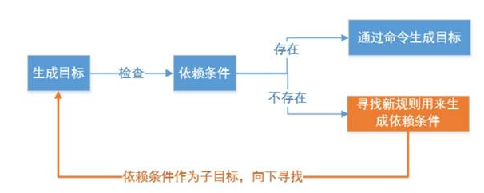
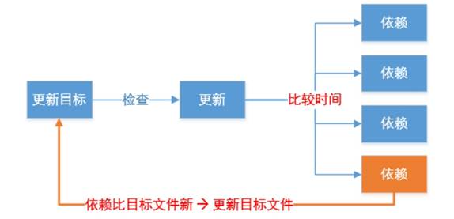

原文链接：http://www.cnblogs.com/codingbigdog/archive/2022/05/12/16262239.html
提交日期：Thu, 12 May 2022 06:06:00 GMT
博文内容：
# 1.Makefile
## 1.1.Makefile简介
makefile用于编译整个项目.
一个工程中的源文件不计其数，其按类型、功能、模块分别放在若干个目录中，makefile定义了一系列的规则来指定，哪些文件需要先编译，哪些文件需要后编译，哪些文件需要重新编译，甚至于进行更复杂的功能操作，因为 makefile就像一个Shell脚本一样，其中也可以执行操作系统的命令。

Makefile带来的好处就是——“自动化编译”，一旦写好，只需要一个make命令，整个工程完全自动编译，极大的提高了软件开发的效率。make是一个命令工具，是一个解释makefile中指令的命令工具，一般来说，大多数的IDE都有这个命令，比如：Delphi的make，Visual C++的nmake，Linux下GNU的make。可见，makefile都成为了一种在工程方面的编译方法。

make主要解决两个问题：
1) 大量代码的关系维护
大项目中源代码比较多，手工维护、编译时间长而且编译命令复杂，难以记忆及维护
把代码维护命令及编译命令写在makefile文件中，然后再用make工具解析此文件自动执行相应命令，可实现代码的合理编译
2) 减少重复编译时间
n 在改动其中一个文件的时候，能判断哪些文件被修改过，可以只对该文件进行重新编译，然后重新链接所有的目标文件，节省编译时间

Makefile文件命名规则：makefile和Makefile都可以，推荐使用Makefile。

make工具的安装：sudo apt install make

## 1.2.make与cmake
不同平台有自己的make标准。如果软件想跨平台，必须要保证能够在不同平台编译。而如果使用上面的 Make 工具，就得为每一种标准写一次 Makefile ，这将是一件让人抓狂的工作。
CMake就是针对上面问题所设计的工具：它首先允许开发者编写一种平台无关的 CMakeList.txt 文件来定制整个编译流程，然后再根据目标用户的平台进一步生成所需的本地化 Makefile 和工程文件，如 Unix 的 Makefile 或 Windows 的 Visual Studio 工程。从而做到“Write once, run everywhere”。
cmake知识可参考：[cmake入门
](https://www.cnblogs.com/codingbigdog/p/16459532.html)


[参考](https://blog.csdn.net/qq_28038207/article/details/80791694)


# 2.Makefile语法规则
## 2.1.一条规则
一条规则：
```
目标：依赖文件列表
<Tab>命令列表
```

Makefile基本规则三要素：
1）目标：
通常是要产生的文件名称，目标可以是可执行文件或其它obj文件，也可是一个动作的名称
2）依赖文件：
- 用来输入从而产生目标的文件
- 一个目标通常有几个依赖文件（可以没有）

3）命令：
- make执行的动作，一个规则可以含几个命令（可以没有）
- 有多个命令时，每个命令占一行
 
示例代码：
```
test:
  echo "hello world"
```
依赖文件可以没有；
echo前面要Tab一下;
```
all:test1  test2
  echo "hello all"

test1:
  echo "hello test1"

test2:
  echo "hello test2"
```
test依赖test1和test2，然后通过test下面代码就可以获取到test1和test2。
依赖test1和test2用空格隔开。
执行命令：make -f 1.mk 
执行结果：
```
echo "hello test1"
hello test1
echo "hello test2"
hello test2
echo "hello all"
hello all
```
还可以执行：
make test1 -f 1.mk   # 执行其他目标
make test1 test2 -f 1.mk  # 执行多个目标


## 2.2.make命令格式
make是一个命令工具，它解释Makefile 中的指令（应该说是规则）。

make命令格式：
make [ -f file ][ options ][ targets ]

**1.[ -f file ]**
make默认在工作目录中寻找名为GNUmakefile、makefile、Makefile的文件作为makefile输入文件
-f 可以指定以上名字以外的文件作为makefile输入文件

**2.[ options ]**

-v： 显示make工具的版本信息
-w： 显示开始处理makefile时所在的工作目录和显示结束makefile文件的处理时所在的工作路径
-C dir：读取目录dir下的makefile文件，如make -C 7makefile/ -f. 1.mk：读取7makefile目录下的1.mk文件
-n：只打印要执行的命令但不执行
-s：执行但不显示执行的命令

**3.[ targets ]**

若使用make命令时没有指定目标，则make工具默认会实现makefile文件内的第一个目标，然后退出
指定了make工具要实现的目标，目标可以是一个或多个（多个目标间用空格隔开）。


## 2.3.Makefile示例
假设有测试程序： test.c add.c sub.c mul.c div.c，内容如下：
```
// add.c
#include "sampleMath.h"
 
int add(int i, int j)
{
	return i + j;
}

// div.c
#include "sampleMath.h"

int div(int i, int j)
{
    if (j != 0)
        return i / j;
    else
        return 0;
}

// sub.c
#include "sampleMath.h"
 
int sub(int i, int j)
{
	return i-j;
}

// mul.c
#include "sampleMath.h"
 
int mul(int i, int j)
{
	return i*j;
}

// sampleMath.h
int add(int i, int j);
int mul(int i, int j);
int sub(int i, int j);
int div(int i, int j);

// test.c
#include <stdio.h>
#include "sampleMath.h"
 
int main(int argc, char *argv[]) 
{
	printf("1 + 2 = %d\n", add(1, 2));
	printf("1/2 = %d\n", div(1, 2));
	printf("1*2 = %d\n", mul(1, 2));
	printf("1-2 = %d\n", sub(1, 2));
	return 0;
}
```


**1.最简单的Makefile**
Makefile文件如下：
```
test:test.c add.c sub.c mul.c div.c
    gcc test.c add.c sub.c mul.c div.c -o test
```
在Makefile所在目录下输入，make即可执行Makefile。
缺点：效率低，修改一个文件，所有文件会被全部编译

**2.第二个版本Makefile**
Makefile文件如下：
```
test:test.o add.o sub.o mul.o div.o
	gcc test.o add.o sub.o mul.o div.o -o test
test.o:test.c
	gcc -c test.c -o test.o
add.o:add.c
	gcc -c add.c -o add.o
sub.o:sub.c
	gcc -c sub.c -o sub.o
mul.o:mul.c
	gcc -c mul.c -o mul.o
div.o:div.c
	gcc -c div.c -o div.o
```
test依赖test.o add.o sub.o mul.o div.o，如果从当前目录中无法找到这些.o文件，那么就会自动在各条规则中是否有相匹配的目标。
对于使用上述Makefile文件，如果修改add.c文件，那么make命令只会重新编译add.c文件，其他文件不会重新编译。
但是这样的文件又长又臭，下面我们将逐步介绍简化的方法。

## 2.4.Makefile中的变量

在Makefile中使用变量有点类似于C语言中的宏定义，使用该变量相当于内容替换，使用变量可以使Makefile易于维护,修改内容变得简单变量定义及使用。

### 2.4.1.自定义变量

1）定义变量方法：
变量名=变量值

2）引用变量：
$(变量名)或${变量名}
 
3）makefile的变量名：
- makefile变量名可以以数字开头
- 变量是大小写敏感的
- 变量一般都在makefile的头部定义
- 变量几乎可在makefile的任何地方使用
 

第三个版本Makefile：

```
#变量
OBJS=add.o sub.o mul.o div.o test.o
TARGET=test
$(TARGET):$(OBJS)
	gcc $(OBJS) -o $(TARGET) 
add.o:add.c
	gcc -c add.c -o add.o​
sub.o:sub.c
	gcc -c sub.c -o sub.o
mul.o:mul.c
	gcc -c mul.c -o mul.o
div.o:div.c
	gcc -c div.c -o div.o
test.o:test.c
	gcc -c test.c -o test.o
clean:
	rm -rf $(OBJS) $(TARGET)
```
除了使用用户自定义变量，makefile中也提供了一些变量（变量名大写）供用户直接使用，我们可以直接对其进行赋值。
> CC = gcc  # 选择gcc作为编译器
CPPFLAGS : C预处理的选项 如:CPPFLAGS = -I
CFLAGS: C编译器的选项 如CFLAGS = -Wall -g -c
LDFLAGS : 链接器选项，如LDFLAGS = -L -l

上述代码运行：make clean # 实现清理工作


### 2.4.2.自动变量
- $@: 表示规则中的目标
- $<: 表示规则中的第一个依赖
- $^: 表示规则中的所有依赖, 组成一个列表, 以空格隔开,如果这个列表中有重复的项则消除重复项。

注意：自动变量只能在规则的命令中使用

第四个版本Makefile：
```
#变量
OBJS=add.o sub.o mul.o div.o test.o add.o
TARGET=test
CC=gcc
$(TARGET):$(OBJS)    # 这里不能使用$^，因为自动变量只能在规则的命令中使用
	$(CC) $^ -o $@   # 等价于#$(CC) $(OBJS) -o $(TARGET) 
	echo $@          # 输出看看$@是不是目标
	echo $<
	echo $^
add.o:add.c
	$(CC) -c $< -o $@ 
sub.o:sub.c
	$(CC) -c $< -o $@ 
mul.o:mul.c
	$(CC) -c $< -o $@ 
div.o:div.c
	$(CC) -c $< -o $@ 
test.o:test.c
	$(CC) -c $< -o $@
clean:
	rm -rf $(OBJS) $(TARGET)
```


### 2.4.3.模式规则
模式规则示例:
```
%.o:%.c
```
第五个版本Makefile：
```
OBJS=test.o add.o sub.o mul.o div.o
TARGET=test
$(TARGET):$(OBJS)
    gcc $(OBJS) -o $(TARGET) 

%.o:%.c               ​# 模式匹配所有的.o都依赖对应的.c
    gcc -c $< -o $@   # 将所有的.c生成对应的.o
clean:
    rm -rf $(OBJS) $(TARGET)
```


# 3.Makefile中的函数
```
makefile中的函数有很多，在这里给大家介绍两个最常用的。

wildcard – 查找指定目录下的指定类型的文件
src = $(wildcard *.c) //找到当前目录下所有后缀为.c的文件,赋值给src

patsubst – 匹配替换
obj = $(patsubst %.c,%.o, $(src)) //把src变量里所有后缀为.c的文件替换成.o
```
在makefile中所有的函数都是有返回值的。

第六个版本Makefile：
```
SRC=$(wildcard *.c)
OBJS=$(patsubst %.c, %.o, $(SRC))
TARGET=test
$(TARGET):$(OBJS)
    gcc $(OBJS) -o $(TARGET) 
%.o:%.c
    gcc -c $< -o $@
clean:
    rm -rf $(OBJS) $(TARGET)
```


# 4.Makefile中的伪目标
clean用途: 清除编译生成的中间.o文件和最终目标文件
make clean 如果当前目录下有同名clean文件，则不执行clean对应的命令，解决方案：

伪目标声明: .PHONY:clean
声明目标为伪目标之后，makefile将不会该判断目标是否存在或者该目标是否需要更新，而是直接执行Makefile中的clean命令


第七个版本Makefile：
```
SRC=$(wildcard *.c)
OBJS=$(patsubst %.c, %.o, $(SRC))
TARGET=test
$(TARGET):$(OBJS)
    gcc $(OBJS) -o $(TARGET) 
​
%.o:%.c
    @gcc -c $< -o $@  # 最前面加了一个"@"，代表只执行不显示执行命令
.PHONY:clean
clean:
    -rm -rf $(OBJS) $(TARGET) # 最前面加了一个"-"，代表此条命令出错，make也会继续执行后续的命令
```
**命令中的特殊符号：**
- “-”此条命令出错，make也会继续执行后续的命令。如:“-rm main.o”
- “@”不显示命令本身,只显示结果。如:“@echo clean done”

总结： 一条规则，两个函数，三个变量。


# 5.Makefile工作原理
**1.生成目标**
若想生成目标, 检查规则中的依赖条件（依赖文件）是否存在,如不存在,则寻找是否有规则用来生成该依赖文件


比如：
```
test:test.o add.o sub.o mul.o div.o
	gcc test.o add.o sub.o mul.o div.o -o test
test.o:test.c
	gcc -c test.c -o test.o
add.o:add.c
	gcc -c add.c -o add.o
sub.o:sub.c
	gcc -c sub.c -o sub.o
mul.o:mul.c
	gcc -c mul.c -o mul.o
div.o:div.c
	gcc -c div.c -o div.o
```
上述代码，目标test依赖test.o，但是目录下没有test.o文件，此时就在Makefile中寻找是否有目标为test.o的规则，最后通过规则生成test.o。
先在目录下查找test.o，如果没有找到，再去查找是否有生成test.o的规则。
**2.更新目标**
检查规则中的目标是否需要更新，必须先检查它的所有依赖,依赖中有任一个被更新,则目标必须更新


from 黑马程序员笔记


# 6.其他

## 6.1.“=”与“:=”
**“=”：**make会将整个makefile展开后，再决定变量的值。也就是说，变量的值将会是整个makefile中最后被指定的值。看例子：
```
x = foo
y = $(x) bar
x = xyz
```
在上例中，y的值将会是 xyz bar ，而不是 foo bar 。


**“:=”：**表示变量的值决定于它在makefile中的位置，而不是整个makefile展开后的最终值。
```
x := foo
y := $(x) bar
x := xyz
```
在上例中，y的值将会是 foo bar ，而不是 xyz bar 了。

参考：[Makefile 中:= ?= += =的区别](https://www.cnblogs.com/wanqieddy/archive/2011/09/21/2184257.html)

##6.2.ifeq、ifneq、ifdef和ifndef（条件判断）

ifeq 和 ifneq：判断两个参数是否相等


注意：条件语句只能用于控制 make 实际执行的 Makefile 文件部分，不能控制规则的 shell 命令执行的过程。
上面这句是什么意思？

参考：[Makefile ifeq、ifneq、ifdef和ifndef（条件判断）](http://c.biancheng.net/view/7068.html)


## 6.5 .PHONY的作用
**.PHONY的作用一：不产生目标文件**
.PHONY是一个伪目标，Makefile中将.PHONY放在一个目标前就是指明这个目标是伪文件目标。其作用就是防止在Makefile中定义的执行命令的目标和工作目录下的实际文件出现名字冲突。例子如下：
```
clean :
  rm *.o temp
```
上述Makefile文件在第一次执行make clean以后会产生clean文件，导致第二次运行make clean失败。
```
.PHONY : clean
clean :
  rm *.o temp
```
上述Makefile文件在第一次执行make clean以后不会产生clean文件，不会导致第二次运行make clean失败。


**.PHONY的作用二：编译多个文件**
```
all : prog1 prog2 prog3
.PHONY : all
prog1 : prog1.o utils.o
  cc -o prog1 prog1.o utils.o
prog2 : prog2.o
  cc -o prog2 prog2.o
prog3 : prog3.o sort.o utils.o
  cc -o prog3 prog3.o sort.o utils.o
```
上述Makefile文件设置了伪目标all，执行Makefile不会生成all文件，但是all的依赖文件prog1、prog2和prog3会被生成。
这样我们就使用Makefile文件编译生成了三个可执行文件——prog1、prog2和prog3。


参考：[如何用一个makefile编译多个目标](https://blog.csdn.net/a815064247/article/details/79442567)


## 6.4.一个makefile示例
makefile的示例学习。本代码摘录于具体项目，有完整的注释，直接看代码学习即可。
```
cc        := g++
name      := pro
workdir   := workspace
srcdir    := src
objdir    := objs
stdcpp    := c++11
syslib    := /home/xd2/.local/lib/python3.6/site-packages/trtpy/lib
cpp_pkg   := /home/zwl/software


cpp_srcs := $(shell find src -name "*.cpp") # 查找src目录下所有.cpp文件，返回字串，示例：src/1.cpp src/2.cpp src/3.cpp
cpp_objs := $(cpp_srcs:.cpp=.o)				# 将cpp_srcs中的.cpp后缀改为.o后缀，返回字串，示例:src/1.o src/2.o src/3.o
cpp_objs := $(cpp_objs:src/%=objs/%)		# 将src/改为objs
cpp_mk   := $(cpp_objs:.o=.mk)				# makefile (mk)文件

c_srcs := $(shell find src -name "*.c")
c_objs := $(c_srcs:.c=.co)
c_objs := $(c_objs:src/%=objs/%)
c_mk   := $(c_objs:.co=.cmk)


include_paths := src              \
	$(cpp_pkg)/opencv4.2/include/opencv4 \
	/home/zwl/software/anaconda3/envs/yolov5Env/include/python3.9


library_paths := $(syslib) $(cpp_pkg)/opencv4.2/lib /home/zwl/software/anaconda3/envs/yolov5Env/lib


# link_librarys := opencv_core opencv_imgproc opencv_videoio  opencv_imgcodecs opencv_highgui \
			stdc++ dl
link_librarys := stdc++ dl python3.9			# 动态库的动态链接需要dl，否则报错。

paths := $(foreach item,$(library_paths),-Wl,-rpath=$(item)) 	 # 循环将$(library_paths)中的单词取出来放进item，然后执行表达式-Wl,-rpath=$(item)
																 # 返回的结果为-Wl,-rpath=item1 -Wl,-rpath=item2 -Wl,-rpath=item3等
																 # -Wl,-rpath=指定运行时链接到的库
include_paths := $(foreach item,$(include_paths),-I$(item))		 # 编译程序按照-I指定的路径进去搜索头文件
library_paths := $(foreach item,$(library_paths),-L$(item))		 # -L指定的路径会被优先搜索
link_librarys := $(foreach item,$(link_librarys),-l$(item))		 # -L用于指定库所在的目录，-l用于指定具体的库

# 如果是其他显卡，请修改-gencode=arch=compute_75,code=sm_75为对应显卡的能力
# 显卡对应的号码参考这里：https://developer.nvidia.com/zh-cn/cuda-gpus#compute
# 如果是 jetson nano，提示找不到-m64指令，请删掉 -m64选项。不影响结果
cpp_compile_flags := -std=c++11 -fPIC -m64 -g -fopenmp -w -O0 # The -m64 option sets int to 32bits and long and pointer to 64 bits and generates code for AMD’s x86-64 architecture.  
															  # 如果想用调试器执行一个可执行文件， 在用gcc编译时必须加上-g选项
															  # -fopenmp：开启多线程支持
															  # -w：关闭编译时的警告，编译后不显示任何warning，因为有时在编译之后编译器会显示一些例如数据转换之类的警告，这些警告是我们平时可以忽略的。
															  # -O0：最少的优化，产生最多代码调试信息
link_flags        := -pthread -fopenmp -Wl,-rpath='$$ORIGIN'  # '$$ORIGIN'表示当前路径，'pwd'也表示当前路径

cpp_compile_flags += $(include_paths) 	# +=用于添加单词
link_flags 		  += $(library_paths) $(link_librarys) $(paths)

ifneq ($(MAKECMDGOALS), clean) # make clean时，不起作用
-include $(cpp_mk) $(c_mk)     # 忽略当前此行命令执行时候所遇到的错误。比如删除一个不存在的文件等，那么也不要管，继续执行make。
							   # include命令可以用来引入其他makefile文件。-include代表不引入这些makefile文件
endif

pro    : workspace/pro
workspace/pro : $(c_objs) $(cpp_objs)
	@echo Link $@
	@mkdir -p $(dir $@)	# dir取出$@的目录部分。mkdir -p 确保目录名称存在，不存在的就建一个
	@g++ $^ -o $@ $(link_flags) 

objs/%.o : src/%.cpp		# .o文件就是静态库文件
	@echo Compile CXX $<
	@mkdir -p $(dir $@)
	@g++ -c $< -o $@ $(cpp_compile_flags) $(link_flags)

objs/%.co : src/%.c
	@echo Compile C $<
	@mkdir -p $(dir $@)
	@g++ -c $< -o $@ $(cpp_compile_flags)

objs/%.mk : src/%.cpp
	@echo Compile depends CXX $<
	@mkdir -p $(dir $@)
	@g++ -M $< -MF $@ -MT $(@:.mk=.o) $(cpp_compile_flags)           		
# -M输出$<依赖哪些头文件。-MF将-M输出的内容放入$@中
# g++ -M main.cpp -MF main.mk：mian.mk中存储的是main.o的依赖。
# -MT重新定义目标对象名,比如将上面的目标mian.o改为hello.o。默认的目标对象名和源文件相同
# g++ -M main.cpp -MF main.mk -MT hello.o
# 由于默认的目标对象名和源文件相同，故-MT $(@:.mk=.o)可以去掉
# $(@:.mk=.o)将$@中的每个.mk结尾字串的后缀改变为.o结尾的后缀


objs/%.cmk : src/%.c   # linux下后缀名一般不起作用，怎么方便怎么取
	@echo Compile depends C $<
	@mkdir -p $(dir $@)
	@g++ -M $< -MF $@ -MT $(@:.cmk=.o) $(cpp_compile_flags)   
	

run : workspace/pro
	@cd workspace && ./pro

debug :
	@echo $(includes)

clean :
	@rm -rf objs workspace/pro build

.PHONY : clean run debug

```


 
