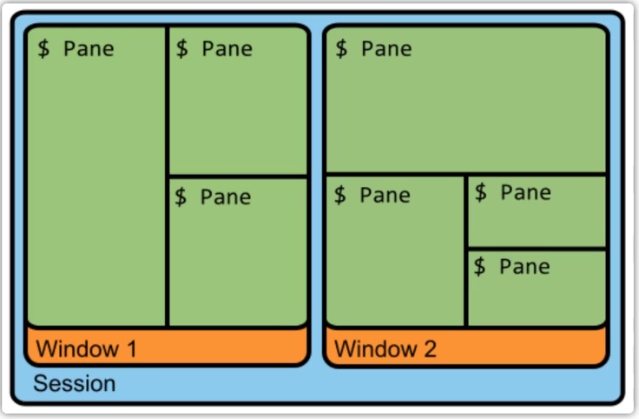

原文链接：http://www.cnblogs.com/codingbigdog/archive/2022/09/14/16692891.html
提交日期：Wed, 14 Sep 2022 06:13:00 GMT
博文内容：
# 1.基本概念和使用

tmux中有三个概念：会话、窗口和窗格，具体如下图所示：




在linux终端中输入如下内容，开启一个会话
```
tmux new -s mysession  # 创建一个名字为mysession的会话
```
创建完会话以后，默认开启一个窗口，然后我们就可在窗口里面创建窗格或者创建新的窗口：
```
ctrl+b %  # 在水平方向创建一个窗格
# 说明：ctrl+b %：不是同时按这些键，而是先按ctrl+b，然后松开，然后再按shift+5。shift+5就是%的意思。
ctrl+b "  # 在垂直方向创建一个窗格
ctrl+b 方向键  # 窗格间进行切换  
```

```
Ctrl+b c  # 创建一个新的窗口
ctrl+b +n：切换到下一个窗口
ctrl+b +p：切换到上一个窗口
```

其他具体的使用，请直接参考：[Tmux 使用教程](https://www.ruanyifeng.com/blog/2019/10/tmux.html)，tmux刚安装完，需要重新打开终端才能生效。

重启以后tmux会话的恢复：https://www.bilibili.com/video/BV1fA411E7VR

```
tmux attach -t 0 不用写全，
如
tmux att -t 0
```

ssh断开以后，tmux开启的会话也不会被杀死，可以进行重新连接。

tmux和vim中的ctrl+w都是用于分屏的，但是前者是用于将输入命令的命令行窗口进行分屏；后者是使用vim进入文件后，分屏编辑文件。

工作中：
一般新建两个窗口，一个窗口用于使用nvim编辑项目，一个窗口用于执行各种脚本

参考：[手把手教你使用终端复用神器 tmux](https://www.bilibili.com/video/BV1KW411Z7W3)
# 2.tmux配置文件（~/.tmux.conf）
我的配置文件：
```
# 以下内容参考：https://xpgeng.gitbooks.io/omooc2py/content/guide/Tmux-Guide.html
# 更改启动快捷键前缀C+b为C+a

# remap prefix from 'C-b' to 'C-a'
# 原本的ctrl a是跳转到命令开头，现在需要点击两次ctrl a才能跳转到开头。
unbind C-b
set -g prefix C-a
bind-key C-a send-prefix

# 更改分屏快捷键

# split panes using | and -
bind | split-window -h
bind - split-window -v
unbind '"'
unbind %

# 不同窗口间移动改成Alt+ 箭头

# switch panes using Alt-arrow without prefix
bind -n M-Left select-pane -L
bind -n M-Right select-pane -R
bind -n M-Up select-pane -U
bind -n M-Down select-pane -D

# 使用鼠标切换窗口
set -g mouse on

# 以下内容参考：https://gist.github.com/Godsing/c817baaeb44ceaaf57c91f047eaf5501
# 自定义状态栏
# set -g status-utf8 on # 状态栏支持utf8，这个有问题
set -g status-interval 1 # 状态栏刷新时间
set -g status-justify left # 状态栏列表左对齐
setw -g monitor-activity on # 非当前窗口有内容更新时在状态栏通知

#set -g status-bg black # 设置状态栏背景黑色
#set -g status-fg yellow # 设置状态栏前景黄色
#set -g status-style "bg=black, fg=yellow" # 状态栏前景背景色

set -g status-left "#[bg=#88cc44] Sess: #S " # 状态栏-左侧内容 (#S: 会话(session)名称)
#set -g status-right 'Continuum status: #{continuum_status}' # 状态栏右侧内容
set -g status-left-length 300 # 状态栏-左边长度300
set -g status-right-length 500 # 状态栏-左边长度500

set -wg window-status-format " #I:#W " # 状态栏-(当前窗口除外的其他)窗口名称格式
set -wg window-status-separator "" # 状态栏-窗口名称之间的间隔
set -wg window-status-current-format " #I:#W #F " # 状态栏-当前窗口名称格式(#I：序号，#w：窗口名称，#F：间隔符)
set -wg window-status-current-style "bg=black, fg=yellow" # 状态栏-当前窗口名称的背景色
#set -wg window-status-last-style "fg=black" # 状态栏最后一个窗口名称的样式

set -g message-style "bg=#202529, fg=#91A8BA" # 指定消息通知的前景、后景色
```
重启tmux以后，配置生效。


 