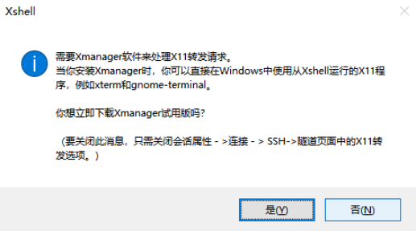

原文链接：http://www.cnblogs.com/codingbigdog/archive/2022/09/17/16702821.html
提交日期：Sat, 17 Sep 2022 07:59:00 GMT
博文内容：

# 1. vim 学习经验

- 把CapsLock映射成<esc>。这个操作我建议使用操作系统的改键工具来完成。win下的修改教程[链接](https://github.com/susam/uncap#windows-scancode-map-registry-value)，mac下直接在系统设置中改即可。不推荐在vim中改是因为系统内修改一次，所有能开启vi-mode的软件都可以使用CapsLock代替esc了，而不需要每次都重新配置。这条是最重要的一条。设置完这条之后几乎马上就可以体会到vim的好处了。
每当写完一段有小停顿，习惯性按下CapsLock进入normal模式。

- 适应面向搜索编程的思想。我个人感觉vim快最重要的原因就是精准选择。而实现精准选择的必要途径就是搜索。搜索是vim的核心。

- 精确跳转+可视化模式 。掌握精确跳转后，结合v V ctrl+v 这三种可视化模式进行精确选择，配合cdyrp等指令，可以完成极其灵活的代码增删改查。到这一步你会发现vim对你编程速度的提高已经是革命性的了。

- 终端中，输入vimtutor zh，可对vim进行学习和练习


# 2. vimtutor zh中命令的总结

终端中，输入vimtutor zh，可对vim进行学习和练习，下面是对vimtutor中内容做的总结，所以请你直接去vimtutor zh中进行练习，不必看第二节的东西。

##　2.1 移动光标
基本移动：
```
光标在屏幕文本中的移动既可以用箭头键，也可以使用 hjkl 字母键。
         h (左移)       j (下行)       k (上行)     l (右移)

e 命令可以使光标移动到单词末尾，从而实现快速移动。
```
行尾和行首：
```
欲移动光标到行首，请按数字0或^
欲移动光标到行尾，请按$。与快捷键"^"和0不同，快捷键$前可以加上数字表示移动的行数。
例如使用"1$"表示当前行的行尾，"2$"表示当前行的下一行的行尾。
```
文档头和文档尾：
```
CTRL-G 用于显示当前光标所在位置和文件状态信息。
G 用于将光标跳转至文件最后一行。
先敲入一个行号然后输入大写 G 则是将光标移动至该行号代表的行。
gg 用于将光标跳转至文件第一行。
```
括号：
```
如果光标当前位置是括号(、)、[、]、{、}，按 % 会将光标移动到配对的括号上。
```
快速移动：
```
w/e 基于单词移动
f{char}  按f，然后按相应的字符，就会跳转距离此光标最近的此字符。f是向前查找，F是向后查找。
ctrl+f ctrl+u 前后翻屏
```


## 2.2 删除修改、查找替换
删除：
```
删除类命令的格式是：d   [number(数字)]   motion
       [number] - 可以附加的数字，代表动作重复的次数
       motion代表操作的动作，可以为：
            w - 从当前光标当前位置直到下一个单词起始处，包括单词间的空格。
            e - 从当前光标当前位置直到单词末尾，不包括单词间的空格。
            $ - 从当前光标当前位置直到当前行末。
举例如下：
1. 欲从当前光标删除至下一个单词，请输入：dw
2. 欲从当前光标删除至当前行末尾，请输入：d$
3. 欲删除整行，请输入：dd
4. 欲重复一个动作，请在它前面加上一个数字，如d2w代表删除两个单词，再如2dd或d2d 删除两行代表删除两行

dty：从光标开始删除到字符y为止（y不删除）

使用d删除掉的内容，可以通过p粘贴出来
```

修改：
```
更改类命令的格式是：c   [number]   motion。
c的参数和d一样的，比如 w 代表单词，$代表行末等等。
```

查找：
```
输入 / 然后紧随一个字符串是在当前所编辑的文档中正向查找该字符串。
输入 ? 然后紧随一个字符串则是在当前所编辑的文档中反向查找该字符串。
完成一次查找之后按 n 键是重复上一次的命令，可在同一方向上查
找下一个匹配字符串所在；或者按大写 N 向相反方向查找下一匹配字符串所在。
CTRL-O 带您跳转回较旧的位置，CTRL-I 则带您到较新的位置。【这个不太懂，它是什么样的跳转规则？？】


使用查找命令时，如/aaa，查找aaa的时候，可以使用set设置一些选项： 
输入 :set xxx 可以设置 xxx 选项。一些有用的选项如下：
        'ic' 'ignorecase'       查找时忽略字母大小写
        'is' 'incsearch'        查找短语时显示部分匹配
        'hls' 'hlsearch'        高亮显示所有的匹配短语
     选项名可以用完整版本，也可以用缩略版本。


:set ic设置以后需要使用:set noic进行关闭，果您想要仅在一次查找时忽略字母大小写，您可以使用 \c，如：
      /ignore\c <回车>

在选项前加上 no 可以关闭选项：  :set noic
```
替换:
```
在一行内替换头一个字符串 old 为新的字符串 new，请输入  :s/old/new
在一行内替换所有的字符串 old 为新的字符串 new，请输入  :s/old/new/g
将两行之间的所有的字符串 old 替换为新的字符串 new，请输入  :#,#s/old/new/g，如566,571s/old/new/g
在文件内替换所有的字符串 old 为新的字符串 new，请输入  :%s/old/new/g
进行全文替换时询问用户确认每个替换需添加 c 标志        :%s/old/new/gc
```


```
在正常模式下删除光标所在位置的字符，请按： x

要替换光标所在位置的字符，请输入小写的 r 和要替换掉原位置字符的新字符即可。

输入大写的 R 将进入替换模式，直至按 <ESC> 键回到正常模式。
```

## 可视模式下的操作
```
v：进入可视模式
V：进入可视模式，按行选取内容
```
可视模式下的快捷键：
```
iw 选择一个单词

上面提到过的移动光标的操作可以用在这里快速选择字符。
```


## 2.4 其他操作
```
欲退出 Vim 编辑器，请输入 <ESC>   :q!   <回车> 放弃所有改动。
                      或者输入 <ESC>   :wq   <回车> 保存改动。
```
```
欲插入或添加文本，请输入：
         i  在光标前插入文本
         I  在行首插入文本
         a  在光标后插入文本（最常用）
         A  在行尾插入文本

输入小写的 o 可以在光标下方打开新的一行并进入插入模式。
输入大写的 O 可以在光标上方打开新的一行并进入插入模式。
```
```
欲撤消以前的操作，请输入：u (小写的u)
欲撤消在一行中所做的改动，请输入：U (大写的U)
欲撤消以前的撤消命令，恢复以前的操作结果，请输入：CTRL-R
```

```
:!command 用于执行一个外部命令 command。

     请看一些实际例子：
         (MS-DOS)         (Unix)
          :!dir            :!ls            -  用于显示当前目录的内容。
          :!del FILENAME   :!rm FILENAME   -  用于删除名为 FILENAME 的文件。

  :w FILENAME  可将当前 VIM 中正在编辑的文件保存到名为 FILENAME 的文件中，此时编辑的是FILENAME文件。（另存为）

v motion :w FILENAME 可将当前编辑文件中可视模式下选中的内容保存到文件FILENAME 中。
按 v 键使 Vim 进入可视模式进行选取。您可以四处移动光标来选取需要的区域。接着您可以使用一个操作符对选中文本进行操作。例如，按 d 键会删除选中的文本内容、:w FILENAME另存为文件

```
```
 :r FILENAME 可提取磁盘文件 FILENAME 并将其插入到当前文件的光标位置后面。

 :r !ls 可以读取ls命令的输出并将其放置到当前文件的光标位置后面。
```

   
```
  1. 输入 :help 或者按 <F1> 键或 <Help> 键可以打开帮助窗口。  

  2. 输入 :help cmd 可以找到关于 cmd 命令的帮助。

  3. 输入 CTRL-W CTRL-W  可以使您在窗口之间跳转。

  4. 输入 :q 以关闭帮助窗口

  5. 您可以创建一个 vimrc 启动脚本文件用来保存您偏好的设置。

  6. 当输入 : 命令时，按 CTRL-D 可以查看可能的补全结果。
     按 <TAB> 可以使用一个补全。
```

```
使用 v 进入可视模式，选择需要的文本，使用操作符 y 复制文本，p 粘贴先前复制的文本。

```


# 3.Windows下的远程连接工具
- xshell：个人版不要钱
- mobaxterm：我在用的。
- windows终端（不是自带的那个，而是[这个](https://learn.microsoft.com/zh-cn/windows/terminal/install)）
- vscode中的远程连接服务器的功能

本人使用mobaxterm过程中的问题：
在mobaxterm中使用vim编辑远程服务器中的文本时，使用y复制了文本，但此文本没有复制到windows的剪切板上。[解决方法](https://blog.csdn.net/pangchol/article/details/91425637)，在这篇解决方法中配置了export DISPLAY和xhost，这会导致如下影响：vscode远程连接服务器时，打开终端速度慢（或者直接打不开）【这个我还不知道是为什么】。 
xshell中也有此问题，可参考[链接的方法一（方法二亲测无效）](https://www.cnblogs.com/pangchol/archive/2015/12/21/5062115.html)。方法一应该是根据xshell弹出的如下弹窗进行设置的：

