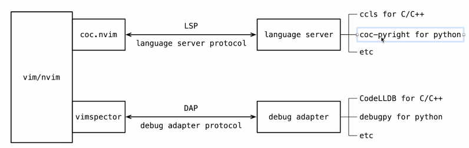
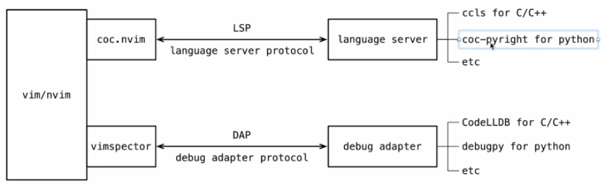

原文链接：http://www.cnblogs.com/codingbigdog/archive/2022/08/25/16624274.html
提交日期：Thu, 25 Aug 2022 06:51:00 GMT
博文内容：
请对照我参考的up主视频，进行学习。

# 4. vim 配置C++环境
参考视频：https://www.bilibili.com/video/BV1dL411V75t
init.vim：https://github.com/cateduo/nvim/blob/main/init.vim

安装nvim：
```
sudo apt-get install neovim
```

创建和编辑nvim配置文件：
```
mkdir ~/.config/nvim
nvim ~/.config/nvim/init.vim  【使用nvim进行编辑，而不是使用vim进行编辑】
```
下面在init.vim文件中进行配置：
首先配置基本的选项：
```
set number " 设置行号
" set relativenumber " 设置相对行号，自己把注释取消掉看看效果
"下面将tab键改为两个空格
set expandtab
set tabstop=2
set shiftwidth=2
set softtabstop=2
set ignorecase " 忽略大小写
set smartcase " 智能大小写
set notimeout " 关闭命令输出的等待超时
" set jumpoptions=stack " 以栈的方式进行跳转。这个好像无效了
set mouse=a
" set paste
let mapleader = "\<SPACE>" " 将leader键映射为空格。这里的\是转义字符。
```

常见的vim插件管理器有：vim-plug, Vundle, Pathogen, Dein.Vim, volt等。综合性能、易用性、文档等几个方面,这里推荐使用vim-plug。

**下载插件管理器vim-plug：**
```
" 首先判断插件管理器是否存在，如果不存在，则去下载，并执行PlugInstall进行安装
if empty(glob('~/.config/nvim/autoload/plug.vim')) 
  :exe '!curl -fLo ~/.config/nvim/autoload/plug.vim --create-dirs
              \ https://raw.githubusercontent.com/junegunn/vim-plug/master/plug.vim'
  au VimEnter * PlugInstall --sync | source $MYVIMRC
endif

call plug#begin('~/.config/nvim/plugged')
  Plug 'cateduo/vsdark.nvim'
call plug#end()
```
将需要的插件放入begin和end之间，然后执行：
```
:source  ~/.config/nvim/init.vim # 重新加载配置文件（也可以退出nvim，然后重新进入）
:PlugInstall    # 安装插件
```

**问题一：**
插件就会自动被下载到~/.config/nvim/plugged文件夹下，如上面的代码会自动将插件从github.com/cateduo/vsdark.nvim下载下来。在下载文件的过程中可能会出现如下问题：
```
curl: (7) Failed to connect to raw.githubusercontent.com port 443: Connection refused）
```
解决方法：设置DNS为114.114.114.114或者8.8.8.8就好了。设置方法：[链接](https://blog.csdn.net/booklijian/article/details/116491288)

**问题二：**
配置中使用curl下载插件管理器，如果提示错误：curl: (23) Failure writing output to destination，则我们需要执行：
```
sudo snap remove curl  # 通过snap下载curl就会出现上面的错误
sudo apt install curl
```
**问题三：**
安装过程可能需要kexue上网

**问题四：**
安装过程可能失败，多执行几次:PlugInstall就可以了

有了上面的知识，我们接下来会安装和配置各种各样的插件。

## 4.1 主题插件
```
call plug#begin('~/.config/nvim/plugged')
  Plug 'cateduo/vsdark.nvim'
call plug#end()

" ==== cateduo/vsdark.nvim的配置 ====
set termguicolors
let g:vsdark_style = "dark"
colorscheme vsdark
```
从上面代码，我们可以看出，添加插件就是在begin和end之间添加插件在github中的位置，然后在begin和end外面做一些对此插件的配置。


使用xshell时，发现：使用nvim编辑文本时，文本一篇漆黑。我们需要对xshell进行设置：“工具” -> “选项” -> “高级”，然后勾选使用本色。

## 4.2 文件浏览器
```
call plug#begin('~/.config/nvim/plugged')
  " file explorer
  Plug 'preservim/nerdtree'
call plug#end()

" ==== preservim/nerdtree ====
nnoremap <LEADER>e :NERDTreeToggle<CR>
```
配置信息中，将leader键+e映射为打开文件浏览器（:NERDTreeToggle<CR>（CR是回车的意思）），并且我们前面已经使用let mapleader = "\<SPACE>"将leader键映射为空格键，所以只用空格+e就可以打开文件浏览器，这里的`\`代表转义字符，对`<`进行转义。

`NERDTree 文件目录`可以打开相应的目录

通过ctrl+w+w 就可以在工作文件和文件浏览器之间进行切换。

## 4.3 coc插件



上图中，首先我们需要在vim/nvim中安装coc.nvim插件，然后安装语言服务器（c++、python等）。当我们在nvim中进行编程的时候，coc.nvim插件就会通过LSP协议与语言服务器进行交互，从而实现代码的补全等操作。

安装coc.nvim插件：
```
call plug#begin('~/.config/nvim/plugged')
  " lsp
  Plug 'neoclide/coc.nvim', {'branch': 'release'}
call plug#end()
```
安装以后，可能会提示缺少依赖nodejs，可以通过[链接](https://github.com/nodesource/distributions/blob/master/README.md#debinstall)对nodejs进行安装。
还可能需要依赖yarn（sudo apt install yarn）。

安装coc以后，可能出现如下警告：
```
coc.nvim switched to custom popup menu from 0.0.82 
you have to change key-mapping of <tab> to make it work. 
checkout current key-mapping by ":verbose imap <tab>"
```
上面警告的意思是：需要我们自己配置tab键的含义，但是使用了up主的配置文件，还是会有上述的问题，所以我参考了https://github.com/neoclide/coc.nvim#example-vim-configuration中对tab的配置，对up主的配置文件进行了修改，修改后的配置文件如下：
```
" ==== neoclide/coc.nvim ====
" coc extensions
let g:coc_global_extensions = [
      \ 'coc-json',
      \ 'coc-tsserver',
      \ 'coc-css',
      \ 'coc-html',
      \ 'coc-vimlsp',
      \ 'coc-cmake',
      \ 'coc-highlight',
      \ 'coc-pyright'
      \ ]
" 上面的配置在重新进入init.vim时会自动安装coc的语言服务器（可能需要多次进入init.vim才能完全下载成功），但是也可以通过CocInstall安装语言服务器，如:CocInstall coc-pyright
" 其他的语言服务器，可参考：https://github.com/neoclide/coc.nvim/wiki/Language-servers

set signcolumn=number " 在行号的位置提醒错误

" 配置tab和shift tab对候选词进行选取

" <TAB> to select candidate forward or
" pump completion candidate
" 使用tab键向下选择自动补全的候选词
inoremap <silent><expr> <TAB>
      \ coc#pum#visible() ? coc#pum#next(1) :
      \ CheckBackspace() ? "\<Tab>" :
      \ coc#refresh()
" <s-TAB> to select candidate backward
" 使用shift+tab向上选择自动补全的候选词
inoremap <expr><S-TAB> coc#pum#visible() ? coc#pum#prev(1) : "\<C-h>"

" Make <CR> to accept selected completion item or notify coc.nvim to format
" <C-g>u breaks current undo, please make your own choice.
" 按回车键确认我们所选择的候选词
inoremap <silent><expr> <CR> coc#pum#visible() ? coc#pum#confirm()
                              \: "\<C-g>u\<CR>\<c-r>=coc#on_enter()\<CR>"

function! CheckBackspace() abort
  let col = col('.') - 1
  return !col || getline('.')[col - 1]  =~# '\s'
endfunction


" 使用K来跳转到帮助文档，如将光标定位到nnoremap，然后使用K可进行跳转
nnoremap <silent> K :call <SID>show_documentation()<CR> 
function! s:show_documentation() 
  if(index(['vim', 'help'], &filetype) >= 0)
    execute 'h '.expand('<cword>')
  elseif (coc#rpc#ready())
    call CocActionAsync('doHover')
  else
    execute '!' . &keywordprg . " " . expand('<cword>')
  endif
endfunction

" highlight link CocHighlightText Visual
" autocmd CursorHold * silent call CocActionAsync('highlight')   " TODO

" 重命名，重命名一个，其他与此同名的，也会被重命名
nmap <leader>rn <Plug>(coc-rename)
" 格式化配置，具体可参考coc的github网站。
xmap <leader>f <Plug>(coc-format-selected)
command! -nargs=0 Format :call CocAction('format')

augroup mygroup
  autocmd!
  autocmd FileType typescript,json setl formatexpr=CocAction('formatSelected')
  autocmd User CocJumpPlaceholder call CocActionAsync('showSignatureHelp')
augroup end

" diagnostic info 错误提示信息
nnoremap <silent><nowait> <LEADER>d :CocList diagnostics<CR>
nmap <silent> <LEADER>- <Plug>(coc-diagnostic-prev) " 跳转到上一个错误
nmap <silent> <LEADER>= <Plug>(coc-diagnostic-next) " 跳转到下一个错误
nmap <LEADER>qf <Plug>(coc-fix-current) " 自动修复错误
 
" Remap <C-f> and <C-b> for scroll float windows/popups. 滚动浮窗
if has('nvim-0.4.0') || has('patch-8.2.0750')
  nnoremap <silent><nowait><expr> <C-f> coc#float#has_scroll() ? coc#float#scroll(1) : "\<C-f>"
  nnoremap <silent><nowait><expr> <C-b> coc#float#has_scroll() ? coc#float#scroll(0) : "\<C-b>"
  inoremap <silent><nowait><expr> <C-f> coc#float#has_scroll() ? "\<C-r>=coc#float#scroll(1)\<CR>" : "\<Right>"
  inoremap <silent><nowait><expr> <C-b> coc#float#has_scroll() ? "\<C-r>=coc#float#scroll(0)\<CR>" : "\<Left>"
  vnoremap <silent><nowait><expr> <C-f> coc#float#has_scroll() ? coc#float#scroll(1) : "\<C-f>"
  vnoremap <silent><nowait><expr> <C-b> coc#float#has_scroll() ? coc#float#scroll(0) : "\<C-b>"
endif

" statusline support
" set statusline^=%{coc#status()}%{get(b:,'coc_current_function','')}  "TODO

" GoTo code navigation. 代码的跳转，包括跳转到定义、跳转到实现等
nmap <silent> gd <Plug>(coc-definition)
nmap <silent> gD :tab sp<CR><Plug>(coc-definition)
nmap <silent> gy <Plug>(coc-type-definition)
nmap <silent> gi <Plug>(coc-implementation)
nmap <silent> gr <Plug>(coc-references)

" 使用nvim编辑cpp文件，然后输入:Gcmake后，就会调用下面函数，此函数判断当前目录下是否有CMakeLists.txt文件，
" 如果有的话，就在当前目录的.vscode目录下生成compile_commands.json。

function! s:generate_compile_commands() 
  if empty(glob('CMakeLists.txt')) 
    echo "Can't find CMakeLists.txt"
    return
  endif
  if empty(glob('.vscode'))
    execute 'silent !mkdir .vscode'
  endif
  execute '!cmake -DCMAKE_BUILD_TYPE=debug
      \ -DCMAKE_EXPORT_COMPILE_COMMANDS=1 -S . -B .vscode'
endfunction
command! -nargs=0 Gcmake :call s:generate_compile_commands()
```

ccls不放在init.vim中的coc_global_extensions下进行安装，而在外面进行安装：
```
sudo apt install ccls
```

然后需要对ccls进行配置，可以在nvim编辑的文件中输入:CocConfig进入ccls配置文件\~/.config/nvim/coc-settings.json，配置如下（文中的注释记得去掉）：
```
{
  "suggest.labelMaxLength": 60,
  "suggest.completionItemKindLabels": {
    "class": "\uf0e8",
    "color": "\ue22b"
  },
  "cmake.formatter": "cmake-format",
  "languageserver": {
    "ccls": {
      "command": "ccls", 
      "filetypes": [ "c", "cc", "cpp", "c++", "objc", "objcpp" ],
      "rootPatterns": [ "compile_commands.json", ".git/", ".hg/", ".vscode", ".vim/" ],
      "initializationOptions": {
        "highlight": {"lsRanges": true},
        "cache": {  
          "directory": "/tmp/ccls" # 缓冲文件所在的路径
        },
        "clang": {  # 编译器，如果你使用的是gdb编译器，那么可以按照https://github.com/neoclide/coc.nvim/wiki/Language-servers#ccobjective-c进行配置
          "resourceDir": "/usr/lib/clang/13.0.0"
        },
        "completion": {
          "detailedLable": true,
          "placeholder": true
        },
        "index": {
          "onChange": false,
          "initialNoLinkage": true,
          "threads": 2
        },
        "compilationDatabaseDirectory": ".vscode/"
      }
    }
  }
}

```
上面的`"compilationDatabaseDirectory": ".vscode/"`代表到.vscode文件夹下查找compile_commands.json文件，根据compile_commands.json就可以查找到头文件和库文件所在目录，而compile_commands.json是由cmake或make生成的。

**cmake生成compile_commands.json：**
```
cmake -DCMAKE_BUILD_TYPE=debug -DCMAKE_EXPORT_COMPILE_COMMANDS=YES -S . -B .vscode

-S  指定源文件根目录，必须包含一个CMakeLists.txt文件
-B  指定构建目录，构建生成的中间文件和目标文件的生成路径  

在当前目录的.vscode目录下生成compile_commands.json

平常cmake只会生成CMakeCache.txt、CMakeFiles、cmake_install.cmake、Makefile。上面的cmake多生成了compile_commands.json等文件。

在coc的配置文件中，我们还写了一个generate_compile_commands函数。有了generate_compile_commands函数，我们就可以通过输入:Gcmake来执行上面的cmake命令。

```


如果我们只有Makefile文件，却没有CMakeLists.txt文件，此时可以通过项目https://github.com/rizsotto/Bear生成compile_commands.json，有兴趣可以看一下这个项目。配置好此项目以后，通过以下命令就可以生成compile_commands.json：
```
bear -- make -C .. -j4
```


## 4.4 vimspector插件
跳转分为了两个，一个是光标移到某个函数，需要进入这个函数；一个是调试的过程中，调试到某个函数（从47:35开始）。coc插件插件实现了前者，而接下来要介绍的vimspector将实现后者。



安装插件：
```
call plug#begin('~/.config/nvim/plugged')
  " debug
  " --enable-rust --enable-python分别代表安装C++和python的相关编译器
  Plug 'puremourning/vimspector', {'do': './install_gadget.py --enable-rust --enable-python'} 
call plug#end()
```

.vimspector.json：
up主完整的配置文件中可以看到：我们可以使用:Gvimspector命令自动生成.vimspector.json文件。从函数的定义来看，我们必须在~/.config/nvim/vimspector_conf/下面预先准备好c.json和python.json，c.json和python.json的内容如下：

C++的配置文件（c.json）：
```
{
  "configurations": {
    "Launch": {
      "adapter": "CodeLLDB",
      "configuration": {
        "request": "launch",
        "program": "${workspaceFolder}/test",
        "cwd": "${workspaceFolder}",
        "args": [ ],
        "environment": [ ],
        "externalConsole": true,
        "MIMode": "lldb"
      }
    }
  }
}
```

python的配置文件（python.json）：
```
{
  "configurations": {
    "run": {
      "adapter": "debugpy",
      "configuration": {
        "request": "launch",
        "type": "python",
        "cwd": "${workspaceFolder}",
        "program": "${file}",
        "stopOnEntry": true,
        "args": [],
        "console": "integratedTerminal"
      },
      "breakpoints": {
        "exception": {
          "raised": "N",
          "uncaught": ""
        }
      }
    }
  }
}

```
${workspaceFolder}代表.vimspector.json所在目录


## 4.5 LeaderF——查找项目中的某个变量
```
call plug#begin('~/.config/nvim/plugged')
  " file finder
  Plug 'Yggdroot/LeaderF', { 'do': ':LeaderfInstallCExtension' }
call plug#end()

" ==== Yggdroot/LeaderF ====
let g:Lf_WindowPosition='right' " 查找窗口的位置
let g:Lf_PreviewInPopup=1  " 此选项指定是否在弹出窗口中预览结果。
let g:Lf_CommandMap = {
\   '<C-p>': ['<C-k>'],
\   '<C-k>': ['<C-p>'],
\   '<C-j>': ['<C-n>']
\}  " 这一段我觉得没什么用
nmap <leader>f :Leaderf file<CR>   "　查找文件名
nmap <leader>b :Leaderf! buffer<CR>　 " 查找buffer中的文件名
nmap <leader>F :Leaderf rg<CR>    " 查找文件中的内容  无法实现？？
" nmap <leader>m :Leaderf mru<CR>   " 查询最近打开过的文件
let g:Lf_DevIconsFont = "DroidSansMono Nerd Font Mono" " 字体和图标
```
要使用`nmap <leader>F :Leaderf rg<CR>`，必须安装ripgrep，直接见[官网](https://github.com/BurntSushi/ripgrep)进行安装。

具体使用可参考：https://blog.csdn.net/qq_42475711/article/details/96731337


## 4.6 注释与开启终端
```
call plug#begin('~/.config/nvim/plugged')
  " enhance editor
  Plug 'tomtom/tcomment_vim'
  
  " terminal
  Plug 'skywind3000/vim-terminal-help'  " alt = 打开终端  
call plug#end()

" ==== tomtom/tcomment_vim ====

let g:tcomment_textobject_inlinecomment = ''  " 不知道说明什么意思，官网也找不到，先放着吧
nmap <LEADER>cn g>c  " leader键+cn 注释
vmap <LEADER>cn g>   " 将选中文本进行注释
nmap <LEADER>cu g<c  " leader键+cu 取消注释
vmap <LEADER>cu g<   " 将选中文本取消注释
```

:help tcomment查看插件的帮助


## 4.7 up主完整的配置文件
```
" request:
"   1. node
"   2. npm
"   3. python3 (pip3 install neovim)
nnoremap <space>rl :so ~/.config/nvim/init.vim<CR>
nnoremap <space>rc :e ~/.config/nvim/init.vim<CR>

set number
set relativenumber
set expandtab
set tabstop=2
set shiftwidth=2
set softtabstop=2
set ignorecase
set smartcase
set notimeout
set mouse=a

let mapleader = "\<SPACE>" " defualt ,

if empty(glob('~/.config/nvim/autoload/plug.vim'))
  :exe '!curl -fLo ~/.config/nvim/autoload/plug.vim --create-dirs
              \ https://raw.githubusercontent.com/junegunn/vim-plug/master/plug.vim'
  au VimEnter * PlugInstall --sync | source $MYVIMRC
endif


" =======================
" ===  plugins  begin ===
" =======================
call plug#begin('~/.config/nvim/plugged')
  
  " enhance editor
  Plug 'tomtom/tcomment_vim'
  
  " terminal
  Plug 'skywind3000/vim-terminal-help'
  
  " file explorer
  Plug 'preservim/nerdtree'

  " file finder
  Plug 'Yggdroot/LeaderF', { 'do': ':LeaderfInstallCExtension' }

  " highlight
  Plug 'cateduo/vsdark.nvim'
  Plug 'jackguo380/vim-lsp-cxx-highlight'
  
  " lsp
  Plug 'neoclide/coc.nvim', {'branch': 'release'}
  
  " debug
  Plug 'puremourning/vimspector', {'do': './install_gadget.py --enable-rust --enable-python'}
  
call plug#end()
" =======================
" ===   plugins  end  ===
" =======================


" =================================
" ===   plugins  configuration  ===
" =================================

" ==== tomtom/tcomment_vim ====

let g:tcomment_textobject_inlinecomment = ''
nmap <LEADER>cn g>c
vmap <LEADER>cn g>
nmap <LEADER>cu g<c
vmap <LEADER>cu g<


" ==== preservim/nerdtree ====

nnoremap <LEADER>e :NERDTreeToggle<CR>


" ==== Yggdroot/LeaderF ====
let g:Lf_WindowPosition='right'
let g:Lf_PreviewInPopup=1
let g:Lf_CommandMap = {
\   '<C-p>': ['<C-k>'],
\   '<C-k>': ['<C-p>'],
\   '<C-j>': ['<C-n>']
\}
nmap <leader>f :Leaderf file<CR>
nmap <leader>b :Leaderf! buffer<CR>
nmap <leader>F :Leaderf rg<CR>
let g:Lf_DevIconsFont = "DroidSansMono Nerd Font Mono"


" ==== cateduo/vsdark.nvim ====

set termguicolors
let g:vsdark_style = "dark"
colorscheme vsdark


" ==== jackguo380/vim-lsp-cxx-highlight 一些高亮的配置 ====

hi default link LspCxxHlSymFunction cxxFunction
hi default link LspCxxHlSymFunctionParameter cxxParameter
hi default link LspCxxHlSymFileVariableStatic cxxFileVariableStatic
hi default link LspCxxHlSymStruct cxxStruct
hi default link LspCxxHlSymStructField cxxStructField
hi default link LspCxxHlSymFileTypeAlias cxxTypeAlias
hi default link LspCxxHlSymClassField cxxStructField
hi default link LspCxxHlSymEnum cxxEnum
hi default link LspCxxHlSymVariableExtern cxxFileVariableStatic
hi default link LspCxxHlSymVariable cxxVariable
hi default link LspCxxHlSymMacro cxxMacro
hi default link LspCxxHlSymEnumMember cxxEnumMember
hi default link LspCxxHlSymParameter cxxParameter
hi default link LspCxxHlSymClass cxxTypeAlias


" ==== neoclide/coc.nvim ====

" coc extensions
let g:coc_global_extensions = [
      \ 'coc-json',
      \ 'coc-tsserver',
      \ 'coc-css',
      \ 'coc-html',
      \ 'coc-vimlsp',
      \ 'coc-cmake',
      \ 'coc-highlight',
      \ 'coc-pyright'
      \ ]

set signcolumn=number

" 配置tab和shift tab对候选词进行选取

" <TAB> to select candidate forward or
" pump completion candidate
" 使用tab键向下选择自动补全的候选词
inoremap <silent><expr> <TAB>
      \ coc#pum#visible() ? coc#pum#next(1) :
      \ CheckBackspace() ? "\<Tab>" :
      \ coc#refresh()
" <s-TAB> to select candidate backward
" 使用shift+tab向上选择自动补全的候选词
inoremap <expr><S-TAB> coc#pum#visible() ? coc#pum#prev(1) : "\<C-h>"

" Make <CR> to accept selected completion item or notify coc.nvim to format
" <C-g>u breaks current undo, please make your own choice.
" 按回车键确认我们所选择的候选词
inoremap <silent><expr> <CR> coc#pum#visible() ? coc#pum#confirm()
                              \: "\<C-g>u\<CR>\<c-r>=coc#on_enter()\<CR>"

function! CheckBackspace() abort
  let col = col('.') - 1
  return !col || getline('.')[col - 1]  =~# '\s'
endfunction

nnoremap <silent> K :call <SID>show_documentation()<CR>
function! s:show_documentation()
  if(index(['vim', 'help'], &filetype) >= 0)
    execute 'h '.expand('<cword>')
  elseif (coc#rpc#ready())
    call CocActionAsync('doHover')
  else
    execute '!' . &keywordprg . " " . expand('<cword>')
  endif
endfunction

" highlight link CocHighlightText Visual
" autocmd CursorHold * silent call CocActionAsync('highlight')   " TODO

nmap <leader>rn <Plug>(coc-rename)
xmap <leader>f <Plug>(coc-format-selected)
command! -nargs=0 Format :call CocAction('format')

augroup mygroup
  autocmd!
  autocmd FileType typescript,json setl formatexpr=CocAction('formatSelected')
  autocmd User CocJumpPlaceholder call CocActionAsync('showSignatureHelp')
augroup end

" diagnostic info
nnoremap <silent><nowait> <LEADER>d :CocList diagnostics<CR>
nmap <silent> <LEADER>- <Plug>(coc-diagnostic-prev)
nmap <silent> <LEADER>= <Plug>(coc-diagnostic-next)
nmap <LEADER>qf <Plug>(coc-fix-current)

" Remap <C-f> and <C-b> for scroll float windows/popups.
if has('nvim-0.4.0') || has('patch-8.2.0750')
  nnoremap <silent><nowait><expr> <C-f> coc#float#has_scroll() ? coc#float#scroll(1) : "\<C-f>"
  nnoremap <silent><nowait><expr> <C-b> coc#float#has_scroll() ? coc#float#scroll(0) : "\<C-b>"
  inoremap <silent><nowait><expr> <C-f> coc#float#has_scroll() ? "\<C-r>=coc#float#scroll(1)\<CR>" : "\<Right>"
  inoremap <silent><nowait><expr> <C-b> coc#float#has_scroll() ? "\<C-r>=coc#float#scroll(0)\<CR>" : "\<Left>"
  vnoremap <silent><nowait><expr> <C-f> coc#float#has_scroll() ? coc#float#scroll(1) : "\<C-f>"
  vnoremap <silent><nowait><expr> <C-b> coc#float#has_scroll() ? coc#float#scroll(0) : "\<C-b>"
endif

" statusline support
" set statusline^=%{coc#status()}%{get(b:,'coc_current_function','')}  "TODO

" GoTo code navigation.
nmap <silent> gd <Plug>(coc-definition)
nmap <silent> gD :tab sp<CR><Plug>(coc-definition)
nmap <silent> gy <Plug>(coc-type-definition)
nmap <silent> gi <Plug>(coc-implementation)
nmap <silent> gr <Plug>(coc-references)

function! s:generate_compile_commands()
  if empty(glob('CMakeLists.txt'))
    echo "Can't find CMakeLists.txt"
    return
  endif
  if empty(glob('.vscode'))
    execute 'silent !mkdir .vscode'
  endif
  execute '!cmake -DCMAKE_BUILD_TYPE=debug
      \ -DCMAKE_EXPORT_COMPILE_COMMANDS=1 -S . -B .vscode'
endfunction
command! -nargs=0 Gcmake :call s:generate_compile_commands()

" ==== puremourning/vimspector ====
let g:vimspector_enable_mappings = 'HUMAN'

function! s:generate_vimspector_conf()
  if empty(glob( '.vimspector.json' ))
    " if &filetype == 'c' || 'cpp' " up主原本这样写是不行的
    if (&filetype == 'c') || (&filetype=='cpp') 
      !cp ~/.config/nvim/vimspector_conf/c.json ./.vimspector.json
    elseif &filetype == 'python'
      !cp ~/.config/nvim/vimspector_conf/python.json ./.vimspector.json
    endif
  endif
  e .vimspector.json
endfunction

command! -nargs=0 Gvimspector :call s:generate_vimspector_conf()

nmap <Leader>v <Plug>VimspectorBalloonEval
xmap <Leader>v <Plug>vimspectorBalloonEval
```
