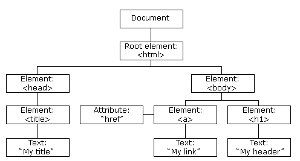

原文链接：http://www.cnblogs.com/codingbigdog/archive/2022/05/12/16264808.html
提交日期：Thu, 12 May 2022 14:50:00 GMT
博文内容：
# 1.安装和运行
**1.安装node.js**
node.js下载链接：https://nodejs.org/en/download/
安装node.js以后，npm就默认被安装了
查看是否安装成功
```
node -v
npm -v
```

**2.安装cnpm**
npm国内速度太慢，下载cnpm来用：
```
npm install -g cnpm --registry=https://registry.npm.taobao.org
```
这个过程不用管warning

利用cnpm -v看是否安装成功

**3.安装vue cli**
```
cnpm install -g @vue/cli
vue -V    # 检查是否安装成功
```
```
vue create serv  # 创建项目serv    
cd serv
npm run serve    # 运行项目
```

一些插件的安装：[链接](https://blog.csdn.net/seimeii/article/details/121115540)。使用cnpm安装更快。

**3.vscode中安装eslint**
在vscode中安装eslint:https://www.cnblogs.com/sheseido/p/12357144.html
记得安装完了要重启。
每一次ctrl+s保存后，都会自动格式化

# 2.
HTML DOM 定义了访问和操作 HTML 文档的标准方法。
DOM 以树结构表达 HTML 文档。



CDN：导入远程的在线js文件


# 3.vue语法
参考：[菜鸟教程](https://www.runoob.com/vue3/vue3-intro.html)

在HTML文件中引入 vue.global.js 文件来测试学习。

```
Vue.createApp(HelloVueApp).mount('#hello-vue')   # 将组件HelloVueApp挂载到id为DOM 元素
```


鱼皮的介绍的一些网站，用于制作网站：https://www.bilibili.com/video/BV1CM4y137kF

vue就是一个单纯的前端，没有什么后端的操作吗？？如果是的话，那我直接找一个写好的前端来用，不更省事？？
