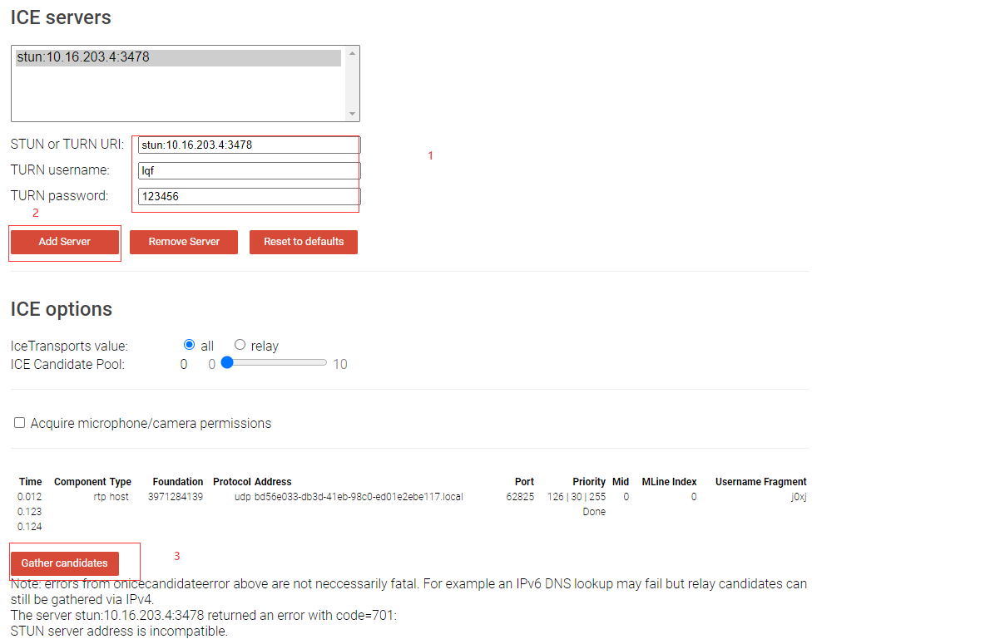
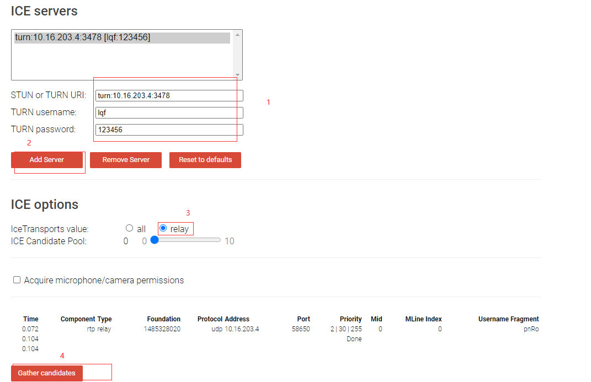

原文链接：http://www.cnblogs.com/codingbigdog/archive/2022/06/30/16428200.html
提交日期：Thu, 30 Jun 2022 11:25:00 GMT
博文内容：
直接看给的文档就行


sudo tail -f nohup.out # 监听nohup.out文件的变化
**测试stun:**
测试网址：https://webrtc.github.io/samples/src/content/peerconnection/trickle-ice/，进行如下操作：

出现错误：
Note: errors from onicecandidateerror above are not neccessarily fatal. For example an IPv6 DNS lookup may fail but relay candidates can still be gathered via IPv4.
The server stun:10.16.203.4:3478 returned an error with code=701:
STUN server address is incompatible.
可以了解STUN的具体知识以后，在回过来看。

**测试turn：**

点击Gather candidates后，nohup.out文件应该有所变化


# 实现一对一通信
**main.js代码的执行顺序：**
1.创建websocket对象，用于连接信令服务器。并且设置一些回调函数。以上这些通过下面代码实现：
```
zeroRTCEngine = new ZeroRTCEngine("ws://192.168.221.134:8099");
zeroRTCEngine.createWebsocket();
```
2.点击加入房间，获取视频流，并且使用doJoin(roomId)给信令服务器发送加入信息。


# js的一些知识
