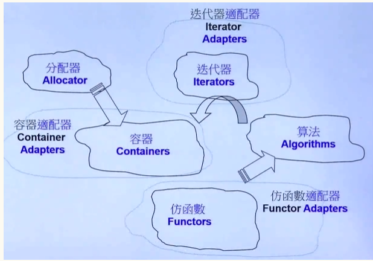
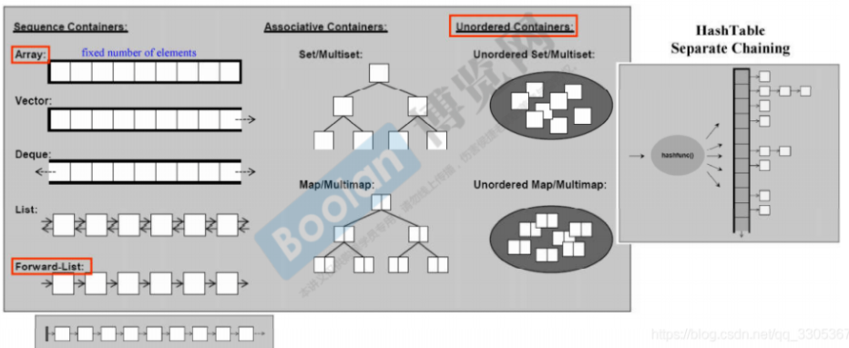

原文链接：http://www.cnblogs.com/codingbigdog/archive/2022/05/07/16243158.html
提交日期：Sat, 07 May 2022 08:47:00 GMT
博文内容：
参考：[链接](https://blog.csdn.net/qq_33053671/article/details/84504632)
#一、简介
C++标准库的header files不带.h后缀的，如：#include<cstdio>
这种形式的head files称为新式headers，新式headers内组件封装在namespace “std”（新式统一规定都在std）
using namespace std;（全部加载）
using std::cout;（cout单个）

常用网站：
- CPlusPlus.com
- CppReference.com
- gcc.gnu.org

我最常使用的是CPlusPlus.com。使用方法就是在搜索框中搜索想要的查询的类。千万不要认为这种开发手册就很复杂，而且是英文的，就不去看。你去认真去看了就会发现，开发手册写得很好。因为我英语不好，所以在搜索函数的后，会直接看开发手册给的实例，比如我在搜索vector的insert函数的使用时，会直接看手册中的代码实例，然后可能会去看看英文的讲解或者直接去百度了。
我认为本视频应该需要配套《stl源码剖析（侯捷）》看。
# 二、STL六大部件（components）
>容器（Containers）：容器存储数据
分配器（Allocators）：分配器为容器分配内存
算法（Algorithms）：算法处理容器的数据
迭代器（Iterators）：迭代器为算法提供访问容器的方式
适配器（Adapters）：进行转换，具体如何转换，以后介绍
仿函式（Functors）：仿函数为类似不同的类相加减提供支持。（？？？我还是不懂仿函式是什么？）
六大部件的关系：



## 2.1.一个例子说明六大部件
```
//一个例子说明六大部件
#include <vector>
#include <algorithm>
#include <functional>
#include <iostream>
using namespace std;

int main()
{
	int ia[6] = {27, 210, 12, 47, 109, 83};
	vector<int, allocator<int>> vi(ia,ia + 6);//<>符号表示模板，allocator<int>是一个分配器模板。
                                              // 如果将本行代码改为vector<int>，则vector会使用默认的分配器
	
	cout << count_if(vi.begin(), vi.end(),
			not1(bind2nd(less<int>(), 40)));    // 输出大于等于四十的数的个数
	return 0;
}
//vector是一个容器containers
//count_if是一个算法algorithm，计算vi里符合条件的元素个数
//vi.begin(), vi.end()是一个迭代器iterator。
//vi.begin()指向第一个元素，vi.end()指向最后一个元素的下一个元素  
//less<int>是一个仿函数function
//bind2nd是一个适配器function adapter，它将40绑定到less函数的第二个形参上
//notl是一个适配器function adapter,表示否定。bind2nd(less<int>(), 40)的结果相当于
//{true,false,true,false,false,false}，则not1(bind2nd(less<int>(), 40))就相当于{false,true,false,true,true,true}
```
我现在暂时对泛性编程的理解是：算法独立与数据结构，也就说函数count_if不止可以用于操作vector类型的数据，还可以操作其他类型的数据，如[这个](http://cplusplus.com/reference/functional/not1/?kw=not1)中的例子

## 2.2.遍历容器中所有元素
```
旧版遍历：
Container<T> c;
...
Container<T>::iterator ite = c.begin();
for (; ite != c.end(); ++ite)
	...

C++11遍历：
for (decl:coll){ // 其中coll为容器或者数组
    statement
}
//举例如下：
//1.
for (int i: {2,3,4,5,6,7,8,9,10})
{
	std::cout << i << std::endl;
}
//2.
int ia[] =  {2,3,4,5,6,7,8,9,10}
for (int i: ia)
{
	std::cout << i << std::endl;
}
//3.
std::vector<double> vec;
...
for (auto elem : vec) {  // auto代表让编译器判断，这里应该是个什么类型
	std::cout << elem << std::endl;   // 不需要进行解引用操作
}

for (auto& elem : vec) {   // auto&使得对elem的修改，就相当于对vec中相应元素的修改
	elem *= 3; 
}
```
## 2.3.容器种类
顺序容器Sequence Containers
- Array（固定元素个数）C++11：就是我们平时使用的数组，不过把现在用一个类将它包装起来。数组元素的个数在定义的时候就已经确定，不可扩充。
- Vector（尾部个数可以扩充）
- Deque（头尾个数可以扩充）
- List（双向链表）
- Forward-List（单向链表）C++11

关联容器Associative Container（通过key可以找到value）：关联容器一般使用红黑树进行实现。查找速度快，但由于插入的时候需要调整红黑树而导致插入速度慢。
- Set/Multiset（key=value）：multiset允许重复元素，Set不允许有重复。
- Map/Multimap(key对应value；multimap允许重复元素，map不允许有重复。

不定序容器Unordered Containers（属于关联容器）:使用hash表进行实现。包括unordered_map、unordered_multimap、unordered_set、unordered_multiset，具体使用，请参考cplusplus.com
各个容器的结构：



适配器（看作一种不能使用迭代器的容器）：
有三种适配器：队列(queue)、优先队列( priority queue)和栈(stack)，
适配器不允许使用迭代器iterator，因为这会破坏栈和队列访问元素的特性（先进后出和先进先出）。

接下来侯捷老师讲解了几种容器的使用，可以直接参考[我的写的博客](https://www.jianshu.com/p/5bfcd6ad88a4)，或者直接在[开发手册](http://cplusplus.com/)中进行学习

allocator：在第一章的allocator，啥也没有介绍。

# 问题
1.map的重复元素指的是key重复吗？？
答：是的，指的就是key不可以重复 

2.如果map或set插入相同key的value时，不会报错。map插入相同key的value时，会将key对应的value改成新插入的value。

3.mutimap不可以使用[]来做插入？？
答：应该是因为multimap允许插入重复元素的原因，所以就不可以使用[]来做插入

4.为什么侯捷将容器适配器stack和queue也当成容器来说明？？ 
答：stack和queue的内部使用的deque进行实现的。由于这两种容器没有自己的数据结构，它们是借用deque进行实现的，所以在技术上，有些人将stack和queue称为Container Adapter。
