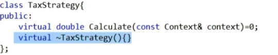

原文链接：http://www.cnblogs.com/codingbigdog/archive/2022/08/07/16558931.html
提交日期：Sun, 07 Aug 2022 05:24:00 GMT
博文内容：
设计模式：让你真正学会使用面向对象进行编程

学完本书，可以再GoF的《设计模式》

《大话设计模式》的C++版本代码：[链接](https://www.cnblogs.com/Galesaur-wcy/p/15928225.html)

附录A是面向对象的基础知识


重点如下（标星的为重点）：


通过[图说设计模式](https://design-patterns.readthedocs.io/zh_CN/latest/index.html)知道设计模式的分类，然后一个一个去百度，如果百度中讲得很乱，就回到《大话设计模式》中进行查阅。
或者通过[图说设计模式](https://design-patterns.readthedocs.io/zh_CN/latest/index.html)知道设计模式的分类，然后回到《大话设计模式》中进行查阅，如果书看不懂，再百度。


可参考黑马程序员的视频+博客https://blog.csdn.net/weixin_42636062
也可直接参考菜鸟教程


1.封装、继承和多态，以及简单工厂

命名要让人知道这个东西是啥，是干嘛的。

凡出现除法运算都要假设用户会输入零和字符，故要进行处理。

面向对象的编程的目的是让程序易维护（只改一小部分且不担心影响全局）、扩展（加入想要的功能且不担心影响全局；在不用把所有源码给你的条件下实现扩展）和复用。这些是通过封装、继承、多态把程序的耦合度降低实现。

封装：计算器的实现，需将计算和显示分开。即让业务逻辑和界面逻辑分开。即将业务逻辑用一个类封装好，在界面逻辑中调用它。

继承：1）将输入用set和get函数实现，并封装成一个基类A 2）每个运算都用一个类进行实现 3）**简单工厂**：将前面定义的类的对象都放进一个类中进行实例化。用一个switch根据输入自动选择实例化哪个运算类。

多态：由于所有的运算都继承于基类A，所以所有运算的对象都可以用基类的对象的指针a进行指向。当a调用方法B时，不同子类的方法B的实现是不一样，同样使用a->B得到的效果是不同。多态指的就是：使用相同的代码a->B却可以根据a具体指向的对象而实现出不同的效果，这个不同的效果就是多态。

利用继承和封装与直接将所有的运算实现放在一个函数中相比的好处：1）实现了易维护、扩展和复用 2）将每一个运算都用一个类进行实现，这样公司要你增加或修改一个运算类时，不需要把全部的运算都交给你，避免你把以前正确的东西瞎鸡巴改成错误的

UML类图：所有东西都总结在开头的图中了，看开头的图就行


2.策略模式

简单工厂：简单工厂仅仅指的是用一个switch根据输入自动选择实例化哪个运算类，前面定义抽象类等东西和它没有关系。

策略模式：策略模式（Strategy Pattern）定义了一组同类型的算法，在不同的类中封装起来，每种算法可以根据当前场景相互替换（指的应该就是多态），从而使算法的变化独立于使用它们的客户端（即算法的调用者）。

策略模式的内容不仅仅包括Context对Strategy对象的封装，还包括了抽象类Strategy的使用，抽象类Strategy起到了对算法的封装作用（就是抽象类普遍的作用）。父类Strategy的对象和对父类Strategy的对象的操作都封装到Context类中，Strategy的对象在类中被进行了一系列操作以后，最终利用一个函数返回算法的结果。故给Context对象中的函数传入各种各样的参数时，实际上在Context对象的内部是对Strategy对象进行操作，最后利用Strategy对象返回一个算法结果，也就是通过一个Context对象实现了向外提供统一的API。

使用Context对Strategy对象进行封装与直接使用Strategy对象的区别就是：Context对Strategy对象进行封装，对Strategy对象的操作都放在了Context中。

何时使用策略模式：一系列算法最终返回的东西是相同的（完成的工作相同），但是算法的实现过程不同。策略模式的目的就是向调用者屏蔽算法的实现过程，提供统一的API供调用者使用。只要在分析过程中听到需要在不同时间应用不同的业务规则，就可以考虑使用策略模式处理这种变化的可能性

简单工厂模式我需要让客户端认识两个类，CashSuper 和CashFactory,而策略模式与简单工厂结合的用法，客户端就只需要认识一个类CashContext就可以了。耦合更加降低。


3.单一职责原则(SRP)， 就一个类而言，应该仅有一个引起它变化的原因。可以简单理解成类的功能单一。

4.开放-封闭原则，是说软件实体(类、模块、函数等等)应该可以扩展，但是不可修改。即不能修改，但可以扩展的思想。面对需求，对程序的改动是通过增加新代码进行的，而不是更改现有的代码。这里的扩展应该有两层意思，第一：子类继承父类并对父类进行扩展；第二：增加子类。

设计人员必须对于他设计的模块应该对哪种变化封闭做出选择。他必须先猜测出最有可能发生的变化种类，然后构造抽象来隔离那些变化。书中的本句话下面有例子。

拒绝不成熟的抽象和抽象本身一样重要。

5.强内聚：指类中的功能完善【我的理解】

松耦合：类间尽量互相独立【我的理解】

依赖倒转原则：编程的最开始要确定的是本程序需要向外面提供什么样的接口，以提供此接口为目的进行编程，即面向接口的编程。

高层通过统一的接口调用低层模块，低层向高层屏蔽实现的细节。如调用操作数据库的相关函数的时候， 这个函数最好是与具体的数据库无关的。

里氏代换原则：子类型必须能够替换掉它们的父类型。这样父类才能被复用，子类也能够在父类的基础上增加新的行为。


6.在软件开发过程中，有时想用一些现存的组件。这些组件可能只是完成了一些核心功能。但在不改变其结构的情况下，可以动态地扩展其功能。所有这些都可以釆用装饰器模式来实现。

其主要缺点是：装饰器模式会增加许多子类，过度使用会增加程序得复杂性。

ConcreteDecoratorX的Operation()就是先调用被装饰对象的Operation()，然后在此基础添加一些新的东西，这些新的东西就被称为装饰。

装饰类也必须继承自Component的原因：因为装饰类对象是用于装饰Component对象，而装饰类对象本身也要可以被装饰，所以装饰类对象本身也要是Component的子类，这样装饰类对象本身才可以被装饰。

定义Decorator抽象类的原因是让装饰类可以被多态地使用。

使用多个装饰类一层一层地装饰Component对象，最后的Component对象的Operation()相当于是一个包含所有装饰的函数。实际上调用最后的Component对象的Operation()后，会一层一层地往上调用被装饰对象的Operation()。

打印了啥就相当于穿了啥。

如果只有一个 ConcreteComponent类而没有抽象的Component类，那么Decorator类可是ConcreteComponent的一个子类。同样道理，如果只有一个ConcreteDecorator类，那么就没有必要建立一个单独的 Decorator类，而可以把Decorator和ConcreteDecorator的责任合并成一个类。


不影响被装饰类的同时添加额外的功能，有效地把类的核心职责和装饰功能区分开了

要保证装饰类之间彼此独立，这样它们就可以以任意的顺序进行组合了


装饰是继承关系的一个替代方案。我觉得装饰是继承的一种特殊形式。

动态地给一个对象添加一些额外的职责。就增加功能来说，Decorator模式相比生成子类更为灵活。不改变接口的前提下，增强所考虑的类的性能。 	

何时使用：

  1）需要扩展一个类的功能，或给一个类增加附加责任。

  2）需要动态的给一个对象增加功能，这些功能可以再动态地撤销。

  3）需要增加一些基本功能的排列组合而产生的非常大量的功能，从而使继承变得 不现实。


0.附录A

类： 类就是具有相同的属性和功能的对象的抽象的集合

对象：就是类的实例化

方法重载：相同函数名，不同形参和返回值

多态：父类对象可以用来装子类对象。C++中利用父类的指针指向子类对象。

多态例子：由于子类都重写了父类中Shout的方法，所以将子类对象装在父类对象后，通过父类对象调用Shout方法时，调用的是子类中的Shout方法。也就是父类对象中装哪个子类，调用的就是哪个子类的Shout方法，这就是多态。多态：父类对象中装哪个子类，调用的就是哪个子类的Shout方法。

重构：将相同代码都放入基类，只在子类中重写不同部分。

抽象类：实例化一只猫，我们能得到一只具体的猫。但是实例化一只动物，一只动物是什么样的？我们会发现动物不需要实例化，动物是一个抽象的概念。

故，抽象类不能实例化；抽象方法必须被子类重写；有抽象方法的类必须定义成抽象类

一般具体类不用来做继承，抽象类才用做继承。简单工厂模式中的计算器实现中，我觉得Operation就可以弄成一个抽象类，当然Operation里面可以没有抽象方法。Operation定义成抽象类，代表Operation是一个不需要具有实例化功能的类。

接口：抽象类是用来表示所有子类的共同特征和功能，而接口是给几个特殊的子类添加共同的功能。如果B和C继承接口A并各自实现了自己的a功能，那么A定义的对象就可以用来装B和C，通过A定义的对象就可以多态地访问a


C++ 接口是使用 抽象类 来实现的？？？？？


问题：

350页？？？


# 李建忠


## 策略模式




C++的类中，写了虚函数，一般都要写一个虚的析构函数，不然多态的内存释放时，可能会出问题。


工程开发中，一般将一个类放在一个文件中？


# 黑马程序员
请参考此链接，对本博客进行学习，因为此链接有的内容，我一般不添加，我只添加我的理解：https://blog.csdn.net/weixin_42636062


## 简单工厂模式
简单工厂模式：假设有很多类（一般这些类都来自一个基类），并且这些类初始化对象的过程可能很复杂，此时就可以将所有类初始化对象的过程都放进一个类中，这个类称为工厂类。然后我们只要向工厂类的对象传入相应的参数，就可以获取相应的类的对象。下面举一个例子：
```
#include <bits/stdc++.h>
using namespace std;

//抽象水果
class AbstractFruit {
public:
	virtual void ShowName() = 0;
};

//苹果
class Apple :public AbstractFruit {
public:
	virtual void ShowName() {
		cout << "我是苹果!" << endl;
	}
};

//香蕉
class Banana :public AbstractFruit {
public:
	virtual void ShowName() {
		cout << "我是香蕉!" << endl;
	}
};

//鸭梨
class Pear :public AbstractFruit {
public:
	virtual void ShowName() {
		cout << "我是鸭梨!" << endl;
	}
};

//水果工厂
class FruitFactor {
public:
	static AbstractFruit * CreateFruit(string flag) {
		if (flag == "apple") {
			return new Apple;
		}
		else if (flag == "banana") {
			return new Banana;
		}
		else if (flag == "pear") {
			return new Pear;
		}
		else {
			return NULL;
		}
	}
};

void test01() {
	FruitFactor* factory = new FruitFactor;
	AbstractFruit* fruit = factory->CreateFruit("apple");
	fruit->ShowName();
	delete fruit;

	fruit = factory->CreateFruit("banana");
	fruit->ShowName();
	delete fruit;

	fruit = factory->CreateFruit("pear");
	fruit->ShowName();
	delete fruit;

	fruit = NULL;
	delete factory;
	factory = NULL;
}

int main(){
	test01();
	return 0;
}
```
【注】上面的工厂类中，各个水果类创建对象的过程只有一句new，但是有时创建对象的过程可能比较复杂，本例子只是为了演示的方便。
【缺点】添加或修改一个水果类，不需要修改类的源代码。但是需要修改工厂类FruitFactor，即需要添加一个else if。

简单工厂模式实现了对象创建和使用的分离。


## 工厂类
为了解决简单工厂中，添加水果类时，需要修改工厂类的问题。我们将工厂类进行抽象。如下：
```
#include <bits/stdc++.h>
using namespace std;

//抽象水果
class AbstractFruit {
public:
	virtual void ShowName() = 0;
};

//苹果
class Apple :public AbstractFruit {
public:
	virtual void ShowName() {
		cout << "我是苹果!" << endl;
	}
};

//香蕉
class Banana :public AbstractFruit {
public:
	virtual void ShowName() {
		cout << "我是香蕉!" << endl;
	}
};

//鸭梨
class Pear :public AbstractFruit {
public:
	virtual void ShowName() {
		cout << "我是鸭梨!" << endl;
	}
};

//抽象工厂
class AbstractFruitFactory {
public:
	virtual AbstractFruit* CreateFruit() = 0;
};


//苹果工厂
class AppleFactory :public AbstractFruitFactory {
public:
	virtual AbstractFruit* CreateFruit() {
		return new Apple;
	}
};

//香蕉工厂
class BananaFactory :public AbstractFruitFactory {
public:
	virtual AbstractFruit* CreateFruit() {
		return new Banana;
	}
};

//鸭梨工厂
class PearFactory :public AbstractFruitFactory {
public:
	virtual AbstractFruit* CreateFruit() {
		return new Pear;
	}
};


void test01() {
	AbstractFruitFactory* factory = NULL;
	AbstractFruit* fruit = NULL;

	//创建一个苹果工厂
	factory = new AppleFactory;
	fruit = factory->CreateFruit();
	fruit->ShowName();
	delete fruit;
	delete factory;

	//创建一个香蕉工厂
	factory = new BananaFactory;
	fruit = factory->CreateFruit();
	fruit->ShowName();
	delete fruit;
	delete factory;

	//创建一个鸭梨工厂
	factory = new PearFactory;
	fruit = factory->CreateFruit();
	fruit->ShowName();
	delete fruit;
	delete factory;
	fruit = NULL;
	factory = NULL;

}

int main() {
	test01();
	return 0;
}
```
从本代码中，我对代码可扩展性的有了一些片面的理解，即代码可扩展性就是指：有一个基类，然后你在下面扩展出子类。通过在基类下面扩展子类的方式，就可以增加需要的功能，而不用修改源代码。所以如果以后如果你遇到了扩展代码需要修改源码的问题，就可以试着将一个类分解成多个的子类（就像上面的工厂模式一样），然后用一个基类“统帅”这些子类。


## 抽象工厂

简单工厂模式：一个工厂类中负责创建一系列水果对象
工厂模式：抽象出一个基类，然后每个子类中负责创建一个水果对象
抽象工厂模式：抽象出一个基类，然后每个子类中负责创建一系列水果对象。为什么每个种类的水果，都要有一个抽象？？直接用一个水果基类，不就行了？

csdn评论区说：讲的有问题


## 单例模式

系统中某个类的对象只能存在一个，从而节约系统资源。比如你打开双击打开任务管理器，打开以后，你再次双击任务管理器，打开的还是上一次打开的那个。

单例模式直接参考：[链接](https://blog.csdn.net/unonoi/article/details/121138176)


## 代理模式

代理模式的定义：为其他对象提供一种代理以控制对这个对象的访问。在某些情况下，一个对象不适合或者不能直接引用另一个对象，而代理对象可以在客户端和目标对象之间起到中介的作用。举例如下：
```
#include <iostream>
using namespace std;

//提供一种代理来控制对其他对象的访问
class AbstraactCommonInterface {
public:
	virtual void run() = 0;

};

//我已经写好的系统
class Mysystem :public AbstraactCommonInterface{
public:
	virtual void run() {
		cout << "系统启动..." << endl;
	}
};

//必须有权限验证，不是所有人都能来启动我的启动，必须提供用户名和密码
class MysystemProxy :public AbstraactCommonInterface {
public:
	MysystemProxy(string username,string password) {
		this->mUsername = username;
		this->mPassword = mPassword;
		
	}
	bool checkUsernameAndPassword() {
		if (mUsername == "admin"&&mPassword == "admin") {
			return true;
		}
		return false;
	}
	virtual void run() {
		if (checkUsernameAndPassword()) {
			cout << "用户名和密码正确，验证通过..." << endl;
			this->pSystem->run();
		}
		else {
			cout << "用户名或密码错误，权限不足...." << endl;
		}
	}
	~MysystemProxy() {
		if (pSystem != NULL) {
			delete pSystem;
		}
	}
public:
	Mysystem* pSystem;
	string mUsername;
	string mPassword;
};

void test01() {
	MysystemProxy* proxy = new MysystemProxy("root","admin");
	proxy->run();
}


int main() {
#if 0
	//这样不行。是个人都能启动
	Mysystem* system = new Mysystem;
	system -> run();
#endif
	//调用代理模式
	test01();
	return 0;
}

```
上面代码中，类Mysystem用于启动系统，但是不是所有人都可以启动系统，必须进行权限的验证，所以就创建了额外的类MysystemProxy进行权限验证，然后就再通过MysystemProxy间接启动系统。
代理类MysystemProxy的作用：为其他对象提供一种代理以控制对Mysystem的对象的访问


参考：[链接](https://design-patterns.readthedocs.io/zh_CN/latest/index.html)
# 结构型模式
结构型模式(Structural Pattern)：描述如何将“类和类结合”或“类和对象结合”，就像搭积木，可以通过简单积木的组合形成复杂的、功能更为强大的结构。
根据[合成复用原则](https://blog.csdn.net/niu2212035673/article/details/78076139)，我们尽量使用“类和对象结合”的方式。


## 适配器模式
请直接看《大话设计模式》的相关部分。《大话设计模式》中认为适配器模式为：将一个类的接口转换成客户希望的另外一个接口。Adapter模式使得原来由于接口不兼容而不能一起工作的那些类可以一起工作。
我看来书中的内容，我对上面这句话的理解为：为了让客户可以使用adaptee类提供的功能，使用了adapter类对adaptee类进行适配。**所以我认为适配器的本质就是在adapter类中调用adaptee对象提供的功能，并将此功能以特定的API形式向外提供。也就是说适配器的本质是对待适配类adaptee进行封装**

由于适配器模式本质是对功能进行封装，所以[C++实现设计模式——适配器(Adapter)模式](https://blog.csdn.net/yxh_1_/article/details/116085949)中提到的将访问mysql,sqlite3,postgersql三种数据库封装成统一的接口，也被算在了适配器模式的里面。


我觉得这篇博文对适配器模式的示例代码可以看一看——[适配器模式C++详解](https://blog.csdn.net/ahelloyou/article/details/123264127)。在本篇博文中，客户需要自己创建adaptee对象，然后将此对象，输入到adapter中，从而完成对adaptee对象的适配。
而在《大话设计模式》中，adaptee对象是在adapter对象创建时，自动创建的。  


**什么时候使用适配器？**
答：A在系统中的很多地方都是使用旧版的API，而新版的API和旧版的API差别很大。此时提供API的人不可能为了A将API修改回去，而A将系统中的旧版的API换成新版的又很困难，这时就需要适配器的帮助。  
**所以适配器模式是不得已使用的模式，能够避免当然是最好的。**


## 桥接模式
在《大话设计模式》中，首先使用了继承的方式，不断地向抽象的手机添加品牌、软件功能，但是这会使得继承关系变得很长。然后在文中提到了合成聚合复用原则，根据合成聚合复用原则，我们知道组合方式是给类添加新功能的最优方式。


合成聚合复用原则： 当想给一个类增加新的功能，有三种方法，第一种就是直接修改代码，第二种是通过继承方式，第三种是通过组合方式。而合成聚合复用原则认为组合/聚合方式是最优的方式。

我看[C++设计模式——桥接模式](https://blog.csdn.net/u012581604/article/details/72887029)和《大话设计模式》以后，认为桥接模式是：实现一个系统需要的东西可以分为很多个大类，每个大类还可以分为很多个小类，此时每个大类都应该有一个独立与其他大类的基类，并在基类下派生子类。而基类之间通过组合的方式进行关联。如《大话设计模式》中将手机品牌和手机软件作为两个基类，再如[C++设计模式——桥接模式](https://blog.csdn.net/u012581604/article/details/72887029)将系统和手机品牌作为两个基类。


# 原则
## 里氏替换原则
可查看：[里氏替换原则解读](https://geek-docs.com/design-pattern/design-principle/liskov-substitution-principle.html)
里氏替换原则:
>1.子类可以实现父类的抽象方法，但不能覆盖父类的非抽象方法
>2.子类可以添加自己的东西
>3.当子类的方法重载父类的方法时，方法的前置条件（即方法的形参）要比父类方法的输入参数更宽松。什么叫做更加宽松？？


## 合成聚合复用原则
可查看：[合成复用原则（C++)](https://blog.csdn.net/niu2212035673/article/details/78076139)
合成聚合复用原则： 当想给一个类增加新的功能，有三种方法，第一种就是直接修改代码，第二种是通过继承方式，第三种是通过组合方式。而合成聚合复用原则认为组合/聚合方式是最优的方式。
