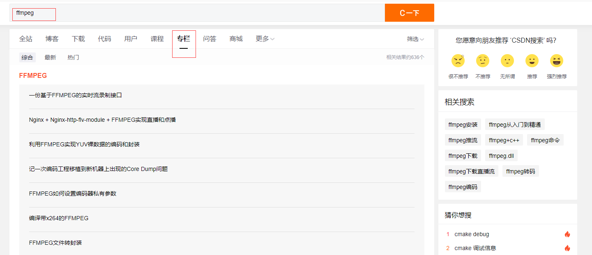

原文链接：http://www.cnblogs.com/codingbigdog/archive/2022/08/01/16542024.html
提交日期：Mon, 01 Aug 2022 14:03:00 GMT
博文内容：
# 1.一些编程的经验
## 1.1 代理的使用

推荐：https://glados.rocks，其他也可以。（不保证安全）
优点：
教育邮箱注册送一年（这个优惠应该还存在），其他邮箱好像送三天。
每天签到，签一天送一天！！使用[glados自动签到脚本](https://github.com/DullSword/GLaDOS-CheckIn)实现永久白嫖。

在windows下使用拨号上网，记得将网络的名字改为英文，不然无法正常使用clash。

## 1.2 虚拟机
在学习ubuntu时，可以下个虚拟机，在虚拟机里面玩ubuntu系统。玩的时候记得拍快照。
拍快照就是“对ubuntu系统此刻的状态进行存档”，以便玩崩后进行恢复。
这里推荐使用虚拟机VM（自己去google一个激活码），去官网下（翻墙下得快），别的地方下可能会有问题，比如主机和虚拟机之间不能复制文本和文件。

在我的使用体验上来看，除了性能外，虚拟机上ubuntu的使用和实际的ubuntu系统没多大差别，主要的差别在网络连接上，所以利用其进行学习ubuntu的使用。下面介绍一下在虚拟机连接网络的两种方式——**NAT和桥接：**
**桥接：**虚拟机上的系统被分配一个与所在主机同一个网段的ip，此时虚拟机上的系统相当于一个独立的主机。
**net：**虚拟机上的系统通过与所在主机来访问互联网。（我现在主要用桥接模式）

在网络编程相关的实验中，由于我没有很多台电脑，所以我在虚拟机中创建了两个ubuntu系统，一个作为客户端，一个作为服务器端，然后让处于同一个局域网的这两个系统进行网络通信。

vm和ubuntu20.04镜像的下载链接如下：
[VM](https://www.vmware.com/products/workstation-pro.html)
[ubuntu20.04镜像](https://releases.ubuntu.com/20.04/)

## 1.3 一些常用资源的推荐
**搜索引擎推荐：**
google.com
baidu.com
cn.bing.com
gzh.sogou.com（搜索一些微信公众号资源）
zh.sa1lib.org（搜索电子书，淘宝上能买到的，几乎都能搜到）
我喜欢电子书是可复制的，所以我平常首先在zh.sa1lib.org上搜书并选泽下载MOBI或EPUB或AZW3格式的书，并通过https://convertio.co/zh/将上述电子书转换为pdf版，此时的pdf版就是可复制的。

**写博客，记录所学，博客推荐：**
每次我学了就忘，看过的内容，过一段时间也记不起来，我的方法是通过写博客记录所学。
博客园（推荐使用）：写的时候自动备份，不会丢失。还可以将所有博客备份到本地（博客备份到本地使用的[脚本](https://github.com/superdogdad/cnblogs_backup)）。博客园还可以自定义博文的皮肤（自行百度）。
Csdn：不要用，会不幸——写的时候没有自动备份

我认为写博客的目的就是为了以后需要的时候能找到它，所以发现有用的博客不需要抄一遍放在自己的博客，只需要将博客收藏成书签起来——推荐使用chrome浏览器收藏书签。
收藏书签的原因：记住所有的知识是不可能的，但是我们要用相关知识的时候，可以找到是重要。
收藏书签的时候可以对书签内容进行总结提炼成一句话。

**C++相关推荐：**
《C++ primer》、游双的高性能服务器开发、陈硕的网络库开发

## 1.4 学习新知识
各个博客网站的专栏可以帮助我们快速的学习，如csdn中：

## 其他

linux下源码安装的一般流程，请参考[链接](https://blog.csdn.net/weixin_42732867/article/details/104789431)

# 2.Docker

docker的目的：代码下载下来以后，要配置代码所需的依赖，这很麻烦。所以将代码和代码所需的依赖包装在一个称作为镜像的东西里面，然后我们直接将镜像下载下来，运行这个镜像就相对于运行了代码。

镜像（Image）：Docker 镜像（Image），就相当于是一个 root 文件系统，文件系统中存储有代码和代码所需依赖。比如官方镜像 ubuntu:16.04 就包含了完整的一套 Ubuntu16.04 最小系统的 root 文件系统。
容器（Container）：镜像（Image）和容器（Container）的关系，就像是面向对象程序设计中的类和实例一样，镜像是静态的定义，容器是镜像运行时的实体。容器可以被创建、启动、停止、删除、暂停等。
[docker使用](https://www.cnblogs.com/codingbigdog/p/16533716.html)

# 3.IDE

## 3.1 vscode
**vscode简介和下载：**
C++有两种常用的IDE——vscode和clion，我现在习惯于使用vscode，理由如下：暂时觉得vscode会比clion好用一些，因为clion操作远程服务器时需要在本地保留一份代码，然后修改本地代码，最后将修改的代码上传到服务器上。而vscode可以通过remote ssh插件直接操作远程服务器的代码，不需要在本地保留一份代码。
下载：https://code.visualstudio.com/Download
推荐使用上述官网网址下载
百度直接搜到的vscode，大多是第三方的下载地址，建议别用。

Vscode连接远程服务器教程见：[Vscode连接远程服务器和python和C++调试配置 ](https://www.cnblogs.com/codingbigdog/p/16533723.html)

# 4.C++
[C++知识整理](https://www.cnblogs.com/codingbigdog/p/16724400.html)
