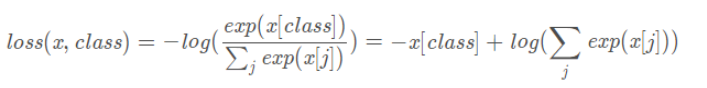
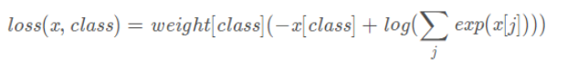

原文链接：http://www.cnblogs.com/codingbigdog/archive/2022/09/13/16689508.html
提交日期：Tue, 13 Sep 2022 08:07:00 GMT
博文内容：
以下所有内容来自与项目Test2_alexnet，项目Test2_alexnet的目录结构如下：
```
├── model.py
├── predict.py
└── train.py
```
项目的Test2_alexnet的具体内容在本博客的最后。


# 1.将数据放入GPU进行计算
```
device = torch.device("cuda:0" if torch.cuda.is_available() else "cpu")  # 选择设备
net = AlexNet(num_classes=5, init_weights=True)
net.to(device)      # 将次此模型指定在ＧＰＵ上运行
# 训练的时候需要将每个batch的图像和和标签都指定到GPU上，如：
outputs = net(images.to(device))
loss = loss_function(outputs, labels.to(device))
# 预测时也需要将每个batch的图像和和标签都指定到GPU上，如：
outputs = net(val_images.to(device))
predict_y = torch.max(outputs, dim=1)[1]
acc += torch.eq(predict_y, val_labels.to(device)).sum().item()
```

# 2. transforms对图像进行变换
```
from torchvision import transforms
data_transform = transforms.Compose([transforms.RandomResizedCrop(224),   
                                     transforms.RandomHorizontalFlip(),
                                     transforms.ToTensor(),
                                     transforms.Normalize((0.5, 0.5, 0.5), (0.5, 0.5, 0.5))]),
```
transforms.Compose()将多个变换进行打包。transforms中有各种各样用于变换的类。

# 3.torch.utils.data.DataLoader加载图片和对图片进行变换
torch.utils.data.DataLoader如下：
```
nw = min([os.cpu_count(), batch_size if batch_size > 1 else 0, 8])  # 使用多线程加载数据。在debug时，一般需要置为0
train_loader = torch.utils.data.DataLoader(dataset=train_dataset,
                                               batch_size=batch_size,         # batch_size代表一次同时喂入的数据
                                               shuffle=True,                         # shuffle=True:打乱数据
                                               num_workers=nw)                 #  num_workers=nw多线程来读数据                                                                               
```
dataset可以是Map-style datasets和Iterable-style datasets，这两种类似介绍如下：

**1.Map-style datasets：**

Map-style型的类需要包含`__getitem__(self,i)`和`__len__(self)`两个函数。
- `__getitem__(self,i)`中定义使用下标访问时所返回的东西，如dataset[i]返回的东西。这里要求dataset[i]必须返回图像和标签，即return img,target。img和target的shape有什么要求，

Map-style型的类的定义，举例如下：
```
import torch
from PIL import Image
import json
import numpy as np
import torchvision.transforms as transforms
import os
identity = lambda x:x # 传入参数x，return x
class SimpleDataset:
    def __init__(self, data_file, transform, target_transform=identity): # 这都可以是自定义的
        with open(data_file, 'r') as f:
            self.meta = json.load(f)
        self.transform = transform
        self.target_transform = target_transform


    def __getitem__(self,i): #
        image_path = os.path.join(self.meta['image_names'][i])
        # print(image_path)
        img = Image.open(image_path).convert('RGB')
        img = self.transform(img)
        target = self.target_transform(self.meta['image_labels'][i])
        return img, target

    def __len__(self):
        return len(self.meta['image_names'])
```
从以上可以看出图像的加载和变换一般都是在通过下标访问数据时（如a[0]）被执行的，即函数`__getitem__`被执行。

还有一个常用的包torchvision.datasets.ImageFolder用于导入数据：
```
train_dataset = datasets.ImageFolder(root=os.path.join(image_path, "train"),        # datasets.ImageFolder加载数据集要求目录为类别名
                                         transform=data_transform)
train_dataset.class_to_idx:返回一个字典，key为类名，value为类对应的数字标签
```
ImageFolder返回的是Map-style datasets

**2.Iterable-style datasets**

暂时没有遇到过，请参考官网[链接](https://pytorch.org/docs/stable/data.html)

# 4.训练网络
## 4.1 一般训练过程
传统的训练函数，一个batch是这么训练的：
```
for i,(images,target) in enumerate(train_loader):
    # 1. input output
    images = images.cuda(non_blocking=True)
    target = torch.from_numpy(np.array(target)).float().cuda(non_blocking=True)
    outputs = model(images)
    loss = criterion(outputs,target)

    # 2. backward
    optimizer.zero_grad()   # reset gradient
    loss.backward()
    optimizer.step()            
```
1.获取loss：输入图像和标签，通过infer计算得到预测值，计算损失函数；
2.optimizer.zero_grad() 清空过往梯度；
3.loss.backward() 反向传播，计算当前梯度；
4.optimizer.step() 根据梯度更新网络参数
## 4.2 变相提高batch的方法
简单的说就是进来一个batch的数据，计算一次梯度，更新一次网络，使用梯度累加是这么写的：
```
for i,(images,target) in enumerate(train_loader):
    # 1. input output
    images = images.cuda(non_blocking=True)
    target = torch.from_numpy(np.array(target)).float().cuda(non_blocking=True)
    outputs = model(images)
    loss = criterion(outputs,target)

    # 2.1 loss regularization
    loss = loss/accumulation_steps   
    # 2.2 back propagation
    loss.backward()
    # 3. update parameters of net
    if((i+1)%accumulation_steps)==0:
        # optimizer the net
        optimizer.step()        # update parameters of net
        optimizer.zero_grad()   # reset gradient
```
1.获取loss：输入图像和标签，通过infer计算得到预测值，计算损失函数；
2.loss.backward() 反向传播，计算当前梯度；
3.多次循环步骤1-2，不清空梯度，使梯度累加在已有梯度上；
4.梯度累加了一定次数后，先optimizer.step() 根据累计的梯度更新网络参数，然后optimizer.zero_grad() 清空过往梯度，为下一波梯度累加做准备；
总结来说：梯度累加就是，每次获取1个batch的数据，计算1次梯度，梯度不清空，不断累加，累加一定次数后，根据累加的梯度更新网络参数，然后清空梯度，进行下一次循环。

一定条件下，batchsize越大训练效果越好，梯度累加则实现了batchsize的变相扩大，如果accumulation_steps为8，则batchsize '变相' 扩大了8倍，是我们这种乞丐实验室解决显存受限的一个不错的trick，使用时需要注意，学习率也要适当放大。
更新1：关于BN是否有影响，之前有人是这么说的：
 As far as I know, batch norm statistics get updated on each forward pass, so no problem if you don't do .backward() every time. 

BN的估算是在forward阶段就已经完成的，并不冲突，只是accumulation_steps=8和真实的batchsize放大八倍相比，效果自然是差一些，毕竟八倍Batchsize的BN估算出来的均值和方差肯定更精准一些。
参考：[链接](https://cloud.tencent.com/developer/article/1700045)


## 4.3 其他
[python进度条库tqdm（泰拳大妈）详解](https://zhuanlan.zhihu.com/p/163613814)：使用循环遍历tqdm包装起来的可迭代对象，当循环结束，进度条就到达100%。

[requires_grad，grad_fn，grad的含义及使用](https://blog.csdn.net/qq_42775938/article/details/125849362)：x的梯度指的是loss对x的偏导值

[Pytorch optimizer.step() 和loss.backward()的关系](https://cloud.tencent.com/developer/article/1653756)：loss.backward()在参数的grad上填上梯度，optimizer.step()使用这个梯度更新参数。


# 5.卷积
nn.Conv2d(3, 48, kernel_size=11, stride=4, padding=2) 
代表输入的channel为3，输出的channel为48。卷积核为11x11。
其中padding可为int或tuple。padding=2：在周围补两圈零，padding=(1,2)：代表在上下各补一行零，左右两侧各补两列零。还有可以利用nn.ZeroPad2d()补零（自己google）
# 6.模型保存
## 6.1 保存模型的方法
```
# 保存整个模型
torch.save(net, path) # 这样保存可能会保存到确切的目录，导致模型在别的地方不能被加载

# 保存模型参数（推荐）
state_dict = net.state_dict()
torch.save(state_dict , path)
```
torch.save(列表，路径)可以用于保存任何列表，如：
```
import torch
torch.save([1,{"a":1,"b":2},"dsdsds"],'./cache/test.pkl')
```

## 6.2 保存断点继续训练
保存断点
```
checkpoint = {
        "net": model.state_dict(),
        'optimizer':optimizer.state_dict(),
        "epoch": epoch
    }
if not os.path.isdir("./models/checkpoint"):
    os.mkdir("./models/checkpoint")
    torch.save(checkpoint, './models/checkpoint/ckpt_best_%s.pth' %(str(epoch)))
```
将网络训练过程中的网络的权重，优化器的权重保存，以及epoch 保存，便于继续训练恢复
在训练过程中，可以根据自己的需要，每多少代，或者多少epoch保存一次网络参数，便于恢复，提高程序的鲁棒性。

从模型的断点继续训练：
```
start_epoch = -1
 
if RESUME:
    path_checkpoint = "./models/checkpoint/ckpt_best_1.pth"  # 断点路径
    checkpoint = torch.load(path_checkpoint)  # 加载断点
 
    model.load_state_dict(checkpoint['net'])  # 加载模型可学习参数
 
    optimizer.load_state_dict(checkpoint['optimizer'])  # 加载优化器参数
    start_epoch = checkpoint['epoch']  # 设置开始的epoch

for epoch in  range(start_epoch + 1 ,EPOCH):
    # print('EPOCH:',epoch)
    for step, (b_img,b_label) in enumerate(train_loader):
        train_output = model(b_img)
        loss = loss_func(train_output,b_label)
        # losses.append(loss)
        optimizer.zero_grad()
        loss.backward()
        optimizer.step()
```
参考：[链接](https://blog.csdn.net/weixin_35698091/article/details/112429883)
[链接](https://blog.csdn.net/LXYTSOS/article/details/90639524)
## 6.3 模型的可复现性
```
import torch
import random
import numpy as np
 
def set_random_seed(seed = 10,deterministic=False,benchmark=False):
    random.seed(seed)
    np.random(seed)
    torch.manual_seed(seed)
    torch.cuda.manual_seed_all(seed)
    if deterministic:
        torch.backends.cudnn.deterministic = True
    if benchmark:
        torch.backends.cudnn.benchmark = True
```
torch.backends.cudnn.deterministic = True和torch.backends.cudnn.benchmark = True使得每次卷积计算采用的是相同的策略。
设置 torch.backends.cudnn.benchmark=True 将会让程序在开始时花费一点额外时间，为整个网络的每个卷积层搜索最适合它的卷积实现算法，进而实现网络的加速。适用场景是网络结构固定（不是动态变化的），网络的输入形状（包括 batch size，图片大小，输入的通道）是不变的，其实也就是一般情况下都比较适用。反之，如果卷积层的设置一直变化，将会导致程序不停地做优化，反而会耗费更多的时间。
参考：[链接](https://blog.csdn.net/qq_36791000/article/details/121786560)

可变学习率：参考——[链接](https://blog.csdn.net/weixin_35698091/article/details/112429883)
# 7.损失函数
## 7.1.nn.CrossEntropyLoss()
```
torch.nn.CrossEntropyLoss(weight=None, size_average=None, ignore_index=- 100, reduce=None, reduction='mean', label_smoothing=0.0)
```
首先输入预测值和真实值。预测值的size为(minibatch,C)和真实值的size为(minibatch)。这里的C是类别数。
对于一个样本x的损失函数的计算如下：




x[class]真实类对应的预测概率。
损失函数中也有权重weight参数设置，若设置权重，则公式为：





当数据不平衡的时候，weight经常被使用。weight是一个1D得tensor，所以weight[class]是一个数。数据不平衡一般指的是存在一些类的样本数很少。如果类class的样本数少一些，那么weight[class]在weight中就会设置的比较大一些。
具体可参见：[链接](https://blog.csdn.net/geter_CS/article/details/84857220)
[链接](https://zhuanlan.zhihu.com/p/159477597)：可知交叉熵就通过求最大化似然估计得到的
官方[链接](https://pytorch.org/docs/stable/generated/torch.nn.CrossEntropyLoss.html)


# 8.batch normalization
直接看：https://zhuanlan.zhihu.com/p/34879333
我完全没看懂为什么使用batch normalization，但是能看懂如何进行batch normalization操作。
batch normalization：网络每次接收batch个数据，每层都会输出batch个特征向量，对每个特征进行标准化。标准化：减去平均值除以标准差，然后使用两个参数进行调整。

出现的原因：
输入变化一点点，各层的输出就会改变很多。（那小样本中是不是就要保持这一特性）
梯度下降导致了参数的变化，然后就导致了每一次分布的不同。
文中所说的分布，好像是指：对于f(x)，当输入所有的x时，f(x)得到的一群点，这群点就叫分布。


文中说，微弱的变化会被放大。我的疑问：神经网络不应该是会学习到什么地方应该放大，什么地方不应该放大吗？
文中说，梯度下降导致参数改变，导致各层分布改变。我的疑问：这不就是神经网络学习的过程吗？不应该让它变吗？
文中说这样的学习效率过慢？那这样慢慢学，会不会到达更好的效果？
看不懂，文中说的陷入梯度饱和区，不应该更不容易陷入梯度饱和区吗？

固定每一层网络输入值的分布来对减缓ICS问题？


#其他
1.assert和format的使用
```
 assert os.path.exists(image_path), "{} path does not exist.".format(image_path)
```
2.dict.items以及for的简便使用
```
cla_dict = dict((val, key) for key, val in flower_list.items())  # flower_list为一个字典
```
3.numpy与torch
numpy中有的函数，torch几乎都有对应的函数。所以如果需要对torch数组进行某种操作A时，可以百度numpy操作A。如搜索“numpy判断数组相同”比搜索“torch判断数组相同”，更容易得到想要的结果。


# 项目Test2_alexnet
结构：
```
├── model.py
├── predict.py
└── train.py
```
train.py：
