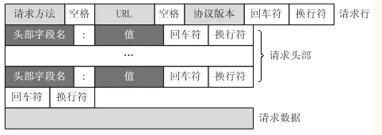

原文链接：http://www.cnblogs.com/codingbigdog/archive/2022/05/07/16243326.html
提交日期：Sat, 07 May 2022 09:13:00 GMT
博文内容：
第6章 高级I/O函数 && 第7章 Linux服务器程序规范 && 第8章 高性能服务器程序框架
# 1.使用printf发送数据（使用dup将标准IO重定向到socket）
使用printf发送数据
```
#include <sys/socket.h>
#include <netinet/in.h>
#include <arpa/inet.h>
#include <assert.h>
#include <stdio.h>
#include <unistd.h>
#include <stdlib.h>
#include <errno.h>
#include <string.h>

int main( int argc, char* argv[] )
{
    if( argc <= 2 )
    {
        printf( "usage: %s ip_address port_number\n", basename( argv[0] ) );
        return 1;
    }
    const char* ip = argv[1];
    int port = atoi( argv[2] );

    struct sockaddr_in address;
    bzero( &address, sizeof( address ) );
    address.sin_family = AF_INET;
    inet_pton( AF_INET, ip, &address.sin_addr );
    address.sin_port = htons( port );

    int sock = socket( PF_INET, SOCK_STREAM, 0 );
    assert( sock >= 0 );

    int ret = bind( sock, ( struct sockaddr* )&address, sizeof( address ) );
    assert( ret != -1 );

    ret = listen( sock, 5 );
    assert( ret != -1 );

    struct sockaddr_in client;
    socklen_t client_addrlength = sizeof( client );
    int connfd = accept( sock, ( struct sockaddr* )&client, &client_addrlength );
    
    if ( connfd < 0 )
    {
        printf( "errno is: %d\n", errno );
    }
    else
    {
        close( STDOUT_FILENO );
        dup( connfd );
        printf( "abcd\n" );
        close( connfd );
    }

    close( sock );
    return 0;
}
```
接收的数据
```
#include <sys/socket.h>
#include <netinet/in.h>
#include <arpa/inet.h>
#include <assert.h>
#include <stdio.h>
#include <unistd.h>
#include <string.h>
#include <stdlib.h>
#include <unistd.h>

#define BUF_SIZE 1024

int main( int argc, char* argv[] )
{
    if( argc <= 2 )
    {
        printf( "usage: %s ip_address port_number\n", basename( argv[0] ) );
        return 1;
    }
    const char* ip = argv[1];
    int port = atoi( argv[2] );

    struct sockaddr_in server_address;
    bzero( &server_address, sizeof( server_address ) );
    server_address.sin_family = AF_INET;
    inet_pton( AF_INET, ip, &server_address.sin_addr );
    server_address.sin_port = htons( port );

    int sockfd = socket( PF_INET, SOCK_STREAM, 0 );
    assert( sockfd >= 0 ); //如果表达式为假，那么就打印错误并终止程序。assert一般用于调试，可以添加#define NDEBUG 来禁用assert调用
    
    if (  connect( sockfd, ( struct sockaddr* )&server_address,sizeof( server_address ) ) < 0 )
    {
        printf( "connection failed\n" );
    }
    else
    {
        char buffer[ BUF_SIZE ];

        memset( buffer, '\0', BUF_SIZE ); 	// 用来给某一块内存空间进行赋值的
        int ret = recv( sockfd, buffer, BUF_SIZE-1, 0 );
        printf( "got %d bytes of normal data '%s'\n", ret, buffer );
    }

    close( sockfd );
    return 0;
}
```
# 2.readv函数（分散读）和writev函数（集中写）
writev函数将多块分散的内存数据一并写入文件描述符中，在本代码中就是使用writev发送两个字符数组。
```
#include <sys/socket.h>
#include <netinet/in.h>
#include <arpa/inet.h>
#include <assert.h>
#include <stdio.h>
#include <unistd.h>
#include <stdlib.h>
#include <errno.h>
#include <string.h>
#include <sys/stat.h>
#include <sys/types.h>
#include <fcntl.h>
#include<sys/uio.h>

#define BUFFER_SIZE 1024
/*定义两种HTTP状态码和状态信息*/
static const char* status_line[2] = { "200 OK", "500 Internal server error" };

int main( int argc, char* argv[] )
{
    if( argc <= 3 )
    {
        printf( "usage: %s ip_address port_number filename\n", basename( argv[0] ) );
        return 1;
    }
    const char* ip = argv[1];
    int port = atoi( argv[2] );
    const char* file_name = argv[3]; /*将目标文件作为程序的第三个参数传入*/

    struct sockaddr_in address;
    bzero( &address, sizeof( address ) );
    address.sin_family = AF_INET;
    inet_pton( AF_INET, ip, &address.sin_addr );
    address.sin_port = htons( port );

    int sock = socket( PF_INET, SOCK_STREAM, 0 );
    assert( sock >= 0 );

    int ret = bind( sock, ( struct sockaddr* )&address, sizeof( address ) );
    assert( ret != -1 );

    ret = listen( sock, 5 ); // 
    assert( ret != -1 );

    struct sockaddr_in client;
    socklen_t client_addrlength = sizeof( client );
    int connfd = accept( sock, ( struct sockaddr* )&client, &client_addrlength );
    if ( connfd < 0 )
    {
        printf( "errno is: %d\n", errno );
    }
    else
    {
        char header_buf[ BUFFER_SIZE ]; /*用于保存HTTP应答的状态行、头部字段和一个空行的缓存区*/
        memset( header_buf, '\0', BUFFER_SIZE );
        char* file_buf; /*用于存放目标文件内容的应用程序缓存*/
        struct stat file_stat; /*用于获取目标文件的属性，比如是否为目录，文件大小等*/
        			// struct stat这个结构体是用来描述一个linux系统文件系统中的文件属性的结构
        bool valid = true;	/*记录目标文件是否是有效文件*/
        int len = 0;		/*缓存区header_buf目前已经使用了多少字节的空间*/
        if( stat( file_name, &file_stat ) < 0 ) /*目标文件不存在*/ // stat()函数获取file_name文件的属性结构
        {
            valid = false;
        }
        else // 将文件存入一个字符数组中
        {
            if( S_ISDIR( file_stat.st_mode ) ) /*目标文件是一个目录*/
            {
                valid = false;
            }
            else if( file_stat.st_mode & S_IROTH ) /*当前用户有读取目标文件的权限*/
            {
            	/*动态分配缓存区file_buf，并指定其大小为目标文件的大小file_stat.st_size
加1，然后将目标文件读入缓存区file_buf中*/
                int fd = open( file_name, O_RDONLY );
                file_buf = new char [ file_stat.st_size + 1 ];
                memset( file_buf, '\0', file_stat.st_size + 1 );
                if ( read( fd, file_buf, file_stat.st_size ) < 0 ) //将fd指向的文件，存入file_buf中。
                {
                    valid = false;
                }
            }
            else
            {
                valid = false;
            }
        }
        
        if( valid )
        {
  /*下面这部分内容将HTTP应答的状态行、“Content-Length”头部字段和一个空行依次加入header_buf中*/
            ret = snprintf( header_buf, BUFFER_SIZE-1, "%s %s\r\n", "HTTP/1.1", status_line[0] ); //  snprintf将字符串"%s %s\r\n"存入header_buf字符数组中。
            len += ret;
            ret = snprintf( header_buf + len, BUFFER_SIZE-1-len, 
                             "Content-Length: %ld\r\n", file_stat.st_size );
            len += ret;
            ret = snprintf( header_buf + len, BUFFER_SIZE-1-len, "%s", "\r\n" );
          /*利用writev将header_buf和file_buf的内容一并写出*/
            struct iovec iv[2];
            iv[ 0 ].iov_base = header_buf;
            iv[ 0 ].iov_len = strlen( header_buf );
            iv[ 1 ].iov_base = file_buf;
            iv[ 1 ].iov_len = file_stat.st_size;
            ret = writev( connfd, iv, 2 );
        }
        else
        {
            ret = snprintf( header_buf, BUFFER_SIZE-1, "%s %s\r\n", "HTTP/1.1", status_line[1] );
            len += ret;
            ret = snprintf( header_buf + len, BUFFER_SIZE-1-len, "%s", "\r\n" );
            send( connfd, header_buf, strlen( header_buf ), 0 );
        }
        close( connfd );
        delete [] file_buf;
    }

    close( sock );
    return 0;
}
```
Kongming20上输入：./6-2testwritev.out 192.168.154.130 12345 6-2testwritev.cpp
ernest-laptop上输入：telnet 192.168.154.130 12345，ernest-laptop就可以获取到6-2testwritev.cpp的内容
# 3.用sendfile函数传输文件
sendfile函数在两个文件描述符之间直接传递数据（完全在内核中操作），从而避免了内核缓冲区和用户缓冲区之间的数据拷贝，效率很高，这被称为零拷贝。
```
#include <sys/socket.h>
#include <netinet/in.h>
#include <arpa/inet.h>
#include <assert.h>
#include <stdio.h>
#include <unistd.h>
#include <stdlib.h>
#include <errno.h>
#include <string.h>
#include <sys/types.h>
#include <sys/stat.h>
#include <fcntl.h>
#include <sys/sendfile.h>

int main( int argc, char* argv[] )
{
    if( argc <= 3 )
    {
        printf( "usage: %s ip_address port_number filename\n", basename( argv[0] ) );
        return 1;
    }
    const char* ip = argv[1];
    int port = atoi( argv[2] );
    const char* file_name = argv[3];

    int filefd = open( file_name, O_RDONLY );
    assert( filefd > 0 );
    struct stat stat_buf;
    fstat( filefd, &stat_buf );

    struct sockaddr_in address;
    bzero( &address, sizeof( address ) );
    address.sin_family = AF_INET;
    inet_pton( AF_INET, ip, &address.sin_addr );
    address.sin_port = htons( port );

    int sock = socket( PF_INET, SOCK_STREAM, 0 );
    assert( sock >= 0 );

    int ret = bind( sock, ( struct sockaddr* )&address, sizeof( address ) );
    assert( ret != -1 );

    ret = listen( sock, 5 );
    assert( ret != -1 );

    struct sockaddr_in client;
    socklen_t client_addrlength = sizeof( client );
    int connfd = accept( sock, ( struct sockaddr* )&client, &client_addrlength );
    if ( connfd < 0 )
    {
        printf( "errno is: %d\n", errno );
    }
    else
    {
        sendfile( connfd, filefd, NULL, stat_buf.st_size );
        close( connfd );
    }

    close( sock );
    return 0;
}
```
使用1中的接收数据的代码，即可接收到数据 

# 4.使用splice函数实现的回射服务器
splice函数用于在两个文件描述符之间移动数据，也是零拷贝操作。
```
#include <sys/socket.h>
#include <netinet/in.h>
#include <arpa/inet.h>
#include <assert.h>
#include <stdio.h>
#include <unistd.h>
#include <stdlib.h>
#include <errno.h>
#include <string.h>
#include <fcntl.h>

int main( int argc, char* argv[] )
{
    if( argc <= 2 )
    {
        printf( "usage: %s ip_address port_number\n", basename( argv[0] ) );
        return 1;
    }
    const char* ip = argv[1];
    int port = atoi( argv[2] );

    struct sockaddr_in address;
    bzero( &address, sizeof( address ) );
    address.sin_family = AF_INET;
    inet_pton( AF_INET, ip, &address.sin_addr );
    address.sin_port = htons( port );

    int sock = socket( PF_INET, SOCK_STREAM, 0 );
    assert( sock >= 0 );

    int ret = bind( sock, ( struct sockaddr* )&address, sizeof( address ) );
    assert( ret != -1 );

    ret = listen( sock, 5 );
    assert( ret != -1 );

    struct sockaddr_in client;
    socklen_t client_addrlength = sizeof( client );
    int connfd = accept( sock, ( struct sockaddr* )&client, &client_addrlength );
    if ( connfd < 0 )
    {
        printf( "errno is: %d\n", errno );
    }
    else
    {
        int pipefd[2];
        assert( ret != -1 );
        ret = pipe( pipefd ); /*创建管道*/
        /*将connfd上流入的客户数据定向到管道中*/
        ret = splice( connfd, NULL, pipefd[1], NULL, 32768, SPLICE_F_MORE | SPLICE_F_MOVE ); 
        assert( ret != -1 );
        /*将管道的输出定向到connfd客户连接文件描述符*/
        ret = splice( pipefd[0], NULL, connfd, NULL, 32768, SPLICE_F_MORE | SPLICE_F_MOVE );
        assert( ret != -1 );
        close( connfd );
    }

    close( sock );
    return 0;
}
```
Kongming20上输入：./6-4testsplice.out 192.168.154.130 12345
ernest-laptop上输入：telnet 192.168.154.130 12345,然后随便输入一串字符，就可以得到相同字符的返回
# 5.tee函数同时输出数据到终端和文件的程序
tee函数在两个管道文件描述符之间复制数据，也是零拷贝操作。它不消耗数据，因此源文件描述符上的数据仍然可以用于后续的读操作
```
#include <assert.h>
#include <stdio.h>
#include <unistd.h>
#include <errno.h>
#include <string.h>
#include <fcntl.h>

int main( int argc, char* argv[] )
{
	if ( argc != 2 )
	{
		printf( "usage: %s <file>\n", argv[0] );
		return 1;
	}
	int filefd = open( argv[1], O_CREAT | O_WRONLY | O_TRUNC, 0666 );
	assert( filefd > 0 );

	int pipefd_stdout[2];
        int ret = pipe( pipefd_stdout );
	assert( ret != -1 );

	int pipefd_file[2];
        ret = pipe( pipefd_file );
	assert( ret != -1 );

	//close( STDIN_FILENO );
	// dup2( pipefd_stdout[1], STDIN_FILENO );
	//write( pipefd_stdout[1], "abc\n", 4 );
	/*将标准输入内容输入管道pipefd_stdout*/
	ret = splice( STDIN_FILENO, NULL, pipefd_stdout[1], NULL, 32768, SPLICE_F_MORE | SPLICE_F_MOVE );
	assert( ret != -1 );
	/*将管道pipefd_stdout的输出复制到管道pipefd_file的输入端*/
	ret = tee( pipefd_stdout[0], pipefd_file[1], 32768, SPLICE_F_NONBLOCK ); 
	assert( ret != -1 );
	/*将管道pipefd_file的输出定向到文件描述符filefd上，从而将标准输入的内容写入文件*/
	ret = splice( pipefd_file[0], NULL, filefd, NULL, 32768, SPLICE_F_MORE | SPLICE_F_MOVE );
	assert( ret != -1 );
	/*将管道pipefd_stdout的输出定向到标准输出，其内容和写入文件的内容完全一致*/
	ret = splice( pipefd_stdout[0], NULL, STDOUT_FILENO, NULL, 32768, SPLICE_F_MORE | SPLICE_F_MOVE );
	assert( ret != -1 );

	close( filefd );
        close( pipefd_stdout[0] );
        close( pipefd_stdout[1] );
        close( pipefd_file[0] );
        close( pipefd_file[1] );
	return 0;
}
```
本程序数据的流向如下：
首先STDIN_FILENO里的内容被放进管道pipefd_stdout中，此时STDIN_FILENO里的内容就没了，无法再读STDIN_FILENO来获取相同的内容。
然后为了让数据保留在管道pipefd_stdout中以便后续使用，故使用了tee函数将管道pipefd_stdout中的数据复制到管道pipefd_file，再将数据从管道pipefd_file传到 filefd。为什么不直接将管道pipefd_stdout的数据复制到 filefd？答：因为tee只能在两个管道之间复制数据，而filefd不是管道。
最后将保留再管道pipefd_stdout中的数据传到 STDOUT_FILENO

# 6.切换root用户为形参指定用户
```
// 切换root用户为形参指定用户
static bool switch_to_user( uid_t user_id, gid_t gp_id ) // 形参为目标用户ID，为目标组ID
{
    if ( ( user_id == 0 ) && ( gp_id == 0 ) ) // 两个都等于零，代表是root用户
    {
        return false;
    }

    gid_t gid = getgid();
    uid_t uid = getuid();
    if ( ( ( gid != 0 ) || ( uid != 0 ) ) && ( ( gid != gp_id ) || ( uid != user_id ) ) ) // 当前用户如果是root或者目标用户时，就不进入if中。保证当前用户只能是root和目标用户
    {
        return false;
    }
	
    /*由于前面保证了当前用户只能是root和目标用户.如果不是root，则已经是目标用户*/
    if ( uid != 0 ) 
    {
        return true;
    }

    if ( ( setgid( gp_id ) < 0 ) || ( setuid( user_id ) < 0 ) )
    {
        return false;
    }

    return true;
}
```
# 7.守护进程的编写
```
bool daemonize()
{
    /*创建子进程，关闭父进程，这样可以使程序在后台运行*/
    pid_t pid = fork();
    if ( pid < 0 )
    {
        return false;
    }
    else if ( pid > 0 )
    {
        exit( 0 );
    }
    
    /*设置文件权限掩码。当进程创建新文件（使用open(const char*pathname,int flags,mode_t mode)系统调用）时，文件的权限将是mode＆0777*/
    umask( 0 );

    /*创建新的会话，设置本进程为进程组的首领*/
    pid_t sid = setsid();
    if ( sid < 0 )
    {
        return false;
    }

    /*切换工作目录*/
    if ( ( chdir( "/" ) ) < 0 )
    {
        /* Log the failure */
        return false;
    }
    
    /*关闭标准输入设备、标准输出设备和标准错误输出设备*/
    close( STDIN_FILENO );
    close( STDOUT_FILENO );
    close( STDERR_FILENO );
    
    /*关闭其他已经打开的文件描述符，代码省略*/
    /*将标准输入、标准输出和标准错误输出都定向到/dev/null文件*/
    open( "/dev/null", O_RDONLY );
    open( "/dev/null", O_RDWR );
    open( "/dev/null", O_RDWR );
    return true;
}
```
# 8.有限状态机

分析HTTP请求行和头部字段并返回不同的字符串：
本代码HTTP请求的一行（包括请求行和头部字段）为行，每一行都有一对回车(\r)换行(\n)符。
HTTP格式可参考：[HTTP协议格式详解](https://www.jianshu.com/p/8fe93a14754c)。其中Http请求消息结构如下：



```
#include <sys/socket.h>
#include <netinet/in.h>
#include <arpa/inet.h>
#include <assert.h>
#include <stdio.h>
#include <stdlib.h>
#include <unistd.h>
#include <errno.h>
#include <string.h>
#include <fcntl.h>

#define BUFFER_SIZE 4096 /*读缓冲区大小*/
// 主状态机的两种可能状态，分别表示：当前正在分析请求行，当前正在分析头部字段
enum CHECK_STATE { CHECK_STATE_REQUESTLINE = 0, CHECK_STATE_HEADER, CHECK_STATE_CONTENT };
// 从状态机的三种可能状态，即行的读取状态，分别表示：读取到一个完整的行、行出错和行数据尚且不完整
enum LINE_STATUS { LINE_OK = 0, LINE_BAD, LINE_OPEN };
// 服务器处理HTTP请求的结果：
// NO_REQUEST表示请求不完整，需要继续读取客户数据；
// GET_REQUEST表示获得了一个完整的客户请求；
// BAD_REQUEST表示客户请求有语法错误；
// FORBIDDEN_REQUEST表示客户对资源没有足够的访问权限；
// INTERNAL_ERROR表示服务器内部错误；
// CLOSED_CONNECTION表示客户端已经关闭连接了
enum HTTP_CODE { NO_REQUEST, GET_REQUEST, BAD_REQUEST, FORBIDDEN_REQUEST, INTERNAL_ERROR, CLOSED_CONNECTION };
// 为了简化问题，我们没有给客户端发送一个完整的HTTP应答报文，而只是根据服务器的处理结果发送如下成功或失败信息
static const char* szret[] = { "I get a correct result\n", "Something wrong\n" };

// 从状态机:解析一行，得出是否从状态机的状态。
// 从状态机的三种可能状态，即行的读取状态，分别表示：读取到一个完整的行、行出错和行数据尚且不完整
LINE_STATUS parse_line(char* buffer, int& checked_index, int& read_index)
{
	char temp;
	// checked_index指向buffer（应用程序的读缓冲区）中当前正在分析的字节，
	// read_index指向buffer中客户数据的尾部的下一字节。
	// buffer中第0～checked_index字节都已分析完毕，第checked_index～(read_index-1)字节由下面的循环挨
	// 个分析
	for (; checked_index < read_index; ++checked_index)
	{
		// 获得当前要分析的字节
		temp = buffer[checked_index];
		// 如果当前的字节是“\r”，即回车符，则说明可能读取到一个完整的行
		if (temp == '\r')
		{
			// 如果“\r”字符碰巧是目前buffer中的最后一个数据，那么这次分析没有读取到一个完整的行，\r后面应
			// 该还有一个\n，返回LINE_OPEN以表示还需要继续读取客户数据才能进一步分析
			if ((checked_index + 1) == read_index)
			{
				return LINE_OPEN;
			}
			// 如果下一个字符是“\n”，则说明我们成功读取到一个完整的行
			else if (buffer[checked_index + 1] == '\n')
			{
				buffer[checked_index++] = '\0';  // 将\r置为\0
				buffer[checked_index++] = '\0';  //  将\n置为\0
				return LINE_OK;
			}
			// 否则的话，说明客户发送的HTTP请求存在语法问题
			return LINE_BAD;
		}
		// 如果当前的字节是“\n”，即换行符，则也说明可能读取到一个完整的行
		else if (temp == '\n')
		{
			if ((checked_index > 1) && buffer[checked_index - 1] == '\r')
			{
				buffer[checked_index - 1] = '\0';
				buffer[checked_index++] = '\0';
				return LINE_OK;
			}
			return LINE_BAD;
		}
	}
	// 如果所有内容都分析完毕也没遇到“\r”字符，则返回LINE_OPEN，
	// 表示还需要继续读取客户数据才能进一步分析
	return LINE_OPEN;
}

// 分析请求行
HTTP_CODE parse_requestline(char* szTemp, CHECK_STATE& checkstate)
{
	// 如果请求行中没有空格“\t”字符，则HTTP请求必有问题
	char* szURL = strpbrk(szTemp, " \t"); // 返回char指针，指向szTemp中为\t的字符的位置
	if (!szURL)
	{
		return BAD_REQUEST;
	}
	*szURL++ = '\0'; // 将空格置零，然后指针指向下一个字符

	char* szMethod = szTemp;
	if (strcasecmp(szMethod, "GET") == 0)
	{
		printf("The request method is GET\n"); // 仅支持GET方法
	}
	else
	{
		return BAD_REQUEST;
	}

	szURL += strspn(szURL, " \t");   // szURL所指位置为下一个空格。strspn( szURL, " \t" )表示在szURL中找到\t的下标。
	char* szVersion = strpbrk(szURL, " \t");
	if (!szVersion)
	{
		return BAD_REQUEST;
	}
	*szVersion++ = '\0';
	szVersion += strspn(szVersion, " \t");
	if (strcasecmp(szVersion, "HTTP/1.1") != 0)
	{
		return BAD_REQUEST;
	}

	if (strncasecmp(szURL, "http://", 7) == 0)
	{
		szURL += 7;
		szURL = strchr(szURL, '/');    // 检索第一次出现'/'的位置
	}

	if (!szURL || szURL[0] != '/')
	{
		return BAD_REQUEST;
	}

	//URLDecode( szURL );
	printf("The request URL is: %s\n", szURL);
	checkstate = CHECK_STATE_HEADER;
	return NO_REQUEST;
}

// 分析头部字段
HTTP_CODE parse_headers(char* szTemp)
{
	// 遇到一个空行，说明我们得到了一个正确的HTTP请求
	if (szTemp[0] == '\0') // 因为parse_line()将空行（回车换行）都弄成了\0
	{
		return GET_REQUEST;
	}
	else if (strncasecmp(szTemp, "Host:", 5) == 0)   // 处理“HOST”头部字段
	{
		szTemp += 5;    // 跳到Host:之后
		szTemp += strspn(szTemp, " \t");
		printf("the request host is: %s\n", szTemp);
	}
	else // 其他头部字段都不处理
	{
		printf("I can not handle this header\n");
	}

	return NO_REQUEST;
}

// 分析HTTP请求的入口函数
HTTP_CODE parse_content(char* buffer, int& checked_index, CHECK_STATE& checkstate, int& read_index, int& start_line)
{
	LINE_STATUS linestatus = LINE_OK;   // 记录当前行的读取状态
	HTTP_CODE retcode = NO_REQUEST;   // 记录HTTP请求的处理结果
	while ((linestatus = parse_line(buffer, checked_index, read_index)) == LINE_OK) // 主状态机，用于从buffer中取出所有完整的行
	{
		char* szTemp = buffer + start_line;	// start_line是行在buffer中的起始位置
		start_line = checked_index;			// 记录下一行的起始位置
		switch (checkstate)					// checkstate记录主状态机当前的状态
		{
		case CHECK_STATE_REQUESTLINE:		// 第一个状态，分析请求行
		{
			retcode = parse_requestline(szTemp, checkstate);
			if (retcode == BAD_REQUEST)
			{
				return BAD_REQUEST;
			}
			break;
		}
		case CHECK_STATE_HEADER:			// 第二个状态，分析头部字段
		{
			retcode = parse_headers(szTemp);
			if (retcode == BAD_REQUEST)
			{
				return BAD_REQUEST;
			}
			else if (retcode == GET_REQUEST)
			{
				return GET_REQUEST;
			}
			break;
		}
		default:
		{
			return INTERNAL_ERROR;
		}
		}
	}
	if (linestatus == LINE_OPEN)	// 若没有读取到一个完整的行，则表示还需要继续读取客户数据才能进一步分析
	{
		return NO_REQUEST;
	}
	else
	{
		return BAD_REQUEST;
	}
}

int main(int argc, char* argv[])
{
	if (argc <= 2)
	{
		printf("usage: %s ip_address port_number\n", basename(argv[0]));
		return 1;
	}
	const char* ip = argv[1];
	int port = atoi(argv[2]);

	struct sockaddr_in address;
	bzero(&address, sizeof(address));
	address.sin_family = AF_INET;
	inet_pton(AF_INET, ip, &address.sin_addr);
	address.sin_port = htons(port);

	int listenfd = socket(PF_INET, SOCK_STREAM, 0);
	assert(listenfd >= 0);

	int ret = bind(listenfd, (struct sockaddr*)&address, sizeof(address));
	assert(ret != -1);

	ret = listen(listenfd, 5);
	assert(ret != -1);

	struct sockaddr_in client_address;
	socklen_t client_addrlength = sizeof(client_address);
	int fd = accept(listenfd, (struct sockaddr*)&client_address, &client_addrlength);
	if (fd < 0)
	{
		printf("errno is: %d\n", errno);
	}
	else
	{
		char buffer[BUFFER_SIZE];
		memset(buffer, '\0', BUFFER_SIZE);
		int data_read = 0;
		int read_index = 0;
		int checked_index = 0;
		int start_line = 0;
		CHECK_STATE checkstate = CHECK_STATE_REQUESTLINE;
		while (1)
		{
			data_read = recv(fd, buffer + read_index, BUFFER_SIZE - read_index, 0);
			if (data_read == -1)
			{
				printf("reading failed\n");
				break;
			}
			else if (data_read == 0)
			{
				printf("remote client has closed the connection\n");
				break;
			}

			read_index += data_read;
			HTTP_CODE result = parse_content(buffer, checked_index, checkstate, read_index, start_line);
			if (result == NO_REQUEST)
			{
				continue;
			}
			else if (result == GET_REQUEST)
			{
				send(fd, szret[0], strlen(szret[0]), 0);
				break;
			}
			else
			{
				send(fd, szret[1], strlen(szret[1]), 0);
				break;
			}
		}
		close(fd);
	}

	close(listenfd);
	return 0;
}
```
我们前面学习的都是发字符串操作，这就是最有用的操作。网络传输中多数的数据都是以字符串进行传输的，然后再对字符串的内容进行解析得到不同的结果。如图片链接会解析成具体的图片。