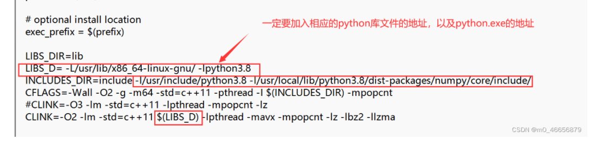

原文链接：http://www.cnblogs.com/codingbigdog/archive/2022/05/11/16258345.html
提交日期：Wed, 11 May 2022 08:00:00 GMT
博文内容：

源码阅读：https://github.com/shouxieai/tensorRT_Pro/tree/main/restful_server

# 组会
想要实现检测视频流，而不是检测一张一张图片

# 整体流程
使用mongoose网络库作为底层的数据收发。
yolov5推理器放在一个类中进行实现。只要在写controller子类的时候，添加一个推理器对象就可以了。
controller的作用

整体的流程是创建controller和server，将链接和处理函数的对应关系放在controller中，然后将controller加入到server中。
初始化server：
- 绑定用于处理request和close的函数。
- 开启一个线程搁那循环，用于监听用户的请求。
- 开启num_threads个线程。每个线程用于处理一个连接（会话）。（为啥不用epoll，是因为mongoose内部已经用来poll了吗？）。线程的处理函数都是worker_thread_proc，worker_thread_proc不断监听队列job_中的会话。

当一个请求到来的时候，
1.会调用HttpServerImpl::on_http_event函数处理请求。
2.在HttpServerImpl::on_http_event中首先创建一个新的会话A，然后对请求进行解析，将请求中的请求方法、url、body等东西提取出来，放进会话A的request结构体中。最后将会话A放进会话队列jobs_中。
3.线程worker_thread_proc监听到jobs_存在会话时，会取出会话中的url，并调用此url对应的处理函数。

# 任务和问题
1.服务器用C++写，算法使用python进行实现，如何在C++中调用python写的算法？
答：1.在C++中调用python脚本
2.用C++写算法。
3.在C++调用python的函数。python中设计一个接口函数，C++中调用接口函数从而实现对算法的调用。

2.习惯每日对git的使用

3.将检测结果放入数据库中。将图片post到后台，后台进行检测，将输出的结果存储到相应的目录下，将此图片的路径存储在数据库中。
保存所有检测图片，保证图片命令不重复。

4.输入图片的格式有所限制——自动判断图片类型

5.配合石中西修改json

6.只能保存图片后检测图片——直接提供视频流检测接口。

7.controller类是个父类。如果通过子类继承，进行实现各种控制器，为什么要怎么设计，具体是如何设计的？？

8.给石中西和张鑫玉提供相同的接口才行。

9.只能收mp4文件、返回avi文件：前端判断一下是什么类型，然后发送给我不就行了。

10.mongoose源码阅读：[mongoose的详细说明](https://github.com/cesanta/mongoose/tree/master/docs)
jsoncpp使用、jsoncpp源码阅读
libevent源码阅读
freecplus源码学习：https://freecplus.net/9ebb8276265b404488a3415be224ed85.html，可不看。。

11.登录功能：
登录以后，通过cookie判断是否为正确用户？
用户密码正确，则启动检测并返回结果。

12.上传大文件——实现在线训练功能

13.根据师兄发的流程图进行学习

14.vim和vscode结合使用

15.bug: 接收的东西不对时，session->request.body.substr(i1)中的i1就会发生下标越界。

16.放不同模型上去，让人感觉有很多功能。

17.学会修改网络，成为基本的调参侠。

18.口罩检测性能还不是很好

# 小知识
**什么是前后端分离？**
答：我觉得就是前后端只使用json格式的数据进行交互

前后端交互方式
前端占用一个端口运行前端界面，
后端占用一个端口运行后端，等待前端调用相应接口，

为什么github中jsoncpp是个项目，而https://github.com/shouxieai/tensorRT_Pro/tree/main/restful_server
中jsoncpp只包含了json.cpp和json.hpp？？
答：项目restful_server的作者将jsoncpp中的多个.cpp文件都拷贝到了json.cpp中，将jsoncpp中的多个.h文件都拷贝到了json.h中，这可以通过json.cpp和json.h的注释中看出来。

post发送文件的格式
服务器端：首先通过Content-Type获取body的编码方式，然后根据编码方式解析出body中的文件。post传输视频时，Content-Type为application/octet-stream，application/octet-stream格式如下

浏览器：
在某些下载文件的场景中，服务端可能会返回文件流，并在返回头中带上Content-Type:application/octet-stream，告知浏览器这是一个字节流，浏览器处理字节流的默认方式就是下载。Content-Type为application/octet-stream时，一般会配合另一个响应头Content-Disposition，该响应头指示回复的内容该以何种形式展示，是以内联的形式（即网页或者页面的一部分），还是以附件的形式下载并保存到本地。
[响应头Content-Type与Content-Disposition的区别](https://blog.csdn.net/LKJgdut/article/details/104249679)

在客户端，Get方式在通过URL提交数据，数据在URL中可以看到；POST方式，数据放置在HTML HEADER内提交。

rtp c++ 网络视频传输
[C++实现RTSP/RTP服务器](https://blog.csdn.net/longruic/article/details/115817371)
码流是一帧一帧的图片数据，所以传输的时候也是一帧帧来传输的，因此这里就会涉及到各种类型的帧处理了
传过来是字节，如何从字节中获取图片，如何将图片组合成视频，视频的编码是什么

https://blog.csdn.net/yaojiawan/article/details/90260155   restbed -C++ restfull 架构的应用

弄好之后，在vscode命令行下输入：”code .“，就可以用vscode打开当前目录
规范代码快捷键:vscode: shift+alt+F，或者安装某个插件以后，就可以通过ctrl+s进行规范

ctrl+点击：跳转到函数的定义，或在函数定义处使用可查看函数在哪些地方使用了

bind：将已有的变量绑定给函数的形参，并将这个函数作为返回值返回。如果有形参不需要绑定已有变量，就使用占位符进行占位，等到实际调用函数的时候再传入实参。
参考：[链接](https://blog.csdn.net/u013654125/article/details/100140328)
[链接2](https://www.cnblogs.com/yunyuanfeng/p/15032506.html)

typedef int (*func)()  // 定义一种类型func。func声明的变量用于指向返回值为int且形参为空的函数。
所以typedef int (*func)()可以用于实现多态，即同一个函数调用语句，会由于指向函数的不同，而产生不同的效果（多态）
C++11中使用function来代替上述内容
[链接1](https://blog.csdn.net/baoendemao/article/details/41209697)
[链接2](https://zhuanlan.zhihu.com/p/161356621)
