原文链接：http://www.cnblogs.com/codingbigdog/archive/2022/05/16/16276741.html
提交日期：Mon, 16 May 2022 05:58:00 GMT
博文内容：

检测是否有物体和分类分开进行：互相依赖的，不能分开。
除非说，你检测出人，然后利用得到的人的框，检测这里面有没有救生衣。那还是要有检测人这一项，
检测出物体，是个伪命题，什么是物体。也就说物体必须有明确地指向。即要得到物体的框，就必须要指明物体的类型。

yolov5原理是什么：

问题：
如果你要在八十类上面添加第八十一类。必须考虑：
1.加入第八十一的数据集中，如果图片包含前八十类的，那么就必须把这八十类也框出来，不然就会影响前八十类的检测受到影响。
2.由于要输出八十一类，故需要修改网络结构。故需要将第八十一的数据集和前八十类的数据集都加进去训练。
这就要求我们必须要去检查前八十类的数据集中，如果图片包含第八十一类，就必须要框出来。这个工作量就很大。

解决方法：
1.让第八十一的数据集中只含有一个类，那么第八十一的数据集会过于简单。那么模型就难以预测一个图片中有多个类，因为训练的时候没见过。。
2.coco有八十类。只训练coco的前79类，得到预训练模型，通过预训练模型，增加一类，训练得到80类的模型。
预训练模型跑得需要时间一两天，有时弄错就要重新跑，还没弄完。

问题：
yolov5在八十类的检测中P就0.4多，R就0.6多。故得到这样的模型没有实际的意义。只是为了写论文，刷榜才有用。当类别多了以后，检测出来就不准了。

有意义的事，是去识别少量的类。就像临水项目中那样，让检测的准确率高一些（95%以上）

至于用八十类的预训练模型，识别一个类，这就是临时水项目中师兄做的————用预训练模型去实现人员检测，最后达到95%，用了上万的数据集

一百三个轮次以后，概率区域稳定。p:6点多，R：五点多，因为昨晚断电了，忘记截图保存了。
一个用于训练一个类的结果：

# 1200
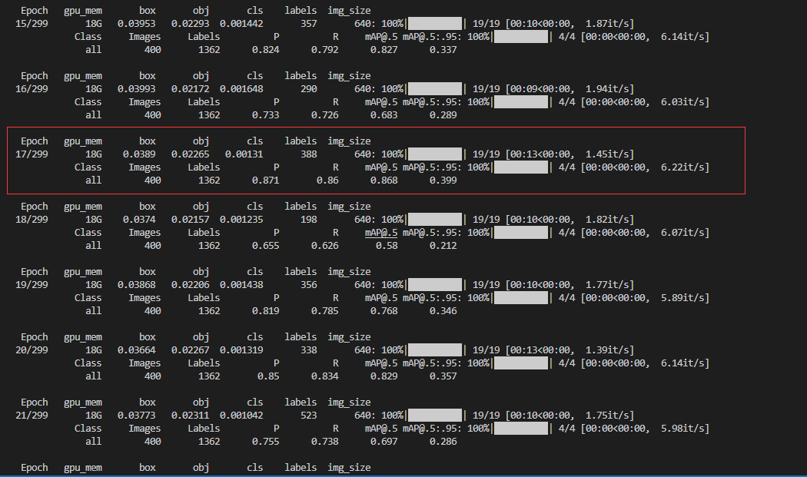

17个epoch之后模型性能不在提升。反而下降

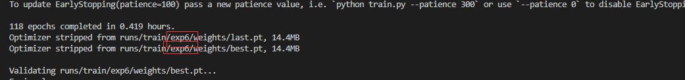
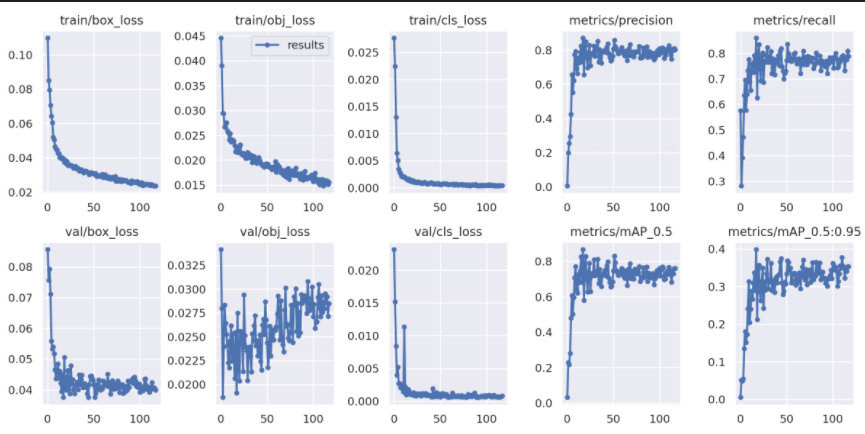

#600

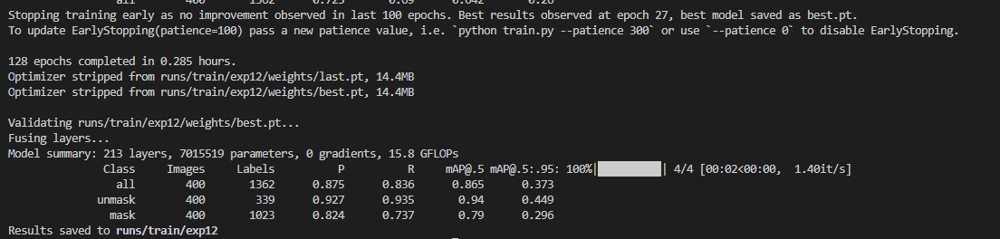

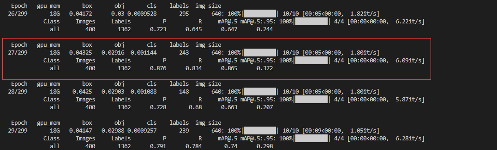

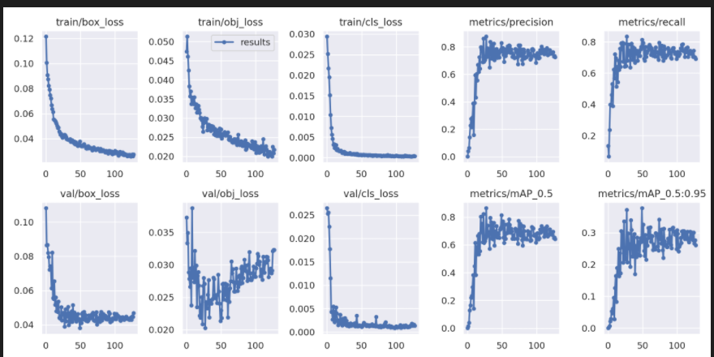

# 300   
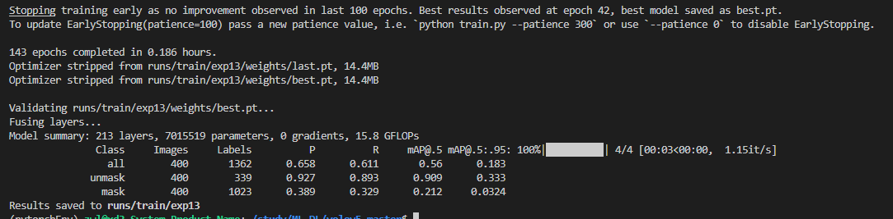

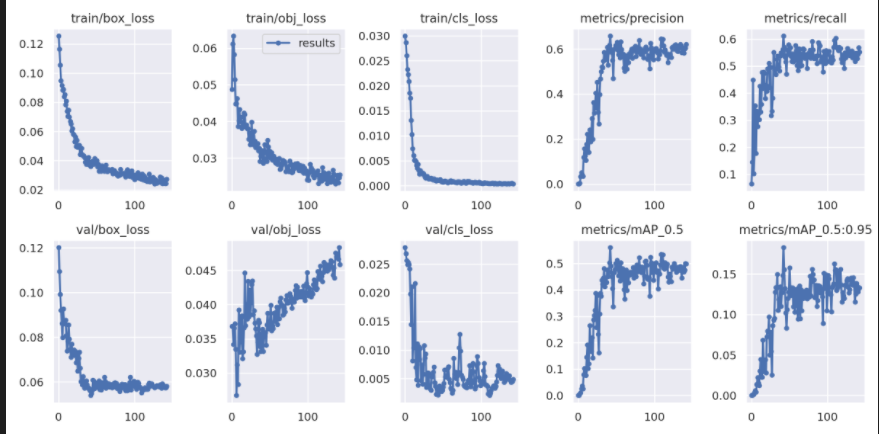

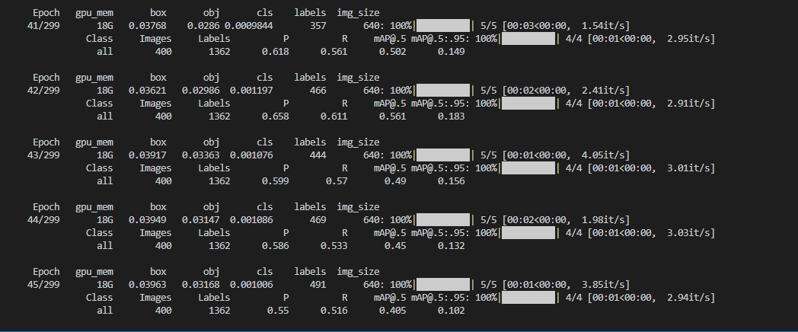

# 400
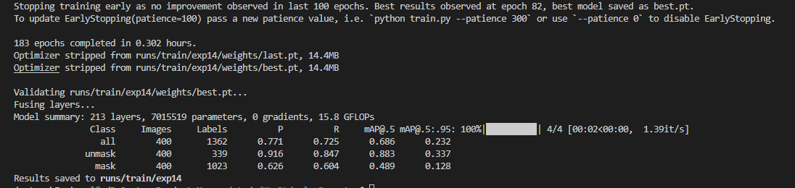

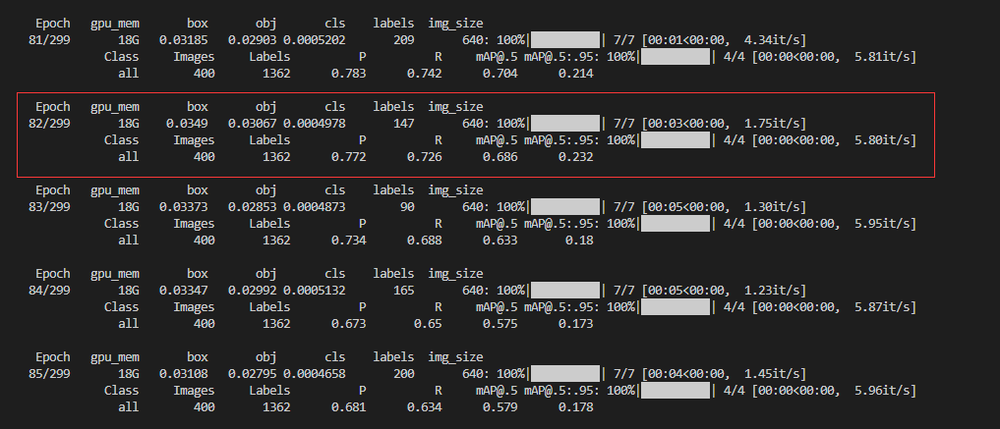

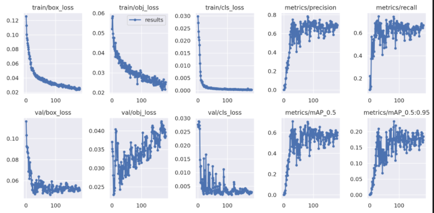

超过100个epoch没有提升，就跳出

# 500
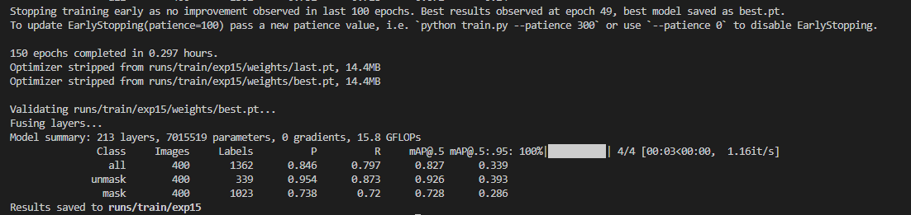
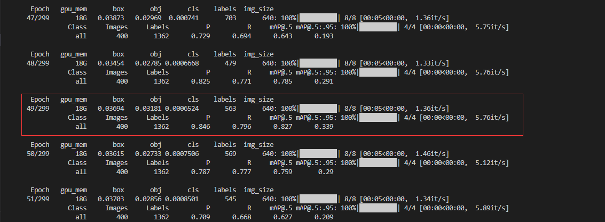

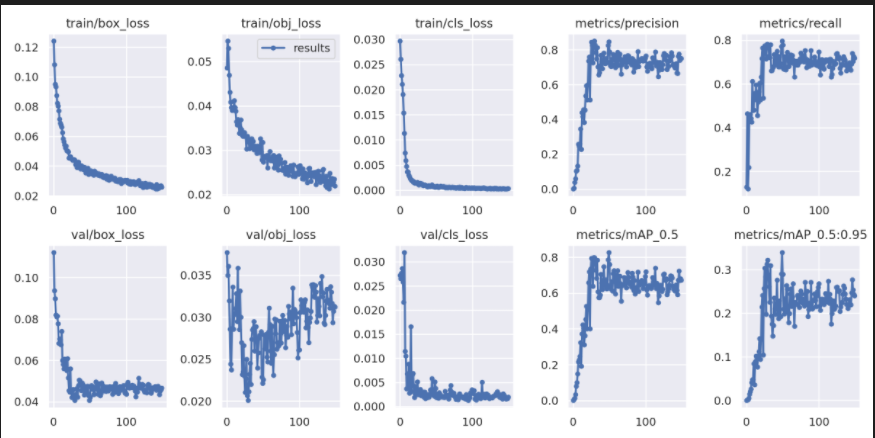

不同的类需要的数据量可能不一致？
不可能实验很多个类然后做平均吧，太麻烦了。而且数据集去哪找。可以找到也是个大的工程，
只能说输进去多少，达到多少的准确率。如果你想要更大的准确率，就请多输入点数据。
这就跑个模型，
感觉所有需要跑的人，都可以会跑，，，而且还可以直接改改网络。自己看看想冻结什么网络就冻结什么网络，跑出来效果肯定更好
提供接口供别人轻易地使用？？？
只能说算个大概，

# 只有mask时
## 1200
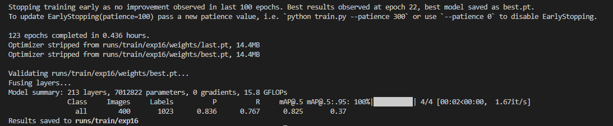
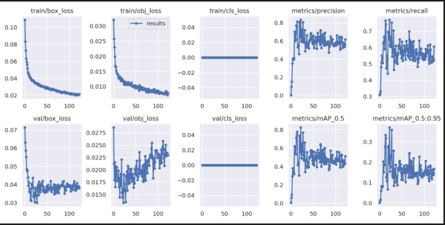

# 20220606

后端代码的实现流程

视频显示有问题，看ffmpeg、opencv

C++的编译链接问题

  
