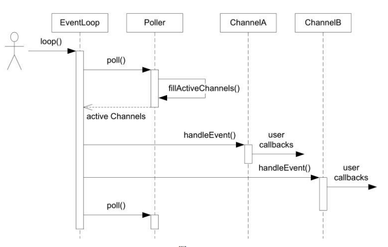

原文链接：http://www.cnblogs.com/codingbigdog/archive/2022/09/05/16659399.html
提交日期：Mon, 05 Sep 2022 11:59:00 GMT
博文内容：
# 第六章 
库安装：按照书中写的进行安装和测试就行。

muduo采用Reactor模式，Reactor模式——要求主线程（I/O处理单元）只负责监听文件描述上是否有事件发生，有的话就立即将该事件通知工作线程（逻辑单元）。如epoll_wait——注册事件，事件发生后通知主线程，主线程将已经发生的事件放入请求队列，并唤醒请求队列上的某个线程去处理这个事件。

介绍了目录结构，我们只需要知道muduo包含基础库（包括线程库等）和网络库。公开接口和内部接口的简介可以大概看一下，知道有这个东西就行。

十几个可用于学习的实例。

《TCP网络编程本质论》，这一小节中说的东西都比较抽象，我们需要对[链接](https://www.cnblogs.com/codingbigdog/p/16244095.html)中的阻塞和非阻塞的知识进行了解，并且知道缓冲区一般指什么——缓冲区：一般指的就是一个char类型数组，这个数组可能用于装待发送数据（发送缓冲区），也可能用于装接收到的数据（接收缓冲区）。
即使只有了上面的知识，可能还是会优点迷糊，不过没关系，以后在回来看也行。

两个代码实现——echo服务和finger服务：echo服务代码可能看起来有点乱（因为没学过boost），可以先看finger服务代码，再回头过来看echo服务代码。

数独服务器：以echo服务的实现为蓝本进行实现的。

方案0~4都是阻塞式网络编程，即首先从listenfd中取出connfd，然后就一直等待客户向connfd发送数据（等待connfd变得可读），如果客户一直不发数据，那么它就一直阻塞在那里。
【设】服务器端用于监听客户请求的套接字设为listenfd；服务器端接收到的客户套接字设为connfd；客户端用于发起连接的套接字设为clientfd。

从方案5开始就引入了IO复用，IO复用select/poll/epoll的作用：以epoll为例，首先将listenfd进行上树并监听这棵树，当listenfd上有客户连接时，我们从listenfd中取出connfd，取出connfd以后，不会一直等待客户向connfd发送数据，而是将connfd加入到监听树上，此时监听树就是监听listenfd（监听是否有新连接）和connfd（监听客户发送的数据）

方案5就是使用poll设计的简单的服务器。树上如果有listenfd和connfd两个套接字，由于它们两者监听的东西不同，所以触发的处理过程也不同，这就是方案5中将这两个处理过程封装成两个独立函数的原因。

首先我们要知道——一个tcp连接可能会发送多个请求
方案6（thread per request）：每个请求都使用一个线程来处理
方案7（worker thread per connection）：每个tcp连接都使用一个线程来处理

方案8：全部的IO工作都在一个Reactor线程完成，而计算任务交给thread pool。【这不是Proactor模式吗？】

方案9（one loop per thread）：
一个Reactor是什么意思？Reactor不是一种设计模式吗？
答：这里的一个Reactor应该代表的是一个方案5的那一套代码。从书中的示例图可以看出，方案9指的是每个线程中都有IO复用函数poll，我觉得`one loop per thread`代表的就是一个线程中有一个IO复用函数poll。知道了这一点，我们再看看书中的这一段话，就清楚了许多了：
>这是muduo内置的多线程方案，也是Netty内置的多线程方 案。这种方案的特点是one loop per thread，有一个main Reactor负责 accept(2)连接，然后把连接挂在某个sub Reactor中（muduo采用round_robin的方式来选择sub Reactor），这样该连接的所有操作都在那个sub Reactor所处的线程中完成。多个连接可能被分派到多个线程中，以充 分利用CPU。

【muduo的默认线程模型为方案9】 

方案11：把方案8和方案9进行结合。用多个Reactor来处理IO，使用线程池处理计算任务。

# 第七章
看五个简单TCP示例之前，可以先复习一下echo服务器的实现，这样你就会发现这五个简单TCP示例很简单。【再看一遍，可以深入源码看一遍】
看到这五个代码的时候，发现陈硕提供的源码里都有CMakeLists.txt文件，让我们更加方便地生成可执行文件。
这五个代码中都实现了两个回调函数：连接时调用的函数（onConnection）和接收数据时调用的函数（onMessage）

# 第八章
## 8.0 
什么都不做的EventLoop：我对s00添加了注释，可以先看代码再看书，书其实讲的不是很清楚。

## 8.1 Reactor的关键结构：
本节讲Reactor最核心的事件分发机制，即将IO multiplexing拿到的IO事件分发给各个文件描述符（fd）的事件处理函数。

本节的代码中有三个类，分别为EventLoop、Poller和Channel，函数的调用过程如下：

在EventLoop类中有一个Poller类型的成员变量poller_，而poller_中存储着channel类型的对象。

Channel类：
- Channel类中有：套接字、监听的事件、发生的事件、各个事件的回调函数。channel中的成员函数update将本channel加入到EventLoop对象的成员变量poller_中。
- Channel传入本EventLoop对象来干嘛：将本channel加入到EventLoop对象的成员变量poller_中。

Poller类：Poller类只负责检测是否有事件发生，并将发生事件的channel放进activeChannels中。事件回调函数的调用不在Poller类中进行。
- Poller中使用pollfds_保存套接字和需要监听的事件。
- Poller中使用IO复用函数poll监听事件的发生，将发生事件的channel都放进activeChannels中。遍历activeChannels，调用各个channel中的事件回调函数。
- Poller传入本EventLoop对象来干嘛：调用Poller成员函数时判断当前线程和创建EventLoop对象时的线程是否一致。
- Poller.h中不使用include <poll.h>中的pollfd，而是自己前向声明了一个struct pollfd，为什么这么做？Poller.cc中又使用了include <poll.h>中的pollfd？

Reactor就是将IO multiplexing拿到的IO事件分发给各个文件描述符（fd）的事件处理函数。其中“IO multiplexing拿到IO事件”由Poller类的poll()实现，poll()返回有事件的channel。处理函数的调用由channel类实现。

8.2 TimerQueue定时器
Timer：中包含了到期时间和到期时需要调用的回调函数
TimerId：不太明白有什么用？？
TimerQueue：

如何在几乎不改其他类的情况下添加新功能

# 大并发服务器架构（陈硕muduo库源码解析）
参考：
视频：https://www.bilibili.com/video/BV1Zt411K7Gg/
ppt和示例代码：https://github.com/zhengchunxian-ai/muduo_server_learn
笔记：https://github.com/Anita-Mul/muduo

主要内容：
EXCEPTION 12
THREAD 13
mutexlock 14
无界队列和有界队列 blockingQueue 15
threadpool 16
singleton 17
线程特定数据 TSD  18
线程本地单例类封装19
日志类封装20
日志类 21 22
并发服务器设计23 24
TCP网络编程本质 25
poll/epoll 26
定时器事件 27
定时器实现28
线程与进程29
eventloopthread封装30
socket的封装31
acceptor 32
tcpserver tcpconnection 33
tcpconnection  生存期管理34
muduo库如何支持多线程35
应用层缓冲区BUffer设计 36
其他缓存和tcpconnection 中send shutdown方法37
完善tcpconnettion 38
muduo对tcp客户端程序的支持39
muduo http库源码分析40
muduo inspect库源码分析41
五个简单tcp协议42
文件传输实例 43
聊天服务器 44 45
测试两天机器延迟RTT 46
限制最大连接数 踢掉空闲连接 47
高效率多线程异步日志48
ABCBank49

P10开始介绍muduo源码，前面都是在介绍基础。

我就从p8开始看吧，前面的基础以后再看,
[大并发服务器架构（陈硕muduo库源码解析）——基础篇](https://www.cnblogs.com/codingbigdog/p/16723428.html)
