原文链接：http://www.cnblogs.com/codingbigdog/archive/2022/06/01/16335745.html
提交日期：Wed, 01 Jun 2022 13:16:00 GMT
博文内容：
# 1.视频编码

## 1.1.音视频处理流程
1.封装：将音视频读出来并封装成相应的格式
2.解码：解压
3.重采样：将视频和音频转换成显卡和声卡支持的形式
4.像素格式：视频需要做像素格式的转换

## 1.2.MPEG-4
MPEG-4是一套用于音频、视频信息的压缩编码标准
在MPEG-4标准的Part14中描述了MPEG-4格式，在MPEG-4标准的Part15中描述了AVC格式
MPEG-4使用H264作为压缩算法。


## 1.3.封装格式(也叫容器)

封装格式(也叫容器）就是将已经编码压缩好的视频流、音频流及字幕按照一定的方案放到一个文件中，便于播放软件播放。
一般来说，视频文件的后缀名就是它的封装格式。

封装的格式不一样，后缀名也就不一样。不同的封装格式，应用在不同的场景下，如mp4常用于本地存储，flv常用于网络传输。


常用封装格式:
AVI：压缩标准可任意选择。可以没有压缩，这样会导致文件很大。早期用的比较多。
FLV（直播等）、ts（电视）、ASF：流媒体格式
mp4

H264+AAC封装为FLV或MP4是最为流行的模式。

## 1.4.常用编码格式（压缩算法）
**视频：**
H264 、wmv、XviD：分析前后帧进行运动补偿，从而实现视频的压缩。拖动使用这种压缩方法的视频的进度条的时候，如果停到非关键帧的地方可能会播放失败【我们平常拖动没出问题，是因为播放器已经对这个问题进行了处理。如果我们自己设计播放器的时候，一定要注意这个问题】。
mjpeg：每一帧都是独立的，压缩率比较低。常在摄像机中看到。

**音频：**
acc、MP3、ape、flac、PCM：现在视频中的音频主要使用acc进行编码。acc和MP3是有损压缩，ape和flac是无损压缩，所以ape和flac编码的音频声音质量比较好。PCM是原始音频


因为音频相对视频会比较小，所以音频可以不压缩，但视频一般都需要进行压缩。

常用视频压缩算法：
```
MPEG2	MPEG阵营
H264		MPEG阵营
H265		MPEG阵营
AVS   		中国阵营
VP8    	Google阵营
VP9    	Google阵营
```


## 1.5.封装结构
每一个视频都采取下面这种封装的结构。

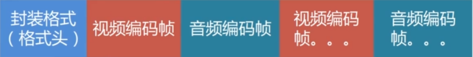

不同的封装格式决定了视频帧和音频帧的编码方式。

封装格式(格式头)：mp4、FLV、AVI等。比如mp4中使用box来保存音视频信息(编码和格式、关键帧索引)。FFmpeg可以解码没有格式头的视频文件，FFmpeg会自动进行探测，使用什么方式可解析出帧，就用什么方式。

视频编码帧：视频编码帧中包含压缩的方式，我们可以根据压缩方式进行解码，比如H264一般解码成YUV格式【Y表示灰度（亮度），UV表示色度。黑白电视只传输Y就可以】。我们在将H264转换成YUV格式之后是没有办法显示的，需要将YUV格式的图像转换成RGB才能显示。经过H264——>YUV——>RBG以后得到的图片会比较大。

音频编码帧：这里以aac解码进行说明。
aac解码之后，变成了PCM FLT格式。PCM代表原始音频，FLT代表音频使用float进行保存，使用float保存音频是为了方便编码和解码时候做浮点运算。由于float是四个字节，32位，而一般显卡不支持32位浮点运算（除非显卡超级好），所以需要将PCM FLT格式的音频继续进行转换，转为声卡支持的S16播放（即转成16位）。

视频编码帧解码的开销比音频编码帧解码的开销多很多，以至于音频编码帧解码的开销可以忽略不记。


# 2.图像和音频的存储方式
## 2.1.图像的存储方式
### 2.1.1.RGB与YUV
视频显示的帧都是压缩过的，所以要将帧抽取出来进行显示，就要将帧进行解压。解压出来的图像会比视频中的帧大很多。解压出来的图像可以是下面几种像素格式：RBG、YUV、RGBA。
RGBA：这里的A是透明通道，A我们一般用不到，但是用显卡显示图片的时候，经常要求传入RGBA。
YUV：Y表示灰度（亮度），UV表示色度。我们视频压缩算法都是在YUV图像上进行的。同样存储一个像素点，YUV需要的空间相比RBG更小。

**RBG与YUV的互相转换**
```
// RBG转YUV：
Y = 0.298R + 0.612G + 0.117B;
 
U = -0.168R - 0.330G + 0.498B + 128;
 
V = 0.449R - 0.435G - 0.083B + 128;

// YUV转RBG：
R = Y + 1.4075( V - 128);
 
G = Y - 0.3455( U - 128) - 0.7169( V - 128);
 
B = Y + 1.779( U - 128);
```
libyuv，Google开源的实现各种YUV与RGB间相互转换、旋转、缩放的库。


**3X3RGB图像在内存中的存放方式(连续)：**

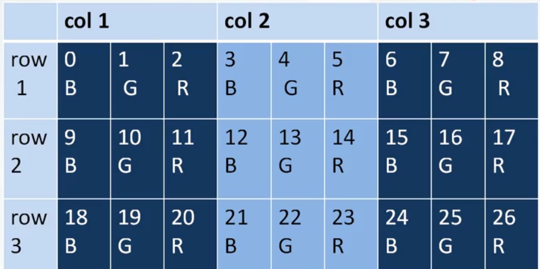

注意：为了运算效率，图像的存储可能会采取某些对齐策略。


### 2.1.2.YUV

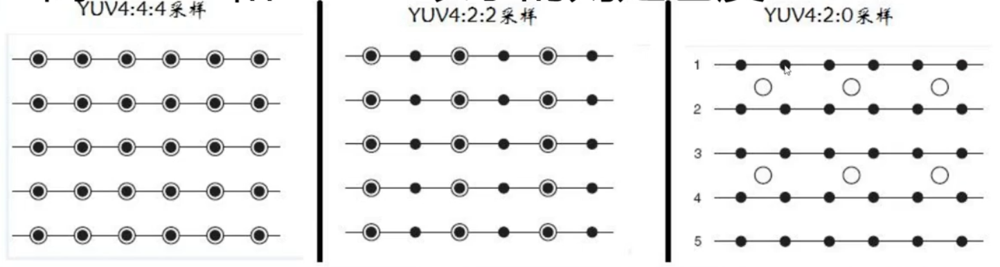

其中空心圆表示UV（UV是成对出现的），实心圆表示Y。
YUV444：每一个Y都对应一个UV。
YUV422：从图中可以看到YUV和Y间隔出现，这表示每两个亮度共用一个色度。
YUV420：四个Y共用一个UV，这四个Y是上下相邻的四个像素。最常使用的就是YUV420.
YUV420p：这里p是平面的意思，代表Y和UV是分开存放的，比如Y放在一个数组，UV放在一个数组。

YUV格式：有两大类：planar和packed。
- 对于planar的YUV格式，先连续存储所有像素点的Y，紧接着存储所有像素点的U，随后是所有像素点的V。YUV420p属于planar。
- 对于packed的YUV格式，每个像素点的Y,U,V是连续交叉存储的。YUV444、YUV422、YUV420都是属于packed。

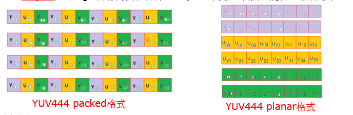

除了上面两个大类外，YUV存在多种格式，比如YUV420sp等，不同的YUV格式的数据在存储时的排列顺序是不一样的，在开发的过程中必须非常注意，否则画面会显示不正常。比如花屏，绿屏等现象。

更多介绍请点击:
https://blog.51cto.com/u_7335580/2059670
https://blog.51cto.com/cto521/1944224
https://blog.csdn.net/mandagod/article/details/78605586

计算一张的RGB_888图像的大小，可采用如下方式： 1280×720 * 3 = 2.637 MB，4分钟就达到了15G的容量。 假如是一部90分钟的电影，每秒25帧，则一部电影为 2.637MB90分钟60秒*25FPS= 347.651GB

相较于RGB，我们可以计算一帧为1280×720的视频帧，用YUV420P的格式来表示，其数据量的大小如下：每个像素点需要1.5个YUV来表示，故 1280 * 720 * 1 ＋ 1280 * 720 * 0.5 = 1.318MB 。
如果fps（1秒的视频帧数目）是25，按照一般电影的长度90分钟来计算，那么这部电影用YUV420P的数据格式来表示的话，其数据量的大小就是： 1.318MB * 25fps * 90min * 60s = 173.76GB

故直接将图片存储成视频，那么这样的视频将会是很大，所以一般会按照一定的规则进行压缩。


## 2.2.音频的存储方式

**PCM音频参数：**
- 采样率sample_ rate：采样率越高，采到的数据越多，声音越真实。CD的采样率为44100，一秒采44100次。 
- 通道channels：如左右声道。CD的采样率为44100，两个声道总的采样率为88200
- 样本大小sample_size(采样格式)：一个声音用多少位的格式来存储，有如下两个方式
AV_SAMPLE_FMT_S16：16位
AV_SAMPLE_FMT_FLTP：32位，一般声卡无法播放32位声音需要转换为16位的声音，即进行重采样处理。

AV_SAMPLE_FMT_S16P：这里p是平面的意思，如在双声道中，将两个声道的数据是分开存放的，一个声道存放在一个数组中。


# 3.MP4标准和h264格式的NAL的GOP分析

## 3.1. MP4格式分析
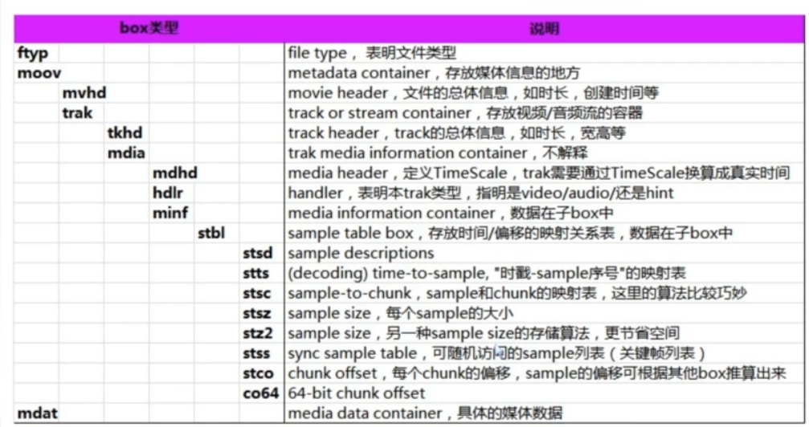


## 3.2. H.264/AVC视频编码标准
**H.264/AVC视频编码标准包括两层：**  
网络抽象层面(NAL)：格式化数据并提供头信息
视频编码层面(VCL)：视频数据的内容


**NAL单元：**
因此我们平时的每帧数据就是一个NAL单元(SPS与PPS除外【SPS与PPS为参数数据，比如分辨率等】)。在实际的H264数据帧中，往往帧前面带有00 00 00 01或0000 01分隔符, 用分隔符来识别数据的开始和结束。一般来说编码器编出的首帧数据为PPS与SPS，接着为I帧。

**GOP**：GOP是一组帧，可以解码出来播放的一组帧。这组帧必然含有关键帧（I帧）。有关键帧似乎才能解码出视频图像，下面是一个GOP：

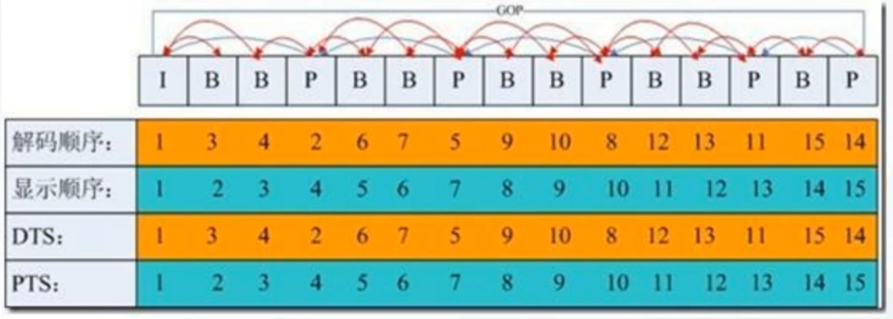

**I帧**
I帧称为关键帧，B帧和P帧依赖I帧解码出图像。I帧存储着完整的数据，可以单独解码出来完整的图像。
- I帧图像采用帧内编码方式;
- I帧所占数据的信息量比较大;
- I帧图像是周期性出现在图像序列中的，出现频率可由编码器选择;
- I帧是P帧和B帧的参考帧(其质量直接影响到同组中以后各帧的质量);
- I帧是帧组GOP的基础帧(第一帧),在一组中只有一个I帧，且在GOP中处于第一帧
- I帧不需要考虑运动矢量;

**P帧**
P帧根据本帧与前一帧（I帧或P帧）的不同点来压缩本帧数据，同时利用了空间和时间上的相关性。这里的“前一帧”必须是I帧或P帧，如果P帧的前一帧是B帧，则往前找，直到找到I帧或P帧。


**B帧**
B帧参考前一帧和后一帧解码出图像。故GOP的第一个图像必须为I帧，这样就能保证GOP不需要参考其他图像，可以独立解码。如果关键帧丢失，那么关键帧后面的B和P帧将无法正确解码。

播放到B帧时，由于B帧参考前一帧和后一帧解码出图像，所以解码B帧时，不能立刻进行播放，而是将此B帧缓存，在此B帧的下一帧解码成功后，再回过来处理，才能正确地显示此B帧。 


# 4.一些概念
## 4.1.音视频概念

视频码率：kb/s，是指视频文件在单位时间内使用的数据流量，也叫码流率。码率越大，说明单位时间内取样率越大，数据流精度就越高。比如一秒25帧且存储每帧使用了A kb的存储空间，那么视频码率就是25A kb/s，也称25A kbps【ps指的是/s】

视频帧率：fps，通常说一个视频的25帧，指的就是这个视频帧率，即1秒中会显示25帧。帧率越高，给人的视觉就越流畅。

视频分辨率：分辨率就是我们常说的640x480分辨率、1920x1080分辨率，分辨率影响视频图像的大小。


## 4.2.物理概念

声音是由物体的振动产生的，而振动是一个一上一下的过程，那么如何使用数学的方式描述这样一个一上一下的过程？
答：就是通过下面这种曲线表示。一上一下的过程称为一个周期，曲线的高度表示声音的大小，一个周期宽度代表声音的快慢。

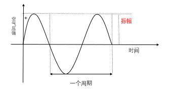

声音的频率是周期的倒数，它表示的是声音在1秒钟内的周期数，单位是赫兹(Hz)。千赫(kHz),即1000Hz,表示每秒振动1000次。声音按频率可作如下划分:
次声		              	0～20Hz
 人耳能听见的声音 	20Hz～20KHz
 超声					20KHz～1GHz
 特超声					1GHz～10THz 

为什么人听不到次生和超声呢？
答：听不到次声是因为“动的很慢的物体，我们会感觉它没动”。
听不到超声是因为“动的很快的物体，我们也会感觉它没动”。【这是我自己的理解】

## 4.3.数字音频
### 4.3.1.采样频率

PCM脉冲编码调制：PCM(Pulse Code Modulation)，脉冲编码调制。人耳听到的是模拟信号，PCM是把声音从模拟信号转化为数字信号的技术。简单来说，就是不把左图全部存储下来，而是将存储某几个时间点的振幅。
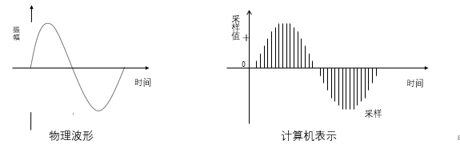

根据Nyguist采样定律，要从采样中完全恢复原始信号波形，采样频率必须至少是信号中最高频率的两倍。就是说平均每个周期要采样至少两次。

前面提到人耳能听到的频率范围是[20H~20kHz]，所以采样频率一般为44.1Khz，这样就能保证声音到达20Khz也能被数字化，从而使得经过数字化处理之后，人耳听到的声音质量不会被降低。


### 4.3.2.采样量化

采样量化（采样精度），就是指一个时间点的振幅用几个bit表示，例如8位量化可以表示256个不同值，而CD质量的16位量化可以表示65536个值。

我们可以直观地将振幅理解为声音的大小，如果用比较多的bit表示一个振幅，那么我们可以听到的声音就越丰富。这就像平时我们调节声音大小一样，如果只有那么几个声音可以调整，那么声音就会不丰富。

```
采样频率：每秒钟采样的点的个数。常用的采样频率有：
22000（22kHz）：	无线广播。
44100（44.1kHz）：CD音质。
48000（48kHz）：	数字电视，DVD。
96000（96kHz）：	蓝光，高清DVD。
192000(192kHz):	蓝光，高清DVD。

采样精度（采样深度）：每个“样本点”的大小，
		常用的大小为8bit， 16bit，24bit。

通道数：单声道，双声道，四声道，5.1声道。

```
### 4.3.3.音频里的其他名词
**比特率**：每秒传输的bit数，单位为：bps（Bit Per Second）
没有压缩的音频数据的比特率 = 采样频率 * 采样精度 * 通道数。
通道数:个人理解,就是同时有个几个设备在进行音频的采样,这样对上面的公式更好理解,最少为1,一般通道数越多,音质越好。

**码率：** 压缩后的音频数据的比特率。常见的码率：
96kbps：FM质量
128-160kbps：一般质量音频。
192kbps：CD质量。
256-320Kbps：高质量音频
	
码率越大，压缩效率越低，音质越好，压缩后数据越大。
码率 = 音频文件大小/时长。

**帧**：每次编码的采样单元数，比如MP3通常是1152个采样点作为一个编码单元，AAC通常是1024个采样点作为一个编码单元。

**帧长：**
- 可以指每帧播放持续的时间：每帧持续时间(秒) = 每帧采样点数 / 采样频率（HZ）
	比如：MP3 48k, 1152个采样点,每帧则为 24毫秒
		1152/48000= 0.024 秒 = 24毫秒；
- 也可以指压缩后每帧的数据大小

**非交错模式：**首先记录的是一个周期内所有帧的左声道样本，再记录所有右声道样本
**交错模式：**数字音频信号存储的方式。数据以连续帧的方式存放，即首先记录**帧**1的左声道样本和右声道样本，再开始帧2的记录...


# 5.音视频录制\播放原理
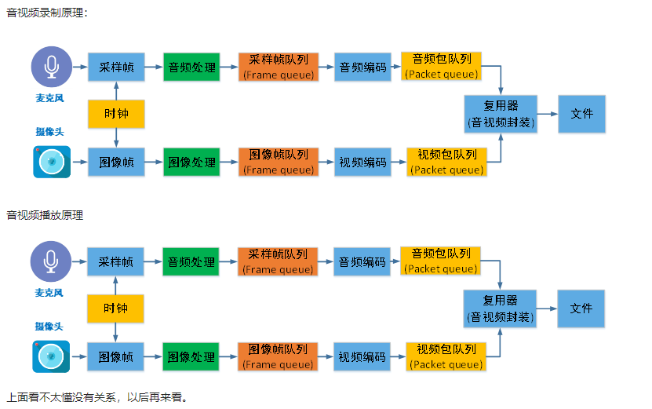


# 6.音频编码原理简介
数字音频压缩编码在保证信号在听觉方面不产生失真的前提下，对音频数据信号进行尽可能大的压缩，降低数据量。数字音频压缩编码采取去除声音信号中冗余成分的方法来实现。所谓冗余成分指的是音频中不能被人耳感知到的信号，它们对确定声音的音色，音调等信息没有任何的帮助。冗余信息：
- 冗余信号包含人耳听觉范围外的音频信号以及被掩蔽掉的音频信号等。例如，人耳所能察觉的声音信号的频率范围为20Hz～20KHz，除此之外的其它频率人耳无法察觉，都可视为冗余信号。
- 此外，根据人耳听觉的生理和心理声学现象，当一个强音信号与一个弱音信号同时存在时，弱音信号将被强音信号所掩蔽而听不见，这样弱音信号就可以视为冗余信号而不用传送。这就是人耳听觉的掩蔽效应，主要表现在**频谱掩蔽效应**和**时域掩蔽效应**。


## 6.1.频谱掩蔽效应

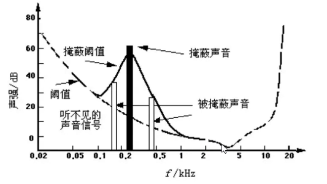

上图中的阈值线表示在这条线以下的声音，人是听不到的。当有另外能量较大的声音出现的时候，该声音频率附近的阈值会提高很多，即所谓的掩蔽效应。如上图，虚线代表阈值，当能量较大的声音在0.2kHz附近出现（黑色柱子）时，该声音频率附近的阈值会提高很多（虚线中凸起的实线部分）。

由图中我们可以看出人耳对2KHz～5KHz的声音最敏感，而对频率太低或太高的声音信号都很迟钝，当有一个频率为0.2KHz、强度为60dB的声音出现时，其附近的阈值提高了很多。由图中我们可以看出在0.1KHz以下、1KHz以上的部分,由于离0.2KHz强信号较远，不受0.2KHz强信号影响,阈值不受影响；而在0.1KHz～1KHz范围，由于0.2KHz强音的出现,阈值有较大的提升，人耳在此范围所能感觉到的最小声音强度大幅提升。如果0.1KHz～1KHz范围内的声音信号的强度在被提升的阈值曲线之下，由于它被0.2KHz强音信号所掩蔽，那么此时我们人耳只能听到0.2KHz的强音信号而根本听不见其它弱信号，这些与0.2KHz强音信号同时存在的弱音信号就可视为冗余信号而不必传送。


## 6.2.时域掩蔽效应

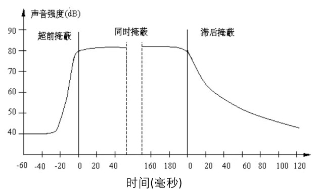

当强音信号和弱音信号同时出现时，还存在时域掩蔽效应。即两者发生时间很接近的时候，也会发生掩蔽效应。时域掩蔽过程曲线如图所示，分为前掩蔽、同时掩蔽和后掩蔽三部分。

时域掩蔽效应可以分成三种：前掩蔽，同时掩蔽，后掩蔽。前掩蔽是指人耳在听到强信号之前的短暂时间内，已经存在的弱信号会被掩蔽而听不到。同时掩蔽是指当强信号与弱信号同时存在时，弱信号会被强信号所掩蔽而听不到。后掩蔽是指当强信号消失后，需经过较长的一段时间才能重新听见弱信号，称为后掩蔽。这些被掩蔽的弱信号即可视为冗余信号。


## 6.3.音频编解码器选型
OPUS
MP3
AAC
AC3和EAC3 杜比公司的方案 
[详解音频编解码的原理、演进和应用选型等](https://www.jianshu.com/p/6b4c481f4294)

# 7.音视频同步
DTS（Decoding Time Stamp）：即解码时间戳，这个时间戳的意义在于告诉播放器该在什么时候解码这一帧的数据。
PTS（Presentation Time Stamp）：即显示时间戳，这个时间戳用来告诉播放器该在什么时候显示这一帧的数据。  

**音视频同步方式：**
Audio Master：视频跟随音频的播放速度
Video Master：音频跟随视频的播放速度
External Clock Master：音频和视频都跟随外部时钟
  
音视频同步方式：Audio Master > External Clock Master > Video Master，即优先选择Audio Master方式进行音视频同步。 
